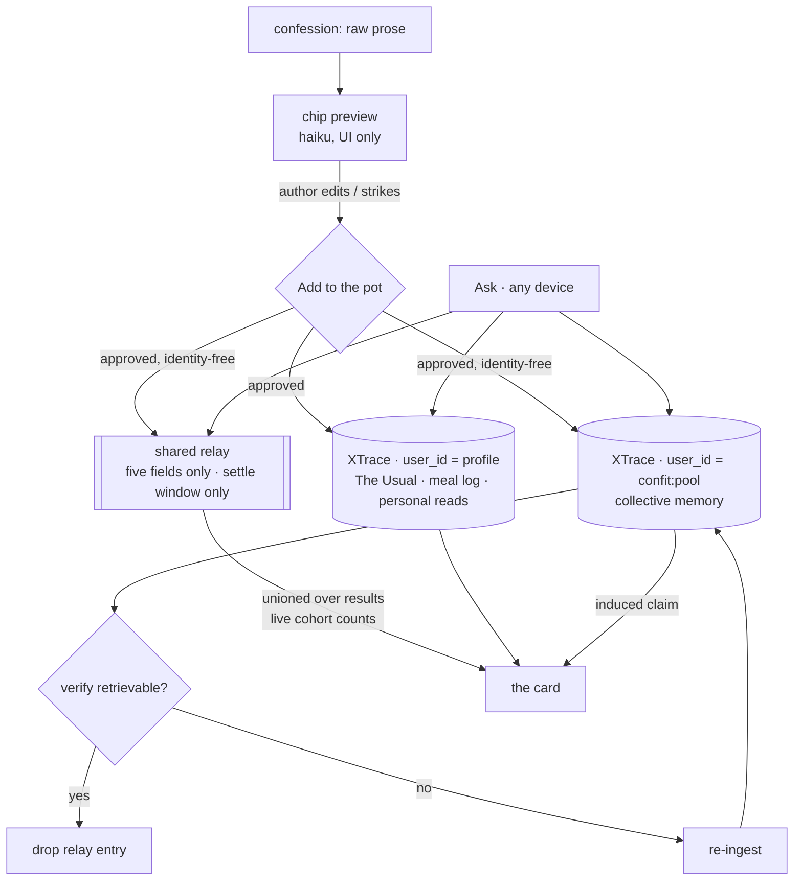

# Confit — the whisper network for what to eat

**Design doc v0.7 · July 25, 2026 · supersedes v0.6**

> **Superseded by [v0.8](./confit-design-v0.8.md)**, which applies all eight findings from [the v0.7 review](./confit-v0.7-review.md). Kept for the review's section references.

**One-liner:** Every food app knows what you ordered; none know what you regretted. Confit asks the question nobody else asks, keeps a memory of the answers, and recommends from the truth people won't put in a review.

**Basis:** v0.6, with the three adoption conditions and two calibration notes from `docs/confit-v0.6-review.md` applied. Empirical claims are sourced in §14. **[slice]** is the 5-hour hackathon build; **[prod]** is after.

**What this revision is:** v0.6 removed the encryption architecture and consolidated both memory tiers onto XTrace, which was right. It also left one mechanism unable to do the job the demo asks of it: the write-through buffer was specified as session-local, and the peak beat needs a read to cross devices in seconds. [E14] fixes that by making the buffer shared. The rest of this revision is bookkeeping the review was right to demand — a named pre-build gate on ingest recovery [E15], the degrade flags written into the design rather than only the plan [E16], and two claims recalibrated to what the evidence actually supports [E17/E18].

---

## 1. Problem: the preference-shame gap

Public reviews are a performance, written for an audience at the moment of maximum self-presentation, so they systematically omit the things that actually predict whether a meal will be enjoyed: the pretended spice tolerance, the lunch-menu-only budget, the hard dietary constraint, the portion someone is tired of being looked at for, the excellent restaurant a breakup made permanently unvisitable. Each predicts a meal better than a star rating.

**The wedge is the collection design, not cryptography** [E9]. A one-to-one prompt with no audience, no byline and no rating widget elicits different answers than a public review box — the box is the thing suppressing the answer. Confit asks the question the way it has to be asked to get a true answer, then remembers.

The v0.1 framing (decision fatigue: people want a confident pick, not another search surface) is the downstream benefit.

## 2. Product summary

Two flows.

**Confess.** The user records a true thing about their eating they would never post. They see a five-chip preview of what will be shared — place, signal, driver, cadence, weight — and press **Add to the pot**. Nothing is pooled without that press. The confession then becomes memory: personal to them, and anonymous in the collective pool.

**Ask.** "Where should I eat tonight?" returns one card shaped by four things: the pool including regret (what people quietly never ordered again), **The Usual** (tolerances, budget bands, portions, patterns, companions, the thing they always actually order), **Rotation** (a per-dish satiation half-life fitted from their own repeat-and-regret intervals), and, opt-in, **the Nudge**.

The design is one sentence: *you tell it once; it remembers for you and for everyone.*

The brief's communal goal — routing traffic to local places people genuinely love — is served indirectly through pool-shaped recommendations. With no restaurant-side surface and no leaderboard that traffic is not directly measurable; §9 forbids the paid version regardless, so whether a visible communal surface returns is open in §13. [C1]

## 3. Modification log

**[E14] The write-through buffer is shared, not session-local.** This is the load-bearing change in v0.7 and it closes a gap v0.6 did not declare. The peak beat requires the judge's read to tip a near-tied ranking *on a stranger's phone, within seconds*; XTrace settle is 5–8 minutes, so the pool tier cannot carry it, and a buffer in the judge's own session memory can never appear in account B's union. The buffer becomes a **shared relay** — the ~60-line KV service already specced as plan v1.0 §8.4 — written alongside XTrace on approval and unioned over query results by every device. It holds only the identity-free five-field object, and only for the settle window: entries are deleted once [E15]'s verification confirms the read is retrievable from XTrace. §6 specifies it; §7 states what it means for privacy.

**[E15] Ingest-recovery is a named pre-build gate, not an open question.** v0.6 recorded "does re-ingest recover a dropped read?" in §13 at an estimated twenty minutes of work while simultaneously resting §12's durability mitigation on the answer. That is the wrong place for it. It moves to §11 as **gate zero**, to be run before anyone builds against this doc. If re-ingest does not recover a dropped read, verify-and-retry is fictional and the sole-store trade needs revisiting while there is still time. **Status: not yet run.**

**[E16] The degrade flags are part of the design, not only the plan.** v0.6 concentrated store, extraction and induction on one substrate without naming what happens when that substrate has a bad minute on stage. Three flags — `extraction: seeded`, `narrator: template`, `pool: relay-only` — are specified in §6 and surfaced in the operator console. They are what turns an incident into a disclosed fallback rather than a dead demo.

**[E17] The raw-prose justification is recalibrated to simplification.** [E11] cited raw prose at **8/8** against pre-structured input at **2/10**. v0.6's own standing caveat undercuts that at slice scale: the 2×2 test of representation against substrate found **no significant difference at ~30 records**. Raw-prose ingest stays — it deletes a seam and a model call, which is reason enough — but the honest slice justification is **simplification, not measured quality**, and neither the demo script nor judge Q&A should lean on the numbers. The figures remain in §14 where their caveat travels with them.

**[E18] The pool's input-format confinement is an explicit open question.** By [E9] and §7 the pool can only ever receive the structured five-field object, and §14 measures structured input as the worst-extracting representation. Immaterial at slice scale by the same caveat as [E17] — but that caveat also says format "only matters as the pool grows," so pool extraction quality and the identity-separation construction are in structural tension exactly where the pool starts being valuable. §13 now records it instead of leaving it implicit.

**[E19] The boundary interceptor is repurposed, not deleted.** Removing encryption retired the vault/pot boundary the interceptor guarded, but not the principle that a privacy boundary is enforced by tooling rather than vigilance. In v0.7 the structural claim is identity separation by construction, and that is assertable in CI: any request toward the pool scope or the relay carrying narrative text or a profile `user_id` fails the build. §9 lists it with the other first-commit guards.

*Carried forward from v0.6:* client-side encryption removed and both tiers on XTrace [E9] · the k≥5 cohort floor and duty of care are primary [E10] · confessions ingest as raw prose, chips are a consent gate [E11] · correctness depends on ingest durability [E12] · `claude-sonnet-5` / `claude-haiku-4-5` [E13].

*Carried forward from v0.5:* x-vec removed [E1] · XTrace as the induction layer [E3] · hour zero measures ingest latency [E6] · procedural memory is real but is not the pool, and "read" ≠ XTrace's `lesson` type [E7/E8].

*Carried forward from v0.3:* [C1] the measurability trade · [C4] the k≥5 cohort floor · [C9] operationalized duty of care · [C10] developer-key auth · [C11] model split by call shape · [C14] disclosure is not validation.

*Retired by [E9]:* [C3] signed tombstones and the ordered Forget-me sequence · [C6]'s redaction framing · [C7] the vault scope question · [C13] the x-vec contingency.

## 4. Goals and non-goals

**[slice]** goals:

- **Nothing is pooled without the author pressing the button** — the chip screen is a hard gate.
- Account B's top three visibly reorders, **within seconds and on a second device**, because account A's read **joined an existing cohort of five or more**, with the card naming the cohort and never quoting the confession [C4/E14].
- A dish eaten twice in seven days is suppressed, with the reason stated plainly.
- A nudge that fires once, is dismissable, and never fires twice in a day.
- An **ingested read is verifiably retrievable** before its relay entry is dropped [E12/E14].

**[prod]** goals carry from v0.1: acceptance rate rising per cohort week over week, dish-level granularity, freshness in the communal signal.

**Non-goals:** accounts (two hardcoded profiles for the demo; device-local identity after), live group dining, native apps, any restaurant-side product, any public trending leaderboard in the slice, **any encrypted-search dependency** [E1], **any claim that Confit cannot read your confession** [E9], and **any narrative text in the relay or the pool** [E19].

## 5. Experience

**Confess is two beats.** The textarea and submit; then the proposed read as five editable chips the author can edit or strike, and **Add to the pot**. The chip screen is where off-limits topics (§9) enforce, upstream of anything communal — a flagged topic never renders as a proposable read.

**Ask returns one card** with a two-clause reason line, each clause from the mechanism suited to it:

> **Skipping three of the highest-rated places nearby.** People who under-report their spice tolerance regret them — *and your read just made that cohort six strong.*

The first clause is an **induced pool claim** — a relationship across many reads, present in none of them. The second is a **live cohort count**, which includes the read the judge just wrote because the relay carries it to every device immediately [E14].

Plus The Usual's context and Rotation's suppressions in plain language: *"Not ramen — twice this week already, and you turn on it by the third."*

If a driver matches no cohort of five, the card says so instead of citing it: *"You're the first person to tell us this — it'll shape recommendations once a few more people do."* Rehearsed deliberately: it turns the most likely demo failure into a live demonstration of the threshold that protects the judge. [C4]

**The demo.** The judge watches their sentence become five identity-free fields and presses the pot button themselves. The peak is their read joining a **seeded** cohort and tipping a **near-tied** ranking on a stranger's phone — a weight, not a switch, and it arrives in seconds because the read reaches B's device through the relay while XTrace settles behind it. Then the beat that earns the substrate: put the induced claim on screen, show the pool rows in plaintext, and invite the judge to find that sentence in any single one. They can't.

Stated plainly for anyone rehearsing: this Reveal is weaker theater than v0.5's *here is your ciphertext*, and it is the beat most likely to draw the privacy question. The answer is the cohort floor (§7), and it needs to sound like a confident answer rather than a fallback.

## 6. Architecture

**[slice]** A Vite SPA with two routes and forty hand-picked places in a static JSON file. **XTrace is the only durable store**, with two scopes:

- **User memory** — `user_id: <profile>`. The Usual, meal log, personal reads.
- **Collective memory** — `user_id: "confit:pool"`, a synthetic pool user every approved read is also written to.

Extraction is XTrace's own — confessions go in as raw prose [E11]. The chip preview is one fast model call for the UI only. Rotation's satiation fit runs client-side; the nudge fires on a demo timer.

**The shared relay** [E14]. Ingest takes 5–8 minutes to become retrievable (§14), which is longer than the entire demo. So on approval a read is written three ways: XTrace user scope, XTrace pool scope, and the relay. Every Ask on every device unions relay contents over its XTrace results, and cohort counts are computed over that union — so a read is countable the instant it is approved, on any device. The relay is plan v1.0 §8.4's KV service, unchanged in shape (`POST /reads`, `GET /reads?since=`, `/stats`, `/seed`, `/reset`, write-token on writes):

- It holds **only the identity-free five-field object** of §7 — never the confession prose, never a profile `user_id` [E19].
- It holds each entry **only for the settle window**. The verify-and-retry loop [E12/E15] polls until the read is retrievable from XTrace, then deletes the relay entry. Bounded by construction: the relay's steady-state contents are the last few minutes of reads.
- XTrace remains the sole durable store. The relay is transport, not memory, and losing it loses nothing that has settled.

**Degrade flags** [E16], live in the operator console:

| flag | fires when | behaviour |
| --- | --- | --- |
| `extraction: seeded` | chip-preview call unavailable | chips come from the pre-computed set for seeded confessions; disclosed in the console, never silently |
| `narrator: template` | Ask assembly unavailable | reason line rendered from a deterministic template over the same fields — degraded copy, never a wrong pick |
| `pool: relay-only` | XTrace unavailable or not settling | pool claims come from the pre-seeded induction set plus live relay contents; cohort counts stay live; the card discloses the pool is degraded |



**Why a pool user and not `group_ids`** — this is the load-bearing finding from testing. XTrace creates episodes with an **empty `group_ids`**, so group-scoped search returns **zero episodes**, and episodes are where the cross-record synthesis lives. Group scoping would return facts and silently drop the induction you are pooling for. User-scoped search returns both. Two corollaries: **reserve episode slots explicitly**, because facts are returned before episodes and a flat top-k drops them all; and **always pass `user_id`**, because omitting it searches app-wide across both tiers.

**[prod]** merges the v0.1 stack: Google Places candidates with per-cell caching, the crowdsourced dish layer with nightly canonicalization, PWA install prompts and storage persistence, Postgres for operational aggregates, device-local pseudonyms — and outcome verification once §13's detection question is answered. The relay either hardens into a real queue or disappears if ingest latency improves.

## 7. Scopes, pooling, and what the pool can leak

A read enters the pool — and the relay — as a structured object with no name, no narrative and no identity:

```json
{
  "place":   "rosas_taqueria",
  "signal":  "returns_despite_incident",
  "driver":  "companion_constraint",
  "cadence": "weekly",
  "weight":  0.81
}
```

Enough to teach the pool that hygiene complaints under-predict loyalty here; not enough to reconstruct a sentence. **Identity separation is by construction, not by cryptography** [E9] — neither the pool user nor the relay holds a link back to the profile that contributed, and [E19] asserts that in CI rather than trusting it.

**Say plainly that the relay is a third place data lives.** [E14] adds a service, and the [E9] posture obliges us to name it rather than let "XTrace is the only store" quietly stop being true. What is true: it is the only durable store; the relay holds five-field objects for minutes, no prose, no profile linkage, and its contents are a subset of what the pool already holds.

**What can still leak, and the defence.** A distinctive read in a thin pool is quasi-identifying to someone who already knows the person, and the demo pool is maximally thin. So the cohort floor is **[slice]**, not [prod] [C4/E10]:

- Pool-derived claims surface in a card only when **at least five reads share the driver** — counted over the XTrace pool *and* the relay, so the floor cannot be dodged by a read still in flight.
- Every demo-relevant driver is **pre-seeded to at least five** across distinct places, so a judge's confession joins a cohort rather than creating one.
- The cohort-miss path is designed and rehearsed, not discovered.

In the slice, integrity is exactly that floor plus disclosed seeding. **[prod]** adds larger thresholds, driver generalization in sparse areas, and velocity and rate defenses on read ingest.

**Deletion** is app-mediated: `DELETE /v1/memories/{id}` against both XTrace scopes, **and a relay purge for the same read** — an un-settled read is deletable too, and forgetting the relay would leave it recommendable for minutes after the user asked it gone. This is a weaker promise than v0.5's signed tombstones — *provable* becomes *promised* — and the UI should say "deleted from Confit," not imply cryptographic enforcement. The per-read keypair design is preserved in the [prod] plan for if the pool ever moves in-house. [E9]

## 8. The brain on XTrace

**User memory.** `user_id`-scoped, and this is where the measurements are strongest. **The Usual** is induced across a profile's own reads rather than stored as a form: situation-keyed retrieval hit **precision@5 of 1.00** against 0.75 for a pgvector baseline (base rate 0.25). **Belief revision** — taste changes and the record captures the change — was measured on a corpus with three preference reversals, each weighted so the *superseded* preference had **more** records than the current one: the substrate articulated *that a preference had changed* in **4 of 4** cases against **1 of 4** for recency-weighted SQL, and held when a single contradicting recent record was injected across a weight sweep from 0.00 to 0.30.

Stated honestly alongside: recency-weighted SQL **tied at 3/3** on identifying *which* preference is current. The measured advantage is in **articulating the transition** — which is exactly what the card's reason line needs — not in knowing the current state, which is cheap.

**Collective memory.** The pool user's value is **induction**: claims true across many reads and present in none of them, which is what cohort counting cannot produce. Counting requires knowing the query in advance; induction surfaces the relationship you didn't think to ask for — *"hygiene complaints under-predict loyalty here"* being the canonical example. Measured at **3/4 against 1/4** on inference-tier retrieval versus pgvector, which itself scored no better than lexical search, and **8/10 against 6/10** overall on the same corpus.

Division of labour in the card: **induced claims** come from the XTrace pool (pre-seeded, warm, ~1.5 s); **cohort counts** are computed over the returned reads plus the relay, so they include the judge's live confession instantly and on every device [E14].

**Rotation** fits a satiation half-life per dish from repeat-and-regret intervals and recommends a dish only once its predicted-appetite curve clears the acceptance line. The half-life is the one number the pool can seed for a cold user, who inherits the median curve per dish and personalizes from their third meal onward.

**Procedural memory is real, and it is not the pool** [E7]. `POST /v1/memories/trigger` returns `type: "procedure" | "lesson"`, keyed on an in-flight tool name via `action: {tool, input}`. Procedures require ingesting conversations containing **tool calls**; a `lesson` additionally requires a **failed** attempt to contrast against. Neither is reachable through search, listing, or usage counters.

> **Terminology.** This doc's **read** is a pooled human preference claim. XTrace's `lesson` is a tool-use rule. Different things; the pool uses neither of XTrace's procedural types.

Where it fits is **[prod]** agent discipline [E8]: once Ask is agent-driven, a rule like *"call `check_exclusions` before `book_table`, because skipping it caused a failed booking"* is a §9 enforcement point that improves itself. Good sixty-second demo, needs a real failure and a settle window — P1/P2, not the slice.

**Outcome verification is [prod]** [C8]. A three-minute demo has no return visit, and nothing in the stack can currently *detect* one. Background location is a heavy permission in tension with §9; payment integration appears nowhere in the plan; asking reintroduces self-report. The leading candidate is a private, next-day, one-tap check-in, on the argument that the bias this product exists to escape is *performance for an audience* and a private one-tap has no audience — weaker bias, not zero, and we say so. Meal-log entries double as passive return evidence where they exist. The rehearsed answer: *"in production, truth is verified by return behaviour; the detection mechanism is a design question we've chosen not to hand-wave."*

At Ask time the model gets a strict choose-from-corpus contract and never introduces a venue or dish absent from the provided candidates.

## 9. Duty of care and integrity (non-negotiable, and now primary)

Unchanged in substance and elevated in importance [E10], because these are now the structural protections rather than the second layer.

The product never comments on quantity, weight, calories or "progress," and contains no streak, score or daily total anywhere. Nudges are opt-in, fire at most once a day, and can be silenced permanently in one tap from the nudge itself. A user can mark any topic permanently off-limits, which stops user memory from recording it and stops the pool from learning from it — enforced at the chip screen, upstream of the pool and the relay alike. Deletion is real deletion within Confit (§7).

Operationally, landing with the first commit [C9/E19]:

- the copy linter over every card and nudge string, and CI regression tests;
- the off-limits propagation test (marked topic → zero new reads);
- **the pool-write boundary assertion** — any request toward the pool scope or the relay carrying narrative text or a profile `user_id` fails the build. The boundary moved when encryption left; the principle that it is enforced by tooling and not vigilance did not.

The business model stays here because it is an integrity property: subscription, explicitly ad-free and affiliate-free. The moment a restaurant can pay for placement the pool is worthless — and with [E9] this is now the *whole* of the trust story, so it is stated first and not as a footnote.

## 10. LLM access and cost

Developer API key; no third-party login without prior approval [C10]. Two calls, split by shape [C11/E13]:

- **Chip preview** on `claude-haiku-4-5` with structured outputs — schema does the work, latency matters, UI only.
- **Ask assembly** on `claude-sonnet-5` — the card's reason line is the only sentence judges read and carries the entire perceived intelligence of the product; at one call per demo its cost is irrelevant.

Extraction itself is now XTrace's, so there is no third call [E11]. Both calls have a degrade path (§6) rather than a hard dependency. **[prod]:** Places lookups dominate once the static corpus lands, mitigated by per-cell caching; dish canonicalization runs nightly on the Batch API.

## 11. Plan

**Gate zero, before build day** [E15]. **Does re-ingest recover a dropped read?** Twenty minutes of work, and §12's principal mitigation is fictional without the answer. Run it before anyone builds against this doc; if it fails, the sole-store decision [E9] gets revisited with time to spare rather than discovered at 1:10. Not yet run.

**[slice]** Hour zero does three things before anything else:

1. **Measure ingest→retrievable latency** and seed the pool immediately [E6]. It is 5–8 minutes; discovering that at 1:10 costs the demo.
2. **Deploy the relay** [E14] — plan v1.0's T0.4, ~20 minutes, curl round-trip from two machines. The peak beat depends on it, so it lands before anything that assumes it.
3. **Wire verify-and-retry** [E12] — poll the ingest job, confirm the memory appears, re-ingest if it does not, drop the relay entry when it does. With XTrace as the sole durable store this is a correctness requirement, not a nicety.

Two consequences for the build:

- **Pre-seed the pool hours ahead**, because induction operates over the pool, not over one new read. The judge's live read reaches the card through the **relay**, not through XTrace.
- **Seeding has a hard requirement** [C4]: every demo-relevant driver at k≥5 across distinct places, tuned so the demo ranking sits near-tied.

The rehearsal block at 4:00 covers the cohort-miss line, the find-it-in-the-rows challenge, and **the two-device reorder on real hardware** — spoken aloud, with someone playing a judge who types something unexpected. The two gates and the 4:00 freeze are otherwise as specced.

**[prod]** P0: device-local pseudonyms, storage persistence, ingest durability hardening, relay hardening or removal, and the deletion story stated accurately in-product. P1: real corpus and real nudge triggers under duty-of-care constraints; procedural memory once Ask is agent-driven. P2: dish layer and Rotation at dish grain. P3: pool hardening — larger thresholds, generalization, velocity defenses — the pool-format tension [E18], and the measurability question. P4: single-geography closed beta, where outcome-verification candidates meet reality.

## 12. Risks

**Ingest durability is a correctness risk** [E12]. 11/16 retention, non-deterministic, against a sole durable store means reads silently vanish — including a judge's, and including reads a user believes they contributed and may later try to delete. Mitigated by verify-and-retry, and by the relay covering the window in which a read is most likely to be missing. The recovery path itself is **untested**, which is why it is gate zero (§11) rather than an open question.

**Settle latency versus the peak beat** — retired as a demo risk by [E14] and replaced by a smaller one: the relay is now on the demo's critical path. It is ~60 lines and deployed at hour zero with a two-machine round-trip check, and `pool: relay-only` covers the opposite failure, but the mitigation is only real once **rehearsed on two devices**. A judge typing a confession and waiting six minutes is the demo dying on stage; so is a reorder that never crosses the room.

**Thin-pool identification is the primary privacy risk** [E10], where encryption used to sit in front of it. The k≥5 floor and pre-seeding are the whole defence in the slice. A judge asking "what stops this identifying me?" gets the cohort floor as the answer, and it needs to be a confident one.

**The seeded pool proves plumbing, not signal** [C14]. 220 synthetic confessions encode our own assumptions about what a confession looks like; the thesis is validated only by the [prod] acceptance-rate goal. A seeded pool must never start feeling like evidence — and per [E17], neither should a benchmark figure whose caveat says it does not apply at our scale.

**Return-visit detection is open and load-bearing** [C8] — it is the only answer to "what stops people lying." And **duty-of-care constraints regress silently if untested**, which is why the linter, the CI tests and the pool-write boundary assertion land with the first commit.

## 13. Open questions

**Does the pool's input-format confinement cost it at scale?** [E18] The pool can only ever receive the five-field object, which §14 measures as the worst-extracting representation, while the same caveat says format only matters as the pool grows. Either the identity-free object gets richer without becoming re-identifying, or pool induction is run over something other than what the pool stores. A [prod] question, but the shape of the answer constrains P3's pool hardening.

Launch geography for the P4 beta. **Return-visit detection** [C8]: private one-tap check-in versus anything heavier, and whether meal-log passivity gets close enough. Whether any visible communal surface returns — the measurability question [C1]. What the in-product deletion copy says now that enforcement is app-mediated rather than cryptographic [E9], and whether it mentions the relay window. And sequencing among group dining, dietary-restriction cohorts and travel, none of which enter scope before the pool has proven itself in one city.

*Moved out of this section:* re-ingest recovery is now gate zero (§11), not an open question [E15].

## 14. Evidence appendix

All findings from direct testing against the live substrate, July 25, 2026. **Read the standing caveat before quoting any number in this section** — two of these figures do not support the weight v0.6 put on them [E17].

### What the memory API does well

| claim | measurement |
| --- | --- |
| Cross-record induction | **3/4** vs 1/4 (pgvector, `bge-small-en-v1.5`) on inference-tier queries |
| Overall retrieval, same corpus | **8/10** vs 6/10 pgvector, 4/10 Postgres FTS |
| Articulating a preference change | **4/4** vs 1/4 (recency-weighted SQL) |
| Robustness to a one-off contradiction | held across a recency-weight sweep 0.00–0.30 |
| Situation-keyed retrieval, precision@5 | **1.00** vs 0.75 pgvector (base rate 0.25) |
| Knowing *which* preference is current | **3/3 — tied** with recency-weighted SQL |

### Constraints that shaped this design

- **Ingest→retrievable: 5–8 minutes**, consistently. Drives pre-seeding and the shared relay [E14].
- **Retention: 11 of 16 records**, non-deterministic. Drives verify-and-retry [E12] and gate zero [E15].
- **Group-scoped search returns zero episodes** — episodes are created with an empty `group_ids`. Drives the synthetic pool user.
- **Facts are returned before episodes**, so a flat top-k drops them all. Reserve slots explicitly.
- **Omitting `user_id` searches app-wide.** Always pass it.
- **Do not pre-clean or pre-structure input.** An LLM pass stripping conversational texture to "just the signal" scored **worst of every configuration (2/10)**; raw prose scored **8/8**. Motivated [E11] — but see the standing caveat: at ~30 records the difference was not significant, so the slice justification for raw prose is simplification, not measured quality [E17]. Do not cite these two numbers on stage.
- **Prose, not notation.** Structured notation extracted **zero** facts from eight complete records.
- **Extraction cannot run on ciphertext**: 0 memories from AES-GCM input vs 11 from the same plaintext — which is why encryption and platform extraction were always mutually exclusive.

### Lessons and procedures

Four lanes, same domain, differing only in conversation shape:

| lane | shape | produced |
| --- | --- | --- |
| control | user prose only | 2 facts + 1 episode |
| assistant | user + assistant prose, `agent_id` set | 4 facts + 1 episode |
| toolcall | assistant narrating tool calls | 3 facts + 1 episode + **1 procedure** |
| outcome | tool calls with FAILED → SUCCEEDED | 3 facts + 1 episode + **1 procedure + 1 lesson** |

`agent_id` alone is insufficient. Recall is keyed on tool name, not semantics. Isolation is correct — another user's `user_id` returns 0 — while omitting `user_id` searches app-wide.

### Why x-vec is not here

`api.xtrace.ai`, the SDK's default admin URL required to create a knowledge base, returns **NXDOMAIN from public DNS**, so KB creation fails for everyone; without a KB every x-vec call 404s. It is **Python 3.11+ only** and browser-incompatible — the homomorphic client and key live in a Python `ExecutionContext`. `float_2_bin` is sign-only quantization: 384 bits against 12,288 as float32, a **32× information loss**. `org_id` is stale: every value tested returned `403 org_mismatch` while omitting the path segment returns `200`.

What is true and worth crediting: the key-custody claim holds (`to_dict_enc` AES-encrypts the secret key; `load_from_remote` requires the passphrase), and the local crypto is fast (keygen 0.6–1.1 s, ~57 chunks/s). Performance was never the problem.

### Standing caveat

These come from corpora of 16–159 records with regex-based scoring that required correction **three times**, each time under-crediting whichever system reformatted or paraphrased its output. One benchmark hit a ceiling at 8/8 across all four configurations — it looked like success and measured nothing. Treat the direction as sound and the exact figures as approximate. In particular, a 2×2 test of representation (prose vs. pre-structured) against substrate (XTrace vs. pgvector) found **no significant difference at ~30 records**: the pooled-record format is not load-bearing at slice scale and only matters as the pool grows. [E17] and [E18] are the two places this caveat changes a decision rather than merely qualifying it.

---

## Appendix: disposition of the v0.6 review

Against `docs/confit-v0.6-review.md`:

| review item | disposition |
| --- | --- |
| Condition 1 — shared, not session-local buffer | **Applied.** [E14]; §6 relay spec, diagram, §7 privacy statement, §4 goal, §12 risk rewrite. |
| Condition 2 — run the re-ingest recovery test | **Accepted, not yet run.** Promoted to gate zero (§11) with [E15]; it is a build blocker, and this doc does not claim the answer. |
| Condition 3 — keep the degrade flags | **Applied.** [E16]; §6 table including `pool: relay-only`, surfaced in the console. |
| Calibration — don't cite 8/8 vs 2/10 at slice scale | **Applied.** [E17]; §14 bullet reframed, figures kept with their caveat attached. |
| Calibration — flag the pool's format confinement | **Applied.** [E18]; §13 open question, P3 in §11. |
| Recommendation — repurpose the boundary interceptor | **Applied.** [E19]; §9 first-commit guard on pool and relay writes. |

*Bottom line unchanged from the review: this is the design to build from. v0.7 makes the peak beat mechanically possible, moves the one untested dependency somewhere it blocks rather than lurks, and stops leaning on two numbers that don't hold at our scale.*
