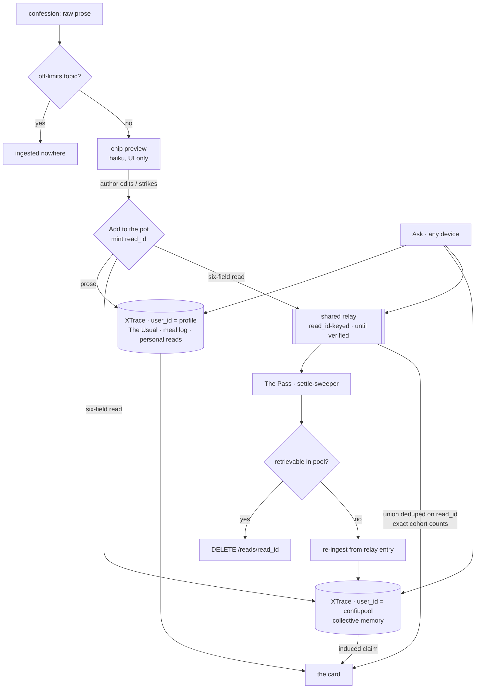

# Confit — the whisper network for what to eat

**Design doc v0.8 · July 25, 2026 · supersedes v0.7**

**One-liner:** Every food app knows what you ordered; none know what you regretted. Confit asks the question nobody else asks, keeps a memory of the answers, and recommends from the truth people won't put in a review.

**Basis:** v0.7, with all eight findings from `docs/confit-v0.7-review.md` applied. Empirical claims are sourced in §14. **[slice]** is the 5-hour hackathon build; **[prod]** is after.

**What this revision is:** v0.7 made the relay load-bearing and did not give its machinery the identities and owners that machinery implicitly assumed. v0.8 supplies them. The read object gains an id [E20], because union dedup, deletion and verify-and-retry were all keyed on nothing; the verify loop gains an owner that outlives the author's session [E21]; the cohort-counting query is specified rather than assumed exhaustive [E22]; and gate zero gains a pass criterion, because one trial against a non-deterministic failure measures nothing [E23]. Four smaller corrections follow, of which [E24] fixes a real §9 violation. **This is the version to freeze contracts against**, once gate zero has run.

---

## 1. Problem: the preference-shame gap

Public reviews are a performance, written for an audience at the moment of maximum self-presentation, so they systematically omit the things that actually predict whether a meal will be enjoyed: the pretended spice tolerance, the lunch-menu-only budget, the hard dietary constraint, the portion someone is tired of being looked at for, the excellent restaurant a breakup made permanently unvisitable. Each predicts a meal better than a star rating.

**The wedge is the collection design, not cryptography** [E9]. A one-to-one prompt with no audience, no byline and no rating widget elicits different answers than a public review box — the box is the thing suppressing the answer. Confit asks the question the way it has to be asked to get a true answer, then remembers.

The v0.1 framing (decision fatigue: people want a confident pick, not another search surface) is the downstream benefit.

## 2. Product summary

Two flows.

**Confess.** The user records a true thing about their eating they would never post. They see a five-chip preview of what will be shared — place, signal, driver, cadence, weight — and press **Add to the pot**. Nothing is pooled without that press. The confession then becomes memory: personal to them, and anonymous in the collective pool.

**Ask.** "Where should I eat tonight?" returns one card shaped by four things: the pool including regret (what people quietly never ordered again), **The Usual** (tolerances, budget bands, portions, patterns, companions, the thing they always actually order), **Rotation** (a per-dish satiation half-life fitted from their own repeat-and-regret intervals), and, opt-in, **the Nudge**.

The design is one sentence: *you tell it once; it remembers for you and for everyone.*

The brief's communal goal — routing traffic to local places people genuinely love — is served indirectly through pool-shaped recommendations. With no restaurant-side surface and no leaderboard that traffic is not directly measurable; §9 forbids the paid version regardless, so whether a visible communal surface returns is open in §13. [C1]

## 3. Modification log

**[E20] The read gains a client-minted `read_id`.** v0.7's five-field object had no identity, and three of its own mechanisms silently needed one: **union dedup** (a read exists in both the relay and the XTrace pool for the whole settle window, so without a key it counts twice and k≥5 can be satisfied by four reads plus a duplicate — and field equality cannot substitute, because two people with identical reads are legitimately two cohort members while one read in two stores is one), **deletion** (§7 promised a relay purge "for the same read," keyed on nothing the client holds for an un-settled read), and **verify-and-retry** (which must know which read to poll for and which entry to drop). A UUID v4 minted client-side at approval, carried in the relay entry and embedded in the pool record, fixes all three. It carries no account linkage, so the [E9]/[E19] posture is untouched. The read is now **six fields, five of which are the chips** — the id is never user-facing and the confess screen is unchanged.

**[E21] The verify loop has an owner that outlives the author's session.** v0.7 said relay entries drop "once verification confirms the read is retrievable" and called the relay "bounded by construction." Both assumed a loop running in the authoring device's SPA — which a judge who confesses and pockets their phone kills, leaving the entry undropped and, on the 11/16 retention path, **re-ingest never attempted**: the exact [E12] failure this machinery exists to prevent. §6 gives The Pass a **settle-sweeper** over entries older than the settle window, and names a property v0.7 had without claiming it — **the relay's own fields are sufficient to reconstruct the pool-scope record**, so the relay is the re-ingest source and any client can do the work. Verified-drop is chosen over TTL explicitly: a TTL expiring an unverified entry would reintroduce silent loss.

**[E22] The cohort-counting query is specified.** v0.7 counted cohorts "over the returned reads plus the relay," inheriting plan v1.0's assumption of an exhaustive `all()` that XTrace does not obviously provide: retrieval is top-k with reserved episode slots, so nothing guaranteed the returned set contained every cohort member. An undercount is safe for privacy — the floor never over-cites — and fatal for the demo, rendering a qualifying cohort as a cohort-miss. §8 now specifies per-driver scoped retrieval with an explicit floor on k, plus a rehearsal-time cross-check against the seed manifest.

**[E23] Gate zero gains a pass criterion.** "Run it, twenty minutes" is not runnable against a **non-deterministic** 11/16 failure — a single trial that happens to succeed proves nothing. §11 now carries the protocol, the pass threshold and what to record, and folds in a `DELETE` + verify-gone trial, since §7's deletion promise is equally untested. ~40 minutes, and "we ran gate zero" becomes falsifiable.

**[E24] Off-limits blocks both writes — this fixes a real §9 violation.** v0.7 enforced off-limits "at the chip screen, upstream of the pool and the relay alike," but the **prose** is ingested to user scope as-is [E11] and XTrace's extraction knows nothing about a struck chip. So a topic a user marked off-limits could still enter **user memory** via prose extraction, directly contradicting §9's claim to stop user memory from recording it. A flagged confession is now ingested **nowhere**. Separately and deliberately: a *struck chip* is not an off-limits topic — striking means "don't share this," not "don't remember it for me," so the prose still reaches the personal tier. That was previously an accident of the design; it is now a stated decision.

**[E25] The [E19] boundary assertion becomes a schema allowlist.** "Any request carrying narrative text fails the build" is unfalsifiable — CI cannot recognize narrative. Inverted: every pool-bound and relay-bound write body must be **exactly** the six-field read schema, closed to additional properties, values within the enum vocabulary. Reject-by-construction is testable; detect-prose is not.

**[E26] The relay's arrival ordering is disclosed as a side-channel.** `GET /reads?since=` reintroduces fine-grained arrival times on identity-free reads, which plan v1.0 deliberately avoided with day-precision timestamps. Anyone reading the relay could correlate "a read arrived at 14:32:05" with whoever just visibly confessed. Contents are a subset of the pool and the window is minutes, so it is accepted for the slice — and said out loud in §7 rather than left for someone to find. Coarse timestamps and opaque cursors join the [prod] hardening list.

**[E27] The confess screen discloses the prose upload.** The chip screen frames five fields as "what will be shared," which under [E9] implies a boundary the architecture no longer has: the prose leaves the device too, to Confit-held user memory. §5 states both halves. §1's wedge survives this — the prompt has no audience either way — but the copy should not imply otherwise.

*Carried forward from v0.7:* the shared relay [E14] · gate zero as a build blocker [E15] · the degrade flags [E16] · raw prose justified by simplification [E17] · the pool-format tension as an open question [E18] · the boundary assertion repurposed [E19], now as [E25].

*Carried forward from v0.6:* encryption removed, both tiers on XTrace [E9] · cohort floor and duty of care primary [E10] · raw-prose ingest, chips as consent gate [E11] · correctness depends on ingest durability [E12] · `claude-sonnet-5` / `claude-haiku-4-5` [E13].

*Carried forward from v0.5:* x-vec removed [E1] · XTrace as the induction layer [E3] · hour zero measures ingest latency [E6] · procedural memory is real but is not the pool [E7/E8].

*Carried forward from v0.3:* [C1] the measurability trade · [C4] the k≥5 cohort floor · [C9] operationalized duty of care · [C10] developer-key auth · [C11] model split by call shape · [C14] disclosure is not validation.

*Retired by [E9]:* [C3] signed tombstones and the ordered Forget-me sequence · [C6]'s redaction framing · [C7] the vault scope question · [C13] the x-vec contingency.

## 4. Goals and non-goals

**[slice]** goals:

- **Nothing is pooled without the author pressing the button** — the chip screen is a hard gate.
- Account B's top three visibly reorders, **within seconds and on a second device**, because account A's read **joined an existing cohort of five or more**, with the card naming the cohort and never quoting the confession [C4/E14].
- A dish eaten twice in seven days is suppressed, with the reason stated plainly.
- A nudge that fires once, is dismissable, and never fires twice in a day.
- An **ingested read is verifiably retrievable** before its relay entry is dropped, **by a sweeper that does not depend on the author still having the app open** [E12/E21].
- **A cohort count is exact**, not a top-k artifact [E22].

**[prod]** goals carry from v0.1: acceptance rate rising per cohort week over week, dish-level granularity, freshness in the communal signal.

**Non-goals:** accounts (two hardcoded profiles for the demo; device-local identity after), live group dining, native apps, any restaurant-side product, any public trending leaderboard in the slice, **any encrypted-search dependency** [E1], **any claim that Confit cannot read your confession** [E9], and **anything but the six-field read schema on a pool- or relay-bound write** [E25].

## 5. Experience

**Confess is two beats.** The textarea and submit; then the proposed read as five editable chips the author can edit or strike, and **Add to the pot**. The chip screen is where off-limits topics (§9) enforce — a flagged topic never renders as a proposable read, and a flagged confession is ingested nowhere at all [E24].

**The copy says both halves** [E27]. The chips are what enters the pot; the words are what enters the user's own Confit memory, which Confit holds. Something in the shape of *"your words go to your private Confit memory — only these five fields go to the pot."* Striking a chip means don't share it, not don't remember it [E24]; marking a topic off-limits means neither.

**Ask returns one card** with a two-clause reason line, each clause from the mechanism suited to it:

> **Skipping three of the highest-rated places nearby.** People who under-report their spice tolerance regret them — *and your read just made that cohort six strong.*

The first clause is an **induced pool claim** — a relationship across many reads, present in none of them. The second is a **live cohort count**, which includes the read the judge just wrote because the relay carries it to every device immediately [E14], and which is exact because §8 specifies how it is counted [E22].

Plus The Usual's context and Rotation's suppressions in plain language: *"Not ramen — twice this week already, and you turn on it by the third."*

If a driver matches no cohort of five, the card says so instead of citing it: *"You're the first person to tell us this — it'll shape recommendations once a few more people do."* Rehearsed deliberately: it turns the most likely demo failure into a live demonstration of the threshold that protects the judge. [C4]

**The demo.** The judge watches their sentence become five identity-free fields and presses the pot button themselves. The peak is their read joining a **seeded** cohort and tipping a **near-tied** ranking on a stranger's phone — a weight, not a switch, and it arrives in seconds because the read reaches B's device through the relay while XTrace settles behind it. Then the beat that earns the substrate: put the induced claim on screen, show the pool rows in plaintext, and invite the judge to find that sentence in any single one. They can't.

Stated plainly for anyone rehearsing: this Reveal is weaker theater than v0.5's *here is your ciphertext*, and it is the beat most likely to draw the privacy question. The answer is the cohort floor (§7), and it needs to sound like a confident answer rather than a fallback.

## 6. Architecture

**[slice]** A Vite SPA with two routes and forty hand-picked places in a static JSON file. **XTrace is the only durable store**, with two scopes:

- **User memory** — `user_id: <profile>`. The Usual, meal log, personal reads.
- **Collective memory** — `user_id: "confit:pool"`, a synthetic pool user every approved read is also written to.

Extraction is XTrace's own — confessions go in as raw prose [E11]. The chip preview is one fast model call for the UI only. Rotation's satiation fit runs client-side; the nudge fires on a demo timer.

**The shared relay** [E14]. Ingest takes 5–8 minutes to become retrievable (§14), which is longer than the entire demo. So on approval a read is written three ways: XTrace user scope, XTrace pool scope, and the relay. Every Ask on every device unions relay contents over its XTrace results, **deduplicating on `read_id`** [E20], and cohort counts are computed over that union per §8 — so a read is countable the instant it is approved, on any device. The relay is plan v1.0 §8.4's KV service, extended with a keyed purge:

```
POST   /reads        {token, read}      → 201   (validates the six-field schema, rejects anything else)
GET    /reads?since=                    → Read[]
DELETE /reads/{read_id}  {token}        → 204   (deletion purge and verified-drop use the same route)
GET    /stats                           → {count, oldest_unverified_age}
POST   /seed         {token, reads[]}    → {count}
POST   /reset        {token}             → {count: 0}
```

- It holds **only the six-field read object** of §7 — never the confession prose, never a profile `user_id` [E25].
- It holds each entry **only until that read is verified in XTrace**, not for a fixed time.
- XTrace remains the sole durable store. The relay is transport, not memory, and losing it loses nothing that has settled.

**The settle-sweeper, and who owns verification** [E21]. Verification is not the author's job, because the author closes the tab. Any client can check whether a relay entry has become retrievable from XTrace, and **the relay entry's own six fields are sufficient to reconstruct the pool-scope record** — so the relay doubles as the re-ingest source. The Pass runs the sweeper over entries older than the settle window: verify → `DELETE /reads/{read_id}`; not found → re-ingest from the relay entry and leave it in place for the next pass. `GET /stats` surfaces `oldest_unverified_age` so a stuck entry is visible on the operator console rather than silently sitting there. **Verified-drop, never TTL**: an entry that expires unverified is a read lost while the UI claimed it pooled, which is the failure [E12] exists to prevent.

One asymmetry, stated rather than hidden: **the user-scope prose has no relay copy** — it must not have one, that is the whole point of §7. Its verify-and-retry therefore holds the prose client-side until XTrace confirms it, and dies with the session if the user leaves first. Acceptable for the personal tier, where a lost confession is one user's data and recoverable by re-confessing; not acceptable for the pool, which is why the pool has the relay.

**Degrade flags** [E16], live in the operator console:

| flag | fires when | behaviour |
| --- | --- | --- |
| `extraction: seeded` | chip-preview call unavailable | chips come from the pre-computed set for seeded confessions; disclosed in the console, never silently |
| `narrator: template` | Ask assembly unavailable | reason line rendered from a deterministic template over the same fields — degraded copy, never a wrong pick |
| `pool: relay-only` | XTrace unavailable or not settling | pool claims come from the pre-seeded induction set plus live relay contents; cohort counts stay live; the card discloses the pool is degraded |



**Why a pool user and not `group_ids`** — this is the load-bearing finding from testing. XTrace creates episodes with an **empty `group_ids`**, so group-scoped search returns **zero episodes**, and episodes are where the cross-record synthesis lives. Group scoping would return facts and silently drop the induction you are pooling for. User-scoped search returns both. Two corollaries: **reserve episode slots explicitly**, because facts are returned before episodes and a flat top-k drops them all; and **always pass `user_id`**, because omitting it searches app-wide across both tiers.

**[prod]** merges the v0.1 stack: Google Places candidates with per-cell caching, the crowdsourced dish layer with nightly canonicalization, PWA install prompts and storage persistence, Postgres for operational aggregates, device-local pseudonyms — and outcome verification once §13's detection question is answered. The relay either hardens into a real queue — with coarse timestamps and opaque cursors per [E26], and the sweeper as a server-side job rather than an operator console — or disappears if ingest latency improves.

## 7. Scopes, pooling, and what the pool can leak

A read enters the pool — and the relay — as a structured object with no name, no narrative and no account linkage:

```json
{
  "read_id": "b7f1c4e2-3a9d-4c58-8e11-2f6d0a5c9b34",
  "place":   "rosas_taqueria",
  "signal":  "returns_despite_incident",
  "driver":  "companion_constraint",
  "cadence": "weekly",
  "weight":  0.81
}
```

Six fields, of which five are the chips the author approved. `read_id` is a UUID v4 minted on the device at approval [E20]: it identifies the read across the relay and the pool so dedup, purge and verify have something to key on, and it identifies nothing else — no profile, no session, no ordering. **Identity separation is by construction, not by cryptography** [E9], and [E25] asserts the construction in CI rather than trusting it: a pool- or relay-bound body is exactly this schema or the build fails.

Enough to teach the pool that hygiene complaints under-predict loyalty here; not enough to reconstruct a sentence.

**Say plainly that the relay is a third place data lives.** [E14] adds a service, and the [E9] posture obliges us to name it rather than let "XTrace is the only store" quietly stop being true. What is true: it is the only durable store; the relay holds six-field objects until they verify, no prose, no profile linkage, and its contents are a subset of what the pool already holds.

**And plainly: the relay knows arrival order, which the pool does not** [E26]. `?since=` gives minute-or-finer ordering over identity-free reads, so someone watching the relay during a demo could correlate an arrival time with whoever just visibly confessed. The window is minutes and the contents are a subset of the pool, so this is accepted for the slice rather than defended as harmless — and it is on the [prod] hardening list.

**What can still leak, and the defence.** A distinctive read in a thin pool is quasi-identifying to someone who already knows the person, and the demo pool is maximally thin. So the cohort floor is **[slice]**, not [prod] [C4/E10]:

- Pool-derived claims surface in a card only when **at least five reads share the driver** — counted per §8 over the XTrace pool *and* the relay, deduped on `read_id`, so the floor can be neither dodged by a read still in flight nor met by the same read counted twice.
- Every demo-relevant driver is **pre-seeded to at least five** across distinct places, so a judge's confession joins a cohort rather than creating one.
- The cohort-miss path is designed and rehearsed, not discovered.

In the slice, integrity is exactly that floor plus disclosed seeding. **[prod]** adds larger thresholds, driver generalization in sparse areas, and velocity and rate defenses on read ingest.

**Deletion** is app-mediated and keyed on `read_id` [E20]: `DELETE /v1/memories/{id}` against both XTrace scopes, and `DELETE /reads/{read_id}` against the relay — an un-settled read is deletable too, and forgetting the relay would leave it recommendable for minutes after the user asked it gone. This is a weaker promise than v0.5's signed tombstones — *provable* becomes *promised* — and the UI should say "deleted from Confit," not imply cryptographic enforcement. Gate zero exercises it once (§11), because an untested deletion path is not a promise. The per-read keypair design is preserved in the [prod] plan for if the pool ever moves in-house. [E9]

## 8. The brain on XTrace

**User memory.** `user_id`-scoped, and this is where the measurements are strongest. **The Usual** is induced across a profile's own reads rather than stored as a form: situation-keyed retrieval hit **precision@5 of 1.00** against 0.75 for a pgvector baseline (base rate 0.25). **Belief revision** — taste changes and the record captures the change — was measured on a corpus with three preference reversals, each weighted so the *superseded* preference had **more** records than the current one: the substrate articulated *that a preference had changed* in **4 of 4** cases against **1 of 4** for recency-weighted SQL, and held when a single contradicting recent record was injected across a weight sweep from 0.00 to 0.30.

Stated honestly alongside: recency-weighted SQL **tied at 3/3** on identifying *which* preference is current. The measured advantage is in **articulating the transition** — which is exactly what the card's reason line needs — not in knowing the current state, which is cheap.

**Collective memory.** The pool user's value is **induction**: claims true across many reads and present in none of them, which is what cohort counting cannot produce. Counting requires knowing the query in advance; induction surfaces the relationship you didn't think to ask for — *"hygiene complaints under-predict loyalty here"* being the canonical example. Measured at **3/4 against 1/4** on inference-tier retrieval versus pgvector, which itself scored no better than lexical search, and **8/10 against 6/10** overall on the same corpus.

**How a cohort is counted** [E22]. Induction and counting need different queries, and v0.7 conflated them by counting over whatever the induction query happened to return. Retrieval is top-k with reserved episode slots, so that set is not exhaustive and a qualifying cohort could render as a cohort-miss — safe for privacy, fatal on stage. Specified:

- **Induced claims** come from the XTrace pool via the semantic query, pre-seeded and warm (~1.5 s). Top-k is fine here; induction does not need every row.
- **Cohort counts** come from a **separate per-driver scoped retrieval** — filtered to the one driver under consideration, with **k set above the largest seeded cohort by a clear margin** — unioned with the relay's reads for that driver and deduped on `read_id`. Counting one driver at a time is what makes an exhaustive-enough result affordable.
- **Cross-checked at rehearsal, not at runtime:** The Pass compares each driver's counted total against the seed manifest, so a k that turns out too small is caught the afternoon before rather than on stage. The near-tie invariant test asserts against this counting path, not the induction path.

The division of labour in the card is unchanged: induced claim from the pool, cohort count from the counting query plus the relay, so the judge's live confession is included instantly and on every device [E14].

**Rotation** fits a satiation half-life per dish from repeat-and-regret intervals and recommends a dish only once its predicted-appetite curve clears the acceptance line. The half-life is the one number the pool can seed for a cold user, who inherits the median curve per dish and personalizes from their third meal onward.

**Procedural memory is real, and it is not the pool** [E7]. `POST /v1/memories/trigger` returns `type: "procedure" | "lesson"`, keyed on an in-flight tool name via `action: {tool, input}`. Procedures require ingesting conversations containing **tool calls**; a `lesson` additionally requires a **failed** attempt to contrast against. Neither is reachable through search, listing, or usage counters.

> **Terminology.** This doc's **read** is a pooled human preference claim. XTrace's `lesson` is a tool-use rule. Different things; the pool uses neither of XTrace's procedural types.

Where it fits is **[prod]** agent discipline [E8]: once Ask is agent-driven, a rule like *"call `check_exclusions` before `book_table`, because skipping it caused a failed booking"* is a §9 enforcement point that improves itself. Good sixty-second demo, needs a real failure and a settle window — P1/P2, not the slice.

**Outcome verification is [prod]** [C8]. A three-minute demo has no return visit, and nothing in the stack can currently *detect* one. Background location is a heavy permission in tension with §9; payment integration appears nowhere in the plan; asking reintroduces self-report. The leading candidate is a private, next-day, one-tap check-in, on the argument that the bias this product exists to escape is *performance for an audience* and a private one-tap has no audience — weaker bias, not zero, and we say so. Meal-log entries double as passive return evidence where they exist. The rehearsed answer: *"in production, truth is verified by return behaviour; the detection mechanism is a design question we've chosen not to hand-wave."*

At Ask time the model gets a strict choose-from-corpus contract and never introduces a venue or dish absent from the provided candidates.

## 9. Duty of care and integrity (non-negotiable, and now primary)

Unchanged in substance and elevated in importance [E10], because these are now the structural protections rather than the second layer.

The product never comments on quantity, weight, calories or "progress," and contains no streak, score or daily total anywhere. Nudges are opt-in, fire at most once a day, and can be silenced permanently in one tap from the nudge itself.

**Off-limits means nowhere** [E24]. A user can mark any topic permanently off-limits. A confession touching a flagged topic is **not ingested at all** — not to the pool, not to the relay, not to user memory. v0.7 enforced this only on the pool side while ingesting the prose to user scope as-is, where XTrace's extraction, which knows nothing of chips, could record the very topic the user had forbidden. That was a §9 violation on the page and it is fixed here.

**Striking a chip is a different act, and it is now a stated decision** [E24]. Striking means *don't share this*, not *don't remember it for me*: the prose still reaches the user's own tier, where The Usual is induced from it. Someone who wants it forgotten entirely marks the topic off-limits or deletes the read (§7).

Deletion is real deletion within Confit (§7), exercised by gate zero (§11).

Operationally, landing with the first commit [C9/E25]:

- the copy linter over every card and nudge string, and CI regression tests;
- **the off-limits propagation test**, asserting zero new records in **both** tiers for a flagged topic — pool reads *and* user-scope records. v0.7's version checked only the pool, which is exactly why [E24]'s hole survived review once;
- **the pool-write schema assertion** — every pool- or relay-bound write body must be exactly the six-field read schema (§7), closed to additional properties, values within the enum vocabulary; anything else fails the build. This replaces v0.7's "requests carrying narrative text fail the build," which CI cannot actually evaluate [E25]. The boundary moved when encryption left; the principle that it is enforced by tooling and not vigilance did not.

The business model stays here because it is an integrity property: subscription, explicitly ad-free and affiliate-free. The moment a restaurant can pay for placement the pool is worthless — and with [E9] this is now the *whole* of the trust story, so it is stated first and not as a footnote.

## 10. LLM access and cost

Developer API key; no third-party login without prior approval [C10]. Two calls, split by shape [C11/E13]:

- **Chip preview** on `claude-haiku-4-5` with structured outputs — schema does the work, latency matters, UI only.
- **Ask assembly** on `claude-sonnet-5` — the card's reason line is the only sentence judges read and carries the entire perceived intelligence of the product; at one call per demo its cost is irrelevant.

Extraction itself is now XTrace's, so there is no third call [E11]. Both calls have a degrade path (§6) rather than a hard dependency. **[prod]:** Places lookups dominate once the static corpus lands, mitigated by per-cell caching; dish canonicalization runs nightly on the Batch API.

## 11. Plan

### Gate zero — before build day [E15/E23]

**Does re-ingest recover a dropped read, reliably enough to rest §12 on?** Retention is 11/16 and **non-deterministic**, so a single successful trial measures nothing. The protocol, ~40 minutes wall-clock:

1. Ingest **N = 12** fresh reads to a scratch `user_id`.
2. Poll each until retrievable, or to **2× the measured settle window**, whichever first.
3. **Re-ingest** every read not retrievable by then. Up to **two** re-ingest rounds.
4. **Pass = all 12 retrievable within two rounds.** Record the distribution of rounds-to-retrievable, not just the verdict — it sizes the sweeper's retry budget.
5. While there, run **one `DELETE` + verify-gone** against a settled read in both scopes. §7's deletion promise is as untested as the recovery path and costs one call to check.

If it fails, verify-and-retry is fictional and the sole-store decision [E9] gets revisited with time to spare rather than discovered at 1:10. **Status: not yet run.**

### [slice]

Hour zero does three things before anything else:

1. **Measure ingest→retrievable latency** and seed the pool immediately [E6]. It is 5–8 minutes; discovering that at 1:10 costs the demo.
2. **Deploy the relay** [E14] — plan v1.0's T0.4, ~20 minutes, curl round-trip from two machines, plus the `DELETE /reads/{read_id}` route and `oldest_unverified_age` in `/stats` that [E20]/[E21] add.
3. **Wire verify-and-retry and the settle-sweeper** [E12/E21] — the sweeper in The Pass, not in the confess flow, because the author's session is not a reliable host.

Two consequences for the build:

- **Pre-seed the pool hours ahead**, because induction operates over the pool, not over one new read. The judge's live read reaches the card through the **relay**, not through XTrace.
- **Seeding has a hard requirement** [C4]: every demo-relevant driver at k≥5 across distinct places, tuned so the demo ranking sits near-tied — and the seed manifest is retained, because §8's cross-check counts against it.

The rehearsal block at 4:00 covers the cohort-miss line, the find-it-in-the-rows challenge, **the two-device reorder on real hardware**, and **the sweeper picking up a read whose author closed the tab** — spoken aloud, with someone playing a judge who types something unexpected. The two gates and the 4:00 freeze are otherwise as specced.

### [prod]

P0: device-local pseudonyms, storage persistence, ingest durability hardening, relay hardening or removal — server-side sweeper, coarse timestamps, opaque cursors [E26] — and the deletion story stated accurately in-product. P1: real corpus and real nudge triggers under duty-of-care constraints; procedural memory once Ask is agent-driven. P2: dish layer and Rotation at dish grain. P3: pool hardening — larger thresholds, generalization, velocity defenses — the pool-format tension [E18], and the measurability question. P4: single-geography closed beta, where outcome-verification candidates meet reality.

## 12. Risks

**Ingest durability is a correctness risk** [E12]. 11/16 retention, non-deterministic, against a sole durable store means reads silently vanish — including a judge's, and including reads a user believes they contributed and may later try to delete. Mitigated by verify-and-retry with an owner that outlives the author's session [E21], and by the relay covering the window in which a read is most likely to be missing while doubling as its re-ingest source. The recovery path is still **untested**, which is why gate zero (§11) blocks build day and now has a criterion that can fail.

**Settle latency versus the peak beat** — retired as a demo risk by [E14] and replaced by a smaller one: the relay is on the demo's critical path. It is ~60 lines, deployed at hour zero with a two-machine round-trip check, and `pool: relay-only` covers the opposite failure — but the mitigation is only real once **rehearsed on two devices, including the closed-tab case**.

**A cohort count that undercounts kills the peak from the other direction** [E22]. The floor is deliberately conservative, so a retrieval that misses members renders a qualifying cohort as a cohort-miss — the demo's rehearsed failure line firing on a success. Mitigated by the per-driver counting query and the seed-manifest cross-check; the failure mode to watch in rehearsal is a k that was sized for the seed and not for the seed plus live reads.

**Thin-pool identification is the primary privacy risk** [E10], where encryption used to sit in front of it. The k≥5 floor and pre-seeding are the whole defence in the slice. A judge asking "what stops this identifying me?" gets the cohort floor as the answer, and it needs to be a confident one.

**The seeded pool proves plumbing, not signal** [C14]. 220 synthetic confessions encode our own assumptions about what a confession looks like; the thesis is validated only by the [prod] acceptance-rate goal. A seeded pool must never start feeling like evidence — and per [E17], neither should a benchmark figure whose caveat says it does not apply at our scale.

**Return-visit detection is open and load-bearing** [C8] — it is the only answer to "what stops people lying." And **duty-of-care constraints regress silently if untested**: [E24] is the proof, a §9 claim that was false on the page for a whole revision because the propagation test only checked one of the two tiers. The linter, both-tier propagation test and schema assertion land with the first commit.

## 13. Open questions

**Does the pool's input-format confinement cost it at scale?** [E18] The pool can only ever receive the six-field object, which §14 measures as the worst-extracting representation, while the same caveat says format only matters as the pool grows. Either the identity-free object gets richer without becoming re-identifying, or pool induction is run over something other than what the pool stores. A [prod] question, but the shape of the answer constrains P3's pool hardening.

**What the in-product copy says, in two places** [E9/E27]: what deletion promises now that enforcement is app-mediated rather than cryptographic — including whether it mentions the relay window — and the confess screen's wording for the prose upload. Same voice, same review, best settled together.

Launch geography for the P4 beta. **Return-visit detection** [C8]: private one-tap check-in versus anything heavier, and whether meal-log passivity gets close enough. Whether any visible communal surface returns — the measurability question [C1]. And sequencing among group dining, dietary-restriction cohorts and travel, none of which enter scope before the pool has proven itself in one city.

*Not in this section:* re-ingest recovery is gate zero (§11) with a pass criterion [E15/E23], and the cohort-counting query is specified in §8 [E22]. Neither is open any more.

## 14. Evidence appendix

All findings from direct testing against the live substrate, July 25, 2026. **Read the standing caveat before quoting any number in this section** — two of these figures do not support the weight v0.6 put on them [E17].

### What the memory API does well

| claim | measurement |
| --- | --- |
| Cross-record induction | **3/4** vs 1/4 (pgvector, `bge-small-en-v1.5`) on inference-tier queries |
| Overall retrieval, same corpus | **8/10** vs 6/10 pgvector, 4/10 Postgres FTS |
| Articulating a preference change | **4/4** vs 1/4 (recency-weighted SQL) |
| Robustness to a one-off contradiction | held across a recency-weight sweep 0.00–0.30 |
| Situation-keyed retrieval, precision@5 | **1.00** vs 0.75 pgvector (base rate 0.25) |
| Knowing *which* preference is current | **3/3 — tied** with recency-weighted SQL |

### Constraints that shaped this design

- **Ingest→retrievable: 5–8 minutes**, consistently. Drives pre-seeding and the shared relay [E14].
- **Retention: 11 of 16 records**, non-deterministic. Drives verify-and-retry [E12], the sweeper [E21], and gate zero's N=12 protocol [E23] — a threshold of one trial would not survive this number.
- **Retrieval is top-k with reserved episode slots**, and no exhaustive listing is assumed. Drives the per-driver counting query [E22].
- **Group-scoped search returns zero episodes** — episodes are created with an empty `group_ids`. Drives the synthetic pool user.
- **Facts are returned before episodes**, so a flat top-k drops them all. Reserve slots explicitly.
- **Omitting `user_id` searches app-wide.** Always pass it.
- **Do not pre-clean or pre-structure input.** An LLM pass stripping conversational texture to "just the signal" scored **worst of every configuration (2/10)**; raw prose scored **8/8**. Motivated [E11] — but see the standing caveat: at ~30 records the difference was not significant, so the slice justification for raw prose is simplification, not measured quality [E17]. Do not cite these two numbers on stage.
- **Prose, not notation.** Structured notation extracted **zero** facts from eight complete records.
- **Extraction cannot run on ciphertext**: 0 memories from AES-GCM input vs 11 from the same plaintext — which is why encryption and platform extraction were always mutually exclusive.

### Lessons and procedures

Four lanes, same domain, differing only in conversation shape:

| lane | shape | produced |
| --- | --- | --- |
| control | user prose only | 2 facts + 1 episode |
| assistant | user + assistant prose, `agent_id` set | 4 facts + 1 episode |
| toolcall | assistant narrating tool calls | 3 facts + 1 episode + **1 procedure** |
| outcome | tool calls with FAILED → SUCCEEDED | 3 facts + 1 episode + **1 procedure + 1 lesson** |

`agent_id` alone is insufficient. Recall is keyed on tool name, not semantics. Isolation is correct — another user's `user_id` returns 0 — while omitting `user_id` searches app-wide.

### Why x-vec is not here

`api.xtrace.ai`, the SDK's default admin URL required to create a knowledge base, returns **NXDOMAIN from public DNS**, so KB creation fails for everyone; without a KB every x-vec call 404s. It is **Python 3.11+ only** and browser-incompatible — the homomorphic client and key live in a Python `ExecutionContext`. `float_2_bin` is sign-only quantization: 384 bits against 12,288 as float32, a **32× information loss**. `org_id` is stale: every value tested returned `403 org_mismatch` while omitting the path segment returns `200`.

What is true and worth crediting: the key-custody claim holds (`to_dict_enc` AES-encrypts the secret key; `load_from_remote` requires the passphrase), and the local crypto is fast (keygen 0.6–1.1 s, ~57 chunks/s). Performance was never the problem.

### Standing caveat

These come from corpora of 16–159 records with regex-based scoring that required correction **three times**, each time under-crediting whichever system reformatted or paraphrased its output. One benchmark hit a ceiling at 8/8 across all four configurations — it looked like success and measured nothing. Treat the direction as sound and the exact figures as approximate. In particular, a 2×2 test of representation (prose vs. pre-structured) against substrate (XTrace vs. pgvector) found **no significant difference at ~30 records**: the pooled-record format is not load-bearing at slice scale and only matters as the pool grows. [E17] and [E18] are the two places this caveat changes a decision rather than merely qualifying it.

---

## Appendix: disposition of the v0.7 review

Against `docs/confit-v0.7-review.md`. All eight findings applied; none required redesign.

| finding | disposition |
| --- | --- |
| **F1** — read object needs an identity (contract-level) | **Applied** — [E20]. `read_id` UUID v4, client-minted at approval, in §7's schema; dedup (§6), purge (§7) and verify (§6) all key on it. |
| **F2** — verify loop needs an owner and a death story | **Applied** — [E21]. Settle-sweeper in The Pass; relay named as the pool-scope re-ingest source; verified-drop chosen over TTL explicitly; `oldest_unverified_age` in `/stats`; user-scope prose asymmetry stated. |
| **F3** — cohort counts over top-k can undercount | **Applied** — [E22]. §8 specifies per-driver scoped retrieval with a k floor, union-deduped with the relay, plus a rehearsal-time seed-manifest cross-check. Near-tie test asserts against the counting path. Also a §12 risk. |
| **F4** — gate zero needs a pass criterion | **Applied** — [E23]. §11 carries the N=12 protocol, two-round bound, pass threshold, rounds distribution, and the `DELETE` + verify-gone trial. |
| **F5** — off-limits doesn't gate the user-scope prose | **Applied** — [E24]. Flagged confession ingested nowhere (§9); struck-chip semantics stated as a decision; propagation test now asserts both tiers. |
| **F6** — assertion should be a schema allowlist | **Applied** — [E25]. §9's guard is exact-schema, closed properties, enum vocabulary; the narrative-detection wording is gone. |
| **F7** — relay `?since=` is a timing side-channel | **Applied** — [E26]. Disclosed in §7, accepted for the slice, on the [prod] hardening list in §6/§11. |
| **F8** — consent copy should disclose the prose upload | **Applied** — [E27]. §5 states both halves; §13 folds the wording in with the deletion copy. |

**Still not done, and not a doc problem:** gate zero has a protocol but has **not been run** — it needs live substrate access. And plan v1.0 remains governed by design v0.3; the v0.6 review's §6 laid out what adoption breaks (Lane A and T0.3 die, B-lane becomes an XTrace adapter, C3 dies, hour zero changes shape, the 32-task lock registry needs reseeding), and the v0.7 review asks that F1–F3 land as frozen contract text. They are design text here; turning them into contracts is plan v2.0's job.

*Bottom line: the relay's machinery now has the identities and owners it was assuming. Run gate zero, then freeze contracts against this doc and cut tasks.*
