# Confit — Implementation Plan v1.0

**The DAG · July 24, 2026 · governed by design doc v0.3 (authoritative for product decisions)**

**Audience:** the implementers. This document is the build. It freezes the interfaces, cuts the work into a DAG of parallelizable tasks with explicit dependencies, assigns lanes, sets the gates, and ships with the admin-panel manual and the demo script. If v0.3 says *what* and *why*, this says *who builds which file, against which interface, proven by which test, by which minute*.

**Scope:** the full `[slice]` — every stated feature usable from the user's entry point (the app URL), plus the admin panel ("The Pass") that seeds data and orchestrates the demo, plus the demo guide ("Service").

---

## 0. How to read this

- **Everyone:** read §1 (definition of done), §2 (system shape — including two simplifications that change the risk picture), §3 (frozen contracts — this is law after 0:20), and §5 (the parallel-safety rules).
- **Your lane:** find your tasks in §4 (DAG) and §7 (task specs). Your files are in the ownership map (§3.6). You never edit outside them.
- **The integrator (M3):** you own §3 after the freeze, the wiring commits at each gate, and the gate scripts in §9.
- **The demo operator (D1):** §10 (The Pass manual) and §11 (Service) are yours. Print them.

---

## 1. Definition of done — traceability matrix

The product is done when every row passes its Proof and shows in its Beat. Nothing else is in scope; anything not on this table is cut without discussion.

| # | Feature (entry-point path) | Built by | Proof | Demo beat |
|---|---|---|---|---|
| S1 | **Encrypted confession.** `/confess`: textarea → stored ciphertext; no plaintext in any request to Confit or XTrace | A1 A2 A3 E2 | `boundary.spec.ts` (sentinel interceptor) + devtools inspection | 0:40 |
| S1b | **User-approved lesson.** Extractor proposes 5 editable chips; nothing enters the pot unreviewed | C1 E2 | manual: strike a chip → struck field absent from pot payload | 0:55 |
| S2 | **Cross-account cohort reorder.** Account B's top-3 visibly reorders because A's lesson joined a cohort of k≥5; card names the cohort, never the confession | B2 B3 D3 C2 E3 F2 | `neartie.test.ts` + `cohort.test.ts` + live two-device run | 1:30 |
| S2b | **Cohort-miss line.** Driver matching no cohort of 5 → "you're the first person to tell us this" | B3 C2 E3 | `cohort.test.ts` (k<5 never cited) | branch |
| S3 | **Rotation.** Dish eaten 2× in 7 days suppressed, reason in plain language | D2 D3 E3 F2 | `rotation.test.ts` | 2:05 |
| S4 | **Nudge.** Opt-in, fires once, dismissable, never twice a day, one-tap permanent silence | D4 E6 | `nudge.test.ts` | 2:20 |
| S5 | **Reveal.** Pool count beside readable count of zero, raw ciphertext on screen | B4 E4 | manual + `boundary.spec.ts` | 2:40 |
| S6 | **The Usual.** Vault-resident (encrypted), decrypted on device at Ask time, drives the card | A2 D1 E3 | `boundary.spec.ts` covers the store; card shows usual line | 1:30 |
| S7 | **Off-limits topics.** Settings control; flagged topic never renders as a proposable chip; pool never learns it | C1 E5 | `offlimits.test.ts` (propagation: marked topic → zero new lessons) | Q&A |
| S8 | **Duty of care ops.** Copy linter over every card/nudge string; CI regression tests; no streak/score/quantity anywhere | C4 F4 | `linter.test.ts` + grep assertions in CI | 2:20 (spoken) |
| S9 | **The Pass.** Seed/reset, census, near-tie inspector, device provisioning, nudge arm, backend toggles, snapshots | F3 | §10 checklist executable end-to-end | pre-show |

Amended acceptance criteria from v0.3 §4 are folded in: S1's boundary is "no plaintext to **Confit or XTrace**" (the disclosed extraction call is exempt), and S2 requires the lesson to **join an existing cohort** — a weight tipping a near-tied ranking, not a switch flipping.

---

## 2. System shape

```
[device — phone A / phone B / laptop]
  confession ─► ephemeral extraction (Haiku, structured output, disclosed) ─► proposed chips
      │                    author edits / strikes ─► "Add to the pot" ──────► POT (shared)
      │                                                                       · identity-free lessons
      ├─► AES-GCM(K): narrative (+ vector via MiniLM worker) ──┐               · cohort join = exact
      ├─► AES-GCM(K): The Usual ───────────────────────────────┼─► VAULT         match on driver vocab
      └─► AES-GCM(K): meal log ────────────────────────────────┘   (x-vec:       · k≥5 floor
                                                                    author-only,
  Ask ─► decrypt Usual+log ─► pot cohorts ─► deterministic          homomorphic
         client SCORING ─► Sonnet NARRATES the card                 similarity)
  admin "/pass" ─► seed · census · near-tie · provision · toggles
```

### 2.1 Two simplifications that de-risk the whole build

**(a) Pot cohorts join on controlled vocabulary — embeddings are off the demo spine.** The extractor maps free text into a **closed enum** of drivers/signals (§3.2). Cohort membership is exact match on `driver`. No vector search is needed anywhere in the confess → lesson → pot → stranger's card path. MiniLM + x-vec homomorphic similarity serve the **vault** (your own encrypted narratives — the XTrace showcase), which v0.3 §11 already established the spine survives without. Consequence: the Gate-1 fallback is even cheaper than v0.3 assumes — if the embedding worker or x-vec is red, we lose a showcase, not the demo.

**(b) The client ranks; the model narrates.** The Ask engine computes a deterministic score per candidate (§3.4). Sonnet receives the ranked top-3 with their supporting facts and writes the card copy, referencing only provided facts. This satisfies v0.3's choose-from-corpus contract by construction (the model never selects a venue at all), makes rehearsals reproducible, and means a narrator-API failure degrades to template copy — never a wrong pick.

### 2.2 The pot is a shared store — and that's an infra decision v0.3 leaves open

The demo runs on two phones. Account A's lesson must reach account B's device in seconds, so the pot cannot be device-local. Primary: a **pot collection in XTrace** (plaintext lessons, standard search — no encryption requirement per v0.3 §7.1). Written fallback: the **pot-relay**, a ~60-line KV service we deploy at hour zero (§8.4), same `PotAdapter` interface. The Pass can flip between them live. Either way the client refetches the pot on every Ask, which is all the freshness the demo needs.

---

## 3. Frozen contracts

Checked in at `src/contracts/` by 0:20. After the freeze, **only the integrator edits these files**, and any change is announced in the team channel before merge. The stub implementations checked in alongside them are the spec — every lane builds against stubs and swaps in real modules behind flags.

### 3.1 Core types (`src/contracts/types.ts`)

```ts
export type Driver =
  | 'spice_tolerance_low' | 'budget_ceiling'   | 'portion_small'
  | 'solo_comfort'        | 'gi_constraint'    | 'allergy_constraint'
  | 'sensory_shift'       | 'companion_constraint'
  | 'emotional_exclusion' | 'acclaim_skeptic'  | 'crowd_aversion';

export type Signal =
  | 'regret_after_order'  | 'never_ordered_again' | 'returns_despite_incident'
  | 'pretends_preference' | 'secret_default'      | 'trusted_safe_place'
  | 'wanted_something_else';

export type Cadence = 'once' | 'rarely' | 'monthly' | 'weekly' | 'daily';

/** Identity-free. This object is the ONLY thing that ever leaves the device unencrypted. */
export interface Lesson {
  id: string;                // random uuid, no account linkage
  placeId: string;           // corpus slug
  signal: Signal;
  driver: Driver;
  cadence: Cadence;
  weight: number;            // 0..1
  createdAt: string;         // ISO date (day precision only — no timestamps that fingerprint)
}

export interface ProposedLesson { chips: Omit<Lesson, 'id'|'createdAt'>; confidence: number; }

export interface UsualProfile {
  spiceTolerance: 0|1|2|3;  budgetBand: 1|2|3|4;  portionPref: 'small'|'standard'|'large';
  soloComfort: boolean;      giConstraint: boolean;
  offLimits: string[];       // free-text topics, enforced at chip render + Ask
  defaultOrder?: { placeId: string; dishId: string };
}

export interface MealLogEntry { dishId: string; placeId: string; at: string; felt?: 'glad'|'fine'|'regret'; }

export interface Place {
  id: string; name: string; cuisine: string; priceBand: 1|2|3|4;
  tags: Array<'late_night'|'counter_seating'|'solo_friendly'|'quiet'|'gi_safe_options'|'small_plates'>;
  signatureDishes: Array<{ dishId: string; name: string; spiceLevel: 0|1|2|3 }>;
}

export interface CohortStat { driver: Driver; k: number; meanWeight: number; placeIds: string[]; }

export interface Card {
  pick: Place;
  reasonLine: string;                    // the only sentence judges read
  poolCitation?: { driver: Driver; k: number };   // named cohort — NEVER narrative content
  rotationLine?: string;                 // "Not ramen — twice this week already…"
  usualLine?: string;
  cohortMiss?: { driver: Driver };       // renders the first-teller line
  runnersUp: Array<{ place: Place; score: number }>;
  scores: Record<string, number>;        // full transparency for The Pass
}
```

### 3.2 Module interfaces (`src/contracts/modules.ts`)

| Module | Interface (summary) | Lane | Stub behavior at freeze |
|---|---|---|---|
| `KeyService` | `unlock(account, passphrase) → CryptoKey` · `destroy()` | A | returns a fixed test key |
| `Vault` | `put(type, obj)` / `get(type)` / `putNarrative(text, vec?)` / `listNarratives()` — all AES-GCM under the unlocked key; backends `xvec\|local` | A | in-memory map, no crypto |
| `PotAdapter` | `add(lesson)` / `all() → Lesson[]` / `stats()` / `seed(lessons)` / `reset()`; backends `xvec\|relay\|local` | B | serves `fixtures/pot-baseline.json` |
| `Cohorts` | `census(lessons) → CohortStat[]` / `matched(usual, lessons, kFloor=5)` | B | computed from fixture pot |
| `Extractor` | `propose(text, offLimits) → ProposedLesson \| {blocked: true}` | C | keyword-matches 6 canned confessions |
| `Narrator` | `write(ranked, facts) → CardCopy` (falls back to templates) | C | templates only |
| `Embedder` | `embed(text) → Float32Array \| null` (null = degraded, allowed) | C | returns null |
| `Rotation` | `fit(log) → curves` / `suppressions(log, now)` / `appetite(dish, now)` | D | fixture curves |
| `AskEngine` | `ask(context) → Card` — pure function over (pot, usual, log, corpus, flags) | D | fixture card |
| `Nudge` | `arm()` / `maybeFire(now)` / `silenceForever()` / state | D | never fires |
| `DemoBus` | typed event channel The Pass uses to drive the app (`seed`, `reset`, `arm-nudge`, `set-flag`) | F | no-op |

### 3.3 Feature flags (`src/contracts/flags.ts`)

Read from `localStorage` at adapter construction; toggled live from The Pass.

```ts
export interface Flags {
  vaultBackend: 'xvec' | 'local';     // Gate-1 lever
  potBackend:   'xvec' | 'relay' | 'local';
  extraction:   'live' | 'seeded';    // seeded = canned proposals (spec's own cut)
  narrator:     'live' | 'template';
  demoMode:     boolean;              // pins deterministic context; enables DemoBus
}
```

### 3.4 Scoring (deterministic; tunable constants live in one file)

```
candidates  = corpus minus hard-constraint violations (gi, allergy, budget > band+1)
pool(p)     = squash( Σ over lessons in cohorts matched to Usual, at place p:
                        polarity(signal) · weight · min(1, k/8) )        → [0,1]
polarity    = +1: returns_despite_incident, secret_default, trusted_safe_place
              −1: regret_after_order, never_ordered_again, wanted_something_else
               0: pretends_preference (informs driver matching, not place score)
usual(p)    = fit of tags/priceBand/spice vs UsualProfile                 → [0,1]
rotation(p) = 1 if all signature dishes clear appetite ≥ 60, else 0.3     (suppressed list kept)
context(p)  = tag match vs demo context (time bucket, solo, weather)      → [0,1]

score(p)    = 0.40·pool + 0.25·usual + 0.20·rotation + 0.15·context
```

**Cohorts only count at k≥5** (`KFLOOR = 5`, slice-scoped per v0.3 §7.3). The card cites `{driver, k}` — never a lesson, never a sentence.

**Near-tie invariant (the engineered peak):** with the baseline seed and account B's fixtures, `score(top1) − score(top3) ≤ 0.04`, and the judge's expected lesson (any demo driver, weight ≥ 0.7) shifts ≥ 0.05. `neartie.test.ts` asserts this against the actual seed file — the demo's climax is CI-protected.

### 3.5 Satiation model (Rotation)

`appetite(d, t) = 100 · (1 − 2^(−Δdays/halfLife(d)))`; recommend above 60. Half-life fitted per dish from repeat intervals in the meal log (needs ≥3 observations; otherwise inherit the seeded median for that dish). Suppression reason strings come from the linted template catalog, not the model.

### 3.6 File ownership map — exclusive, no exceptions

| Lane | Owns (globs) |
|---|---|
| A (M1) | `src/crypto/**`, `src/vault/**` |
| B (M2) | `src/pot/**`, `infra/pot-relay/**` |
| C (M3) | `src/model/**` (extract, narrate, embed, prompts, linter-runtime) |
| D (P2) | `src/intelligence/**` (usual, rotation, ask, nudge) |
| E (P1+P2) | `src/ui/**`, `src/app/**` (P1: shell/confess/settings/nudge · P2: ask/reveal) |
| F (D1) | `src/seeds/**`, `src/admin/**`, `fixtures/**`, `tests/**`, `docs/demo/**`, `scripts/**` |
| Integrator only | `src/contracts/**`, `src/wiring/**`, `src/contracts/flags.ts` |

---

## 4. The DAG

```mermaid
flowchart TD
  subgraph P0["Phase 0 — all hands, 0:00–0:20"]
    T01["T0.1 repo bootstrap<br/>Vite+React+TS+CI"]
    T02["T0.2 CONTRACTS freeze<br/>types+stubs+fixtures"]
    T03["T0.3 x-vec spike<br/>write+similarity RT"]
    T04["T0.4 pot-relay deploy"]
  end

  subgraph LA["Lane A — Crypto & Vault (M1)"]
    A1["A1 KeyService<br/>PBKDF2→AES-GCM"] --> A2["A2 Vault store<br/>3 objects, IndexedDB"]
    A2 --> A3["A3 x-vec vault adapter<br/>+ local fallback"]
    A2 --> A4["A4 boundary interceptor<br/>+ boundary.spec.ts"]
    A3 --> A5["A5 destroy-key control<br/>(stretch)"]
  end

  subgraph LB["Lane B — Pot & Cohorts (M2)"]
    B1["B1 PotAdapter + local impl"] --> B2["B2 remote pot<br/>xvec / relay"]
    B1 --> B3["B3 cohortQuery k≥5<br/>+ census"]
    B2 --> B4["B4 stats / reset / seed"]
  end

  subgraph LC["Lane C — Models (M3)"]
    C1["C1 Extractor<br/>Haiku + json_schema"] 
    C2["C2 Narrator<br/>Sonnet + templates"]
    C3["C3 Embedder<br/>MiniLM worker (non-spine)"]
    C4["C4 runtime copy-linter hook"]
  end

  subgraph LD["Lane D — Intelligence (P2)"]
    D1["D1 Usual + meal log shapes"] --> D2["D2 Rotation fit + suppress"]
    D2 --> D3["D3 AskEngine scoring"]
    D4["D4 Nudge rules"]
  end

  subgraph LE["Lane E — UI (P1, P2)"]
    E1["E1 shell / unlock / routes"] --> E2["E2 Confess + chips"]
    E1 --> E3["E3 Ask + Card"]
    E1 --> E4["E4 Reveal"]
    E1 --> E5["E5 Settings + off-limits"]
    E1 --> E6["E6 Nudge surface"]
  end

  subgraph LF["Lane F — Data / Admin / Demo (D1)"]
    F1["F1 corpus 40 places"] --> F2["F2 seeds 220<br/>census + near-tie tuned"]
    F3["F3 The Pass admin panel"]
    F4["F4 CI wiring + gates scripts"]
    F5["F5 demo prep + rehearsal"]
  end

  T02 --> A1 & B1 & C1 & C2 & D1 & E1 & F1
  T03 --> A3
  T03 & T04 --> B2
  A2 --> E2
  C1 --> E2
  B2 & B3 --> E3
  C2 --> E3
  D3 --> E3
  D4 --> E6
  B4 --> E4
  F1 --> D3
  F2 --> B3
  E1 & B3 & F2 --> F3
  A4 & C1 & D4 --> F4
  F3 & F4 --> F5

  G1(("Gate 1<br/>1:10")):::gate
  G2(("Gate 2<br/>2:20")):::gate
  A3 --> G1
  E2 & E3 --> G2
  classDef gate fill:#b03a48,color:#fff
```



### Task table

| ID | Task | Depends on | Deliverable / acceptance | Est |
|---|---|---|---|---|
| T0.1 | Repo bootstrap: Vite + React 18 + TS strict + Tailwind + zustand + vitest + Playwright + `npm run gate1/gate2` script stubs; deploy target (Vercel/Netlify) wired | — | `npm run dev` + `npm test` green; deployed hello | 20m |
| T0.2 | Contracts freeze: §3 files + working stubs + fixtures (`pot-baseline.json` placeholder, `usual-A/B.json`, `meallog-B.json`, canned confessions) | — | every module importable; app boots on stubs | 20m |
| T0.3 | x-vec spike: org key; write one encrypted vector + ciphertext; similarity query returns it | — | pass/fail verdict posted in channel **by 0:20 sharp** | 20m |
| T0.4 | Pot-relay deployed (§8.4) with `DEMO_TOKEN` | — | curl round-trip from two machines | 20m |
| A1 | PBKDF2-SHA256 (250k iters, per-account salt) → AES-256-GCM key; two hardcoded accounts | T0.2 | unit test: same passphrase → same key; wrong → decrypt fails | 20m |
| A2 | Vault: IndexedDB records `{id, type, iv, ct}`; put/get for narrative/usual/meallog | A1 | round-trip test; devtools shows ciphertext only | 25m |
| A3 | x-vec vault adapter + `local` fallback behind `flags.vaultBackend` | A2, T0.3 | Gate-1 script passes on at least one backend | 25m |
| A4 | Boundary interceptor: dev/test fetch wrapper asserting no vault-plaintext to pot/x-vec origins; `boundary.spec.ts` | A2 | Playwright test red on injected violation, green on app | 30m |
| A5 | *(stretch)* Settings "Destroy my key": wipes key + vault, reveal shows unreadable store. Signed tombstones remain [prod] | A3 | manual | 20m |
| B1 | PotAdapter interface + local impl + fixtures | T0.2 | stub pot serves baseline | 30m |
| B2 | Remote pot: x-vec collection primary, relay fallback, `flags.potBackend` | B1, T0.3/4 | lesson added on device 1 visible on device 2 < 3s | 30m |
| B3 | `census()` + `matched()` with KFLOOR=5; never expose sub-floor cohorts | B1 | `cohort.test.ts` | 30m |
| B4 | `stats()` (count for reveal), `seed()`, `reset()` glue to The Pass | B2 | admin buttons work | 20m |
| C1 | Extractor: Haiku 4.5, `output_config.format` json_schema (enums = §3.1 vocab, `additionalProperties:false`), off-limits pre-filter + client post-filter; 1 retry → `seeded` fallback | T0.2 | 6 canned confessions map to expected drivers; blocked topic returns `{blocked}` | 40m |
| C2 | Narrator: Sonnet 4.6, thinking disabled, structured card-copy output; facts-only prompt; linter check → regenerate once → template | T0.2 | golden test: given facts, copy cites cohort + passes linter | 40m |
| C3 | Embedder: MiniLM (Xenova/all-MiniLM-L6-v2, quantized) in a worker, preload at unlock; returns null on failure (vault stores ciphertext w/o vector — allowed) | T0.2 | embeds in <2s warm; degradation path logged | 30m |
| C4 | Runtime linter hook: banned-lexicon scan on every model-produced string before render | C2 | violation → template fallback, logged | 15m |
| D1 | Usual + meal log fixture shapes; provisioning payloads for A/B | T0.2 | fixtures validate against types | 20m |
| D2 | Rotation: half-life fit, suppressions, appetite | D1 | `rotation.test.ts`: ramen 2×/7d suppressed w/ reason | 30m |
| D3 | AskEngine: §3.4 scoring, pure + deterministic under `demoMode` | D2, F1 | `scoring.test.ts` snapshot; `neartie.test.ts` | 30m |
| D4 | Nudge: opt-in default off, once/day guard, permanent silence, DemoBus arm | T0.2 | `nudge.test.ts` | 20m |
| E1 | Shell: unlock screen (account picker + passphrase), routes `/confess /ask /reveal /settings /pass`, design tokens | T0.1/2 | app navigable on stubs | 30m |
| E2 | Confess: textarea → chips (edit/strike each) → "Add to the pot" → vault+pot writes; blocked-topic state | E1, C1(stub→live), A2 | S1/S1b manual pass | 60m |
| E3 | Ask + Card: pick, reason, cohort citation chip, rotation/usual lines, cohort-miss state, runners-up w/ scores, "I went" button (appends meal log) | E1, D3, C2, B3 | S2/S2b/S3 pass | 60m |
| E4 | Reveal: `N lessons pooled · 0 readable` + raw vault blob viewer | E1, B4 | S5 | 25m |
| E5 | Settings: off-limits editor (vault-stored), nudge opt-in | E1 | S7 UI path | 25m |
| E6 | Nudge surface: quiet banner, dismiss, silence-forever | E1, D4 | S4 | 25m |
| F1 | Corpus: 40 hand-picked local places per §3.1 schema, tags/dishes tuned for the demo city | T0.2 | validates; loads | 40m |
| F2 | Seeds: 220 lessons — every demo driver k∈[5,9] across distinct places; near-tie tuned for B; `scripts/gen-seeds.ts` + hand-edit | F1, B1 | `neartie.test.ts` + census all-green | 70m |
| F3 | The Pass (§10): all controls | E1, B3, F2 | manual §10 checklist end-to-end | 80m |
| F4 | CI: all §9 tests wired; `npm run gate1`, `npm run gate2` real | A4 C1 D4 | CI green | 20m |
| F5 | Demo prep: devices provisioned, wifi tested, script printed, 3 rehearsals | all | §11 executed | 45m+ |

---

## 5. Why this parallelizes safely

Six mechanisms — this section is the answer to "how do N people not collide in a 5-hour build":

1. **Contract freeze at 0:20.** §3 is law. The integrator alone edits it afterward; every change is broadcast before merge. A lane that wants an interface change asks the integrator, keeps working against the old one meanwhile.
2. **Stub-first — the stub is the spec.** Every module ships a working stub *inside the freeze commit*. UI lanes build against stubs and are demo-able alone; backend lanes swap implementations behind flags. No lane ever blocks on another lane's unfinished code.
3. **Exclusive file ownership (§3.6).** No shared-file edits, so no merge conflicts by construction. Cross-lane needs route through contracts or the integrator.
4. **Trunk-based, merge every ≤20 minutes.** Small merges to `main`; the merge gate is `npm test` (contract + unit tests). After A4 lands, `boundary.spec.ts` joins the merge gate — **a privacy regression cannot merge**. No long-lived branches; a red main is an all-stop.
5. **Integration is a named role, not a shared duty.** M3 does the wiring commits (stub → real swaps) at 1:10, 1:50, and 2:20. Lanes never wire themselves into other lanes.
6. **Flags make partial work shippable.** Unfinished = flag stays on stub/fallback. The build is green and demo-able at every minute after 0:40, in progressively less-faked form.

Safety also means the **privacy boundary**: the interceptor (A4) runs in dev and CI from hour two onward, so "no plaintext to Confit or XTrace" is enforced by tooling, not vigilance.

---

## 6. The clock

Six implementers: **M1** crypto/vault · **M2** pot · **M3** models + integrator · **P1** UI-confess · **P2** intelligence + UI-ask · **D1** data/admin/demo.

```mermaid
gantt
  title Confit slice — 5 hours, 6 implementers
  dateFormat HH:mm
  axisFormat %H:%M
  section Gates
  Contracts freeze          :milestone, 00:20, 0m
  Gate 1 — vault roundtrip  :milestone, 01:10, 0m
  Gate 2 — cross-account    :milestone, 02:20, 0m
  Freeze — no new code      :milestone, 04:00, 0m
  section M1
  T0.3 x-vec spike     :00:00, 20m
  A1 keys              :00:20, 20m
  A2 vault             :00:40, 30m
  A3 x-vec adapter     :01:10, 25m
  A4 boundary test     :01:35, 30m
  A5 stretch + assist  :02:05, 55m
  section M2
  T0.4 relay deploy    :00:00, 20m
  B1 pot local         :00:20, 30m
  B2 pot remote        :00:50, 30m
  B3 cohorts           :01:20, 30m
  B4 stats seed reset  :01:50, 20m
  gate2 support        :02:10, 30m
  section M3
  T0.2 contracts       :00:00, 20m
  C1 extractor         :00:20, 40m
  C2 narrator          :01:00, 40m
  wire gate1           :01:40, 10m
  C3 embedder          :01:50, 30m
  wire gate2 + C4      :02:20, 30m
  section P1
  T0.1 bootstrap       :00:00, 20m
  E1 shell             :00:20, 30m
  E2 confess+chips     :00:50, 60m
  wire live extract    :01:50, 20m
  E5 settings          :02:10, 25m
  E6 nudge surface     :02:35, 25m
  section P2
  D1 fixtures shapes   :00:20, 20m
  D2 rotation          :00:40, 30m
  D3 ask engine        :01:10, 30m
  E3 ask+card          :01:40, 60m
  D4 nudge rules       :02:40, 20m
  E4 reveal            :03:00, 25m
  section D1
  F1 corpus            :00:00, 40m
  F2 seeds+tuning      :00:40, 70m
  F3 The Pass          :01:50, 80m
  F4 CI wiring         :03:10, 20m
  F5 demo prep         :03:30, 75m
  section All
  rehearse x3          :04:00, 45m
  buffer               :04:45, 15m
```



### Gates (decision points, not status checks)

- **Gate 1 — 1:10 — "one confession round-trips encrypted."** `npm run gate1`: encrypt → store → retrieve → decrypt on the configured vault backend, plus the x-vec spike verdict. **Red x-vec:** flip `vaultBackend='local'`, keep building; M1 gets until 2:00 to land x-vec or the flag stays and the disclosure line enters the script (§11). Do not debug past the gate.
- **Gate 2 — 2:20 — "a stranger's lesson reorders a ranking."** `npm run gate2`: seeds loaded → add one lesson as A → B's Ask output reorders, card cites the cohort. **Red: everyone stops and fixes this.** It is the demo's spine; features are worthless without it.
- **Freeze — 4:00 — no new code.** Rehearsal only. A feature landed at 4:40 has never won a hackathon; a demo that crashes at 4:40 has lost many.
- **Cut order if behind** (v0.3 §11, restated): nudge → reveal-polish → embedder/x-vec-vault (to `local`, disclosed) → live extraction (to `seeded`, disclosed). The encrypted round-trip and Gate 2 are never cut.

### Collapsing to fewer people

- **4 people:** M = A + B lanes (crypto then pot; relay deploy moves to Phase 0 shared). P1 = E + C1-wiring. P2 = D + E3/E4. D1 unchanged. Gates shift: G1→1:30, G2→2:45.
- **3 people (v0.3's M/P/D):** M = A+B+C, P = E, D = D-lane + F. Drop A5, C3 (embedder) pre-emptively; The Pass ships as its §10 "minimum console" variant. Same gates as 4-person.

---

## 7. Task specs — the details each lane needs

### Lane A — Crypto & Vault

- **Keys:** `PBKDF2(SHA-256, 250_000, salt_account)` → 256-bit AES-GCM key. Salts are public constants in `fixtures/accounts.ts` (`confit-demo-a`, `confit-demo-b`). Passphrases live in `.env.demo`, never in the repo. 12-byte random IV per record, stored as `iv‖ct`.
- **Vault layout:** IndexedDB DB `confit-vault-{account}`, object store `records`, records `{id, type: 'narrative'|'usual'|'meallog', iv, ct, vecEnc?}`. The Usual and the meal log are each **one encrypted record**, replaced on write — cheap, per v0.3 §3(a).
- **x-vec adapter:** wraps the spike code; `putNarrative` pushes `{ciphertext, encryptedVector}`; `similar(text)` embeds locally, queries homomorphically. All failures degrade to `local` silently + logged; never crash confess.
- **Boundary interceptor:** dev/test-only `fetch` wrapper. Requests to pot/x-vec origins are scanned for any tracked plaintext (sentinel strings registered by tests + live narrative text in dev). Violation throws in dev, fails `boundary.spec.ts` in CI. The extraction/narration origin (`api.anthropic.com`) is exempt **and printed to the console as the disclosed seam** every time it is used — honesty is enforced by tooling too.

### Lane B — Pot & Cohorts

- Lessons are validated against the vocab enums on `add` — an invalid driver is rejected client-side (defense against a drifting extractor).
- `census()` computes per-driver `k`, mean weight, places — feeds The Pass and `matched()`.
- `matched(usual, lessons)` maps Usual traits → drivers (`spiceTolerance ≤ 1 → spice_tolerance_low`, `budgetBand ≤ 2 → budget_ceiling`, `portionPref='small' → portion_small`, `soloComfort → solo_comfort`, `giConstraint → gi_constraint`) and returns only cohorts with `k ≥ 5`.
- Remote pot: x-vec collection (plaintext lesson JSON; search unused — we filter client-side at this scale) or relay. `all()` refetches on every Ask; no sync machinery.

### Lane C — Models (verified API surface)

Client calls use the TS SDK with `dangerouslyAllowBrowser: true` (hackathon-only: dedicated key, hard spend cap, restricted to these two models, revoked after the event — §8.2).

- **Extractor** — `claude-haiku-4-5`, non-streaming, `max_tokens: 1024`, structured output:
  ```ts
  const res = await client.messages.create({
    model: 'claude-haiku-4-5',
    max_tokens: 1024,
    system: EXTRACT_SYSTEM,           // vocab definitions + "map, never invent"
    messages: [{ role: 'user', content: buildExtractPrompt(text, corpusSlugs, offLimits) }],
    output_config: { format: { type: 'json_schema', schema: PROPOSED_LESSON_SCHEMA } },
  });
  ```
  `PROPOSED_LESSON_SCHEMA`: `placeId` (enum of corpus slugs + `"unknown"`), `signal`/`driver`/`cadence` enums from §3.1, `weight` number, `offLimitsHit` boolean, `additionalProperties: false`. If `offLimitsHit` or the client post-filter matches, the UI shows the blocked state and **nothing renders as a proposable chip** (v0.3 §9). One retry on failure, then `flags.extraction='seeded'`.
- **Narrator** — `claude-sonnet-4-6`, `thinking: {type:'disabled'}` (latency; sampling defaults untouched), structured output `{reasonLine, rotationLine?, usualLine?}`. The prompt provides the ranked candidates and **facts only** (cohort `{driver,k}`, suppressions with dish names, usual-fit notes, first-teller flag) with the instruction that every clause must trace to a provided fact and the banned-lexicon list is embedded. Output re-checked by the runtime linter (C4): violation → one stricter regenerate → template. Templates are pre-written, linted copy with slots — the demo cannot be blocked by this call.
- **Extraction seam honesty (ops note):** v0.3's "retention off at the API layer" needs care on stage — zero-data-retention is an org-level configuration requiring prior approval, not a per-request switch. If the org is standard-retention, the spoken line is: *"one transient API call — not stored by Confit or XTrace, not used for training; in production this moves on-device."* D1 confirms which line is true during F5 and prints it in the script. Do not ad-lib this sentence.
- **Embedder** — worker, model preloaded at unlock behind a `requestIdleCallback`; ~25MB quantized download, cached. Returns `null` on any failure; vault stores ciphertext without a vector and the reveal/vault showcase notes "similarity degraded" in The Pass only.

### Lane D — Intelligence

- Ask context in `demoMode` is pinned: `{ hour: 19, solo: true, weather: 'rain' }` — rehearsals are reproducible.
- `AskEngine` is a pure function; it never fetches. The Ask screen gathers (pot refetch, vault decrypt) and passes everything in. This makes `scoring.test.ts` trivial and The Pass's near-tie inspector a direct call.
- Nudge: `optIn` default **false**; `maybeFire` requires opt-in + armed + not-fired-today + not-silenced. DemoBus `arm(90s)` is the only trigger in the slice. Copy comes from the linted catalog; no quantity/weight/streak language exists in the codebase (CI grep in F4).

### Lane E — UI

Screens are deliberately spare — the demo reads at projector distance:

- **Unlock:** two account cards (A "Confessor", B "Stranger"), passphrase field. Wrong passphrase = generic failure.
- **Confess:** textarea (`autocomplete=off`), submit → chips row (each chip: value + edit affordance + strike toggle) → prominent "Add to the pot" → success state showing the lesson JSON as sent. Blocked-topic state: calm, non-judgmental copy from catalog.
- **Ask:** one button ("Where should I eat tonight?") → the Card: pick name large, reasonLine, cohort citation as a small chip ("people with your spice tolerance · 6 of them"), rotation line, runners-up with scores (small, honest), "I went" button.
- **Reveal:** two huge numbers (`221 pooled` / `0 readable`) + collapsible raw vault record.
- All model-origin strings pass through the C4 linter hook before render.

### Lane F — Data, seeds, admin, demo

- **Corpus:** 40 places for the venue's actual city. At least: 6 with `spiceLevel≥2` signature dishes, 8 `solo_friendly`, 6 `gi_safe_options`, 5 `priceBand 1`, 1 obvious tourist-bait (`acclaim_skeptic` target). Fictionalized names are fine — say so if asked.
- **Seeds (the craft task of the build):** `scripts/gen-seeds.ts` emits ~220 lessons from per-driver distributions; then hand-tune. Hard requirements, all CI-checked: every demo driver `k ∈ [5,9]`; every cohort spans ≥3 distinct places; near-tie invariant (§3.4) holds for account B; ≥30% of lessons carry negative-polarity signals (regret is the product's thesis — the pool must embody it).
- **Fixtures:** `usual-A/B.json`, `meallog-B.json` (a fortnight: ramen ×2 in last 7 days; ≥3 observations for 3 dishes so fits are real). Provisioning encrypts these **on the device** via The Pass (the fixture JSON is plaintext in the repo; it becomes vault ciphertext only on-device — the boundary holds even for fixtures).

---

## 8. Infrastructure & environment

### 8.1 Stack

Vite · React 18 · TypeScript strict · Tailwind · zustand · react-router · idb-keyval · `@anthropic-ai/sdk` · `@xenova/transformers` · vitest · Playwright (Chromium). Deploy: any static host with HTTPS (camera/crypto APIs need it); Vercel/Netlify one-click.

### 8.2 Environment variables

| Var | Notes |
|---|---|
| `VITE_ANTHROPIC_KEY` | **Hackathon-only browser exposure.** Dedicated key: spend cap ≤ $20, created day-of, revoked at demo end. Never the org's main key. |
| `VITE_XTRACE_ORG` / `VITE_XTRACE_KEY` | From app.xtrace.ai; free tier is rate-limited but functional — the spike also checks limits won't bite at demo volume. |
| `VITE_POT_RELAY_URL` / `VITE_POT_TOKEN` | Relay endpoint + write token. |
| `VITE_ADMIN_KEY` | Gates `/pass`. |
| `.env.demo` (not committed) | Account passphrases. |

### 8.3 Model calls

Two call shapes total (v0.3 §10): extraction on `claude-haiku-4-5`, narration on `claude-sonnet-4-6`, both non-streaming with structured outputs (§7-C). Cost at demo volume is cents. Note for the future, not the slice: Haiku's schema-constrained extraction is compatible with a later on-device swap because the contract is the JSON schema, not the model.

### 8.4 Pot-relay (the written contingency, deployed at hour zero)

~60 lines on Val Town / Cloudflare Workers / tiny Express:

```
POST /lessons   {token, lesson}     → 201   (validates enums, strips unknown keys)
GET  /lessons?since=ISO             → Lesson[]
GET  /stats                         → {count}
POST /seed      {token, lessons[]}  → {count}
POST /reset     {token}             → {count: 0}
```

In-memory + periodic JSON dump is acceptable; The Pass's snapshot export is the real persistence. `DEMO_TOKEN` on writes; reads open (lessons are identity-free by construction — that is the §7.1 point).

---

## 9. Tests, CI, gate scripts

| Test | Asserts | Guards |
|---|---|---|
| `boundary.spec.ts` (Playwright) | sentinel confession typed → no request to pot/x-vec origins contains it; vault record is ciphertext; anthropic-origin use logged as disclosed seam | S1 — **merge gate** |
| `linter.test.ts` | banned lexicon (calorie, weight, diet, burn, cheat, guilt, streak, points, goal, portion-control, skinny…) absent from string catalog + templates; no `streak`/`score` identifiers in UI source | S8 |
| `offlimits.test.ts` | marked topic → extractor post-filter blocks → pot count unchanged | S7 — the propagation test |
| `nudge.test.ts` | default off; once/day; permanent silence irreversible in-session | S4 |
| `cohort.test.ts` | k<5 never cited; joins are exact-vocab; census math | S2b |
| `rotation.test.ts` | 2-in-7-days suppression + reason string from catalog | S3 |
| `neartie.test.ts` | baseline spread ≤0.04; demo-driver delta ≥0.05 — **runs against the real seed file** | the peak beat |
| `scoring.test.ts` | deterministic ranking snapshot under demoMode | rehearsals |
| `extract.golden.test.ts` | 6 canned confessions → expected drivers (recorded, replayed offline) | C1 |

`npm run gate1` and `npm run gate2` are executable definitions of the gates (§6) — a gate "passes" when its script exits 0 on the demo hardware, not when someone says it does. CI = vitest + Playwright on every merge; the linter + boundary tests land with the first commits of their lanes, per v0.3 §9.

---

## 10. The Pass — admin panel spec & user manual

Route `/pass?key=<VITE_ADMIN_KEY>`. Not linked from the app. It is demo infrastructure and we say so if asked — it seeds disclosed synthetic data and drives rehearsals; it has no access to any vault (it cannot decrypt anything; provisioning encrypts *on* the target device).

### 10.1 Controls reference

| Section | Control | Effect |
|---|---|---|
| **Pot** | `Seed baseline` | loads the 220-lesson seed file into the active pot backend |
|  | `Reset pot` | empties pot (confirmation required) |
|  | live counter | polls `stats()` every 2s — this is the number that ticks 220→221 on the projector |
| **Census** | table: driver · k · mean weight · places | row green when k≥5; any red row = do not start the demo |
| **Near-tie** | account selector → baseline top-3 with scores, spread, per-driver projected delta | green banner when §3.4 invariant holds; red names the offending margin |
| **Devices** | `Provision as A` / `Provision as B` | prompts passphrase → encrypts fixture Usual + meal log into this device's vault |
|  | `Reset this device` | clears vault + local state (not the pot) |
| **Nudge** | `Arm (90s)` / `Fire now` / `Reset daily guard` | drives S4 in demo and rehearsal |
| **Backends** | vault: `xvec/local` · pot: `xvec/relay/local` · extraction: `live/seeded` · narrator: `live/template` | the §6 cut-order levers, live |
|  | health row | x-vec ping, relay ping, anthropic reachability, MiniLM loaded — four dots, green/red |
| **Snapshots** | `Export` / `Import` / `Load rehearsal baseline` | pot JSON + flags + provisioning markers; the between-rehearsals reset |

*Minimum console (3-person fallback):* Pot seed/reset/counter, census table, provisioning, nudge arm, backend toggles. Near-tie inspector degrades to a script (`npm run neartie`).

### 10.2 Pre-demo checklist (T-45 → T-0)

```
[ ] T-45  Deploy latest main; CI green; run `npm run gate1 && npm run gate2` ON the demo laptop
[ ] T-40  /pass health: four green dots — else flip the relevant backend flag NOW and
          mark the script's disclosure lines (§11 footnotes) as active
[ ] T-35  Reset pot → Seed baseline → census ALL GREEN (every demo driver k≥5)
[ ] T-30  Near-tie inspector green for account B; if red, D1 adjusts seed weights, re-seed, re-check
[ ] T-25  Provision phone A (account A) and phone B (account B); phone B Ask shows the
          "Not ramen" rotation line (proves meal-log fixture landed)
[ ] T-20  Laptop: tab 1 = /reveal, tab 2 = /pass, devtools open on a vault record (IndexedDB
          pinned, ciphertext visible at projector zoom)
[ ] T-15  Nudge: opt-in ON for phone B, daily guard reset, NOT armed yet
[ ] T-12  Verify the extraction-seam spoken line against the org's actual retention config (§7-C)
[ ] T-10  Network drill: switch both phones to hotspot and back; pot counter still live
[ ] T-08  Export snapshot ("preshow")
[ ] T-05  One full silent run of beats 1–8 (operator only, no narration)
[ ] T-02  Reset to snapshot; phones on the unlock screen; laptop on /reveal
```

### 10.3 Recovery playbook

| Symptom | Operator action (in /pass) | Narrator's line |
|---|---|---|
| Extraction call fails on stage | `extraction → seeded`; judge picks from 3 canned confessions | "Live extraction is having a moment — these are pre-extracted, same pipeline, and the boundary is identical." |
| Narrator call fails | `narrator → template` | none needed (templates are indistinguishable at podium speed) |
| x-vec down | vault → `local` | drop the word "cloud" from beat 3; add: "encrypted on-device; the cloud vault re-syncs later" |
| Relay/pot unreachable | pot → `local`; run A and B as two browser profiles on the laptop | "Both accounts on one machine, two keys — the boundary is the same." |
| Phone dies | laptop browser profile replaces it | none |
| Judge's confession matches no cohort | nothing — this is a designed path | the §11 miss-branch script |
| Pot counter doesn't tick | refresh /pass; if still dead, pot → `local` + `Seed baseline` | improvise beat 4 from phone B directly |

---

## 11. Service — the demo guide

**Cast:** *Narrator* (speaks, holds phone B) · *Operator* (laptop: /reveal + /pass + devtools; silent) · *Judge* (volunteer, holds phone A). Three minutes. Everything before 1:30 is setup; everything after is proof.

Rehearse three times at 4:00, on demo hardware, on venue wifi, with someone playing a judge who types something unexpected. The miss-branch and the two disclosure lines are **spoken aloud in rehearsal** — the words are part of the build.

### 11.1 Beat sheet

| Clock | Surface | Action + spoken line |
|---|---|---|
| 0:00 | — | **"Every food app knows what you ordered. None of them know what you regretted."** No slides. |
| 0:15 | Phone A | Hand the judge the phone: *"Type one true thing about your eating you'd never put in a review."* Let the hesitation happen — it's the thesis demonstrating itself. Operator: **arm nudge (90s)** now. |
| 0:40 | Laptop devtools | Vault record on screen. *"That sentence, as stored: ciphertext. We can't read it. XTrace can't read it. Only that phone can."* |
| 0:55 | Phone A | Chips appear. *"Our extractor proposed five fields — no name, no story. Edit them. Strike any of them."* Judge edits, **judge presses "Add to the pot."** Then, volunteered, not defensive: *"Full disclosure: extraction is one transient API call — nothing stored by us or XTrace, on-device in production — and nothing enters the pot until you approved exactly what's in it."* † |
| 1:15 | Laptop /pass | Counter ticks **220 → 221**; census row increments. *"Their lesson just joined a cohort — now six people with that trait. Not created a group of one. Joined one. That threshold is how we protect the person who just typed."* |
| **1:30** | **Phone B** | **The peak.** *"Different person, different account, different key."* Tap Ask. The top-3 reorders; the card reads its reason. *"Skipping two of the highest-rated places nearby — people who share your spice tolerance regretted both. Six of them. One of them confessed twenty seconds ago."* A weight tipped a near-tied ranking — visible in the runners-up scores on screen. |
| 2:05 | Phone B | Rotation line: *"Not ramen — twice this week already, and you turn on it by the third."* *"No food app models that. Everyone in this room recognizes it."* |
| 2:20 | Phone B | Nudge fires (quiet banner). *"Opt-in, once a day, silenced forever in one tap — and it will never, ever mention quantity, weight, or calories. That's not a setting. It's a constraint with a CI test."* |
| 2:40 | Laptop /reveal | **221 lessons pooled · 0 readable.** Hold it for two seconds of silence. |
| 2:55 | — | *"Reviews are what people perform. This is what they actually remember."* **Stop talking.** |

† If T-12 found the org is ZDR-configured, the stronger line is available; otherwise this exact phrasing. Never claim "retention off" unverified.

### 11.2 The miss branch (rehearsed, not feared)

If the judge's confession maps to a driver with no cohort of five, phone B's card shows the first-teller line. Narrator, unhurried:

> "This is my favorite failure. Their truth matched nobody yet — so the card says: *you're the first person to tell us this; it'll shape recommendations once a few more people do.* The system just declined to whisper about a group of one. The privacy threshold you can't see everywhere else — you just watched it work."

Then continue at beat 2:05 (rotation) on phone B — the rest of the demo is unaffected.

### 11.3 Judge Q&A (forty-word answers, rehearsed aloud)

- **"Yelp with extra steps?"** Yelp has stars — a performance. We have regret and return behavior, which nobody performs. Regret predicts the second visit; no platform stores it because nobody will type it into a public box.
- **"How is it private if you recommend from it?"** The narrative never leaves the device unencrypted. What pools is a five-field lesson with no identity and no reconstructable sentence — and only when five people share the trait. You watched both on screen.
- **"Cold start?"** Correct — we seeded 220 and said so. Food seeds unusually well: one person's rotation memory or safe-list is immediately useful to the next person with the same constraint. And disclosure isn't validation — the thesis is proven by acceptance rates in the beta, not by our seeds.
- **"What stops people lying?"** Today: the cohort floor and disclosed seeding. In production, truth gets verified by return behavior — and the detection mechanism is a design question we've chosen not to hand-wave. The honest options are a private one-tap check-in, or nothing heavier.
- **"Why XTrace?"** The vault needs similarity search over data nobody can decrypt — that's homomorphic search over ciphertext, XTrace's x-vec. The pot deliberately needs no encryption, because the boundary did its work before pooling. Right tool on each side of the line.
- **"Business model?"** Subscription, ad-free, affiliate-free — before you ask: the moment a restaurant can pay for placement, the pool is worthless. Integrity is the product.
- **"Why won't an incumbent copy this?"** They'd have to unperform their own data. Star ratings, engagement signals, sponsored placement — their entire corpus and business model is the performance we route around. The honest pool only exists where users are certain nobody's reading, and that certainty is architectural, not a policy page.

### 11.4 The vision close (use when invited — 60 seconds)

> "What you saw is a food app, and food is the right first room: everyone eats several times a day, and regret shows up fast. But the machine underneath is more general. Anywhere people know something true they won't say publicly — what a treatment was actually like, what a job actually paid, what a landlord actually did — a pool of honest, anonymous lessons beats a pile of performed reviews. The rule is always the same sentence: *your story stays yours; the lesson goes in the pot.* Next for Confit: group dining — what all five of you can actually eat, with the constraints nobody wants to announce at the table; the coeliac, IBS, and GLP-1 cohorts every food product underserves; then travel, where a stranger's honest memory outranks a review in a language you can't read. One city first, so the pool concentrates. Food is just the room where we could prove it before lunch."

---

## 12. Risks → owners → mitigations

| Risk | Owner | Mitigation in this plan |
|---|---|---|
| x-vec red at hour zero | M1 | T0.3 hard-timeboxed; §2.1(a) means the spine never needed it; flags + disclosure lines pre-written |
| Cross-device pot fails | M2 | relay deployed at 0:00 before it's needed; laptop dual-profile drill in the playbook |
| Extractor maps to wrong drivers | M3 | closed vocab + golden tests + judge-edits-chips beat means a wrong chip is *corrected on stage, by design* |
| Peak beat doesn't visibly reorder | D1 | near-tie invariant is a CI test against the real seed file; inspector check at T-30 |
| Anthropic API hiccup on stage | M3/D1 | `seeded` + `template` flags; both rehearsed with their spoken lines |
| Browser API key abuse | D1 | dedicated capped key, created day-of, revoked at demo end |
| Duty-of-care regression | all | linter + grep + propagation tests are merge gates from hour two |
| Overclaiming on stage | Narrator | the two disclosure lines are scripted, verified at T-12, and rehearsed aloud |

---

## 13. After the hackathon (bridge to v0.3 [prod])

What survives as-is: the contracts (§3) become the P0 API shapes; the boundary interceptor grows into the standing privacy CI; the seed generator becomes the synthetic-data harness for pool-hardening tests; The Pass becomes the internal ops console (behind real auth). P0 then lands passkey-wrapped keys, device pseudonyms, `navigator.storage.persist()`, the ordered Forget-me with signed tombstones (with its ordering test: tombstone-all precedes key destruction; partial failure blocks destruction), and the §7.4 on-device-extraction decision — for which the extractor's JSON-schema contract was deliberately kept model-agnostic.

*Your story stays yours. The lesson goes in the pot. Now go build the pot.*
