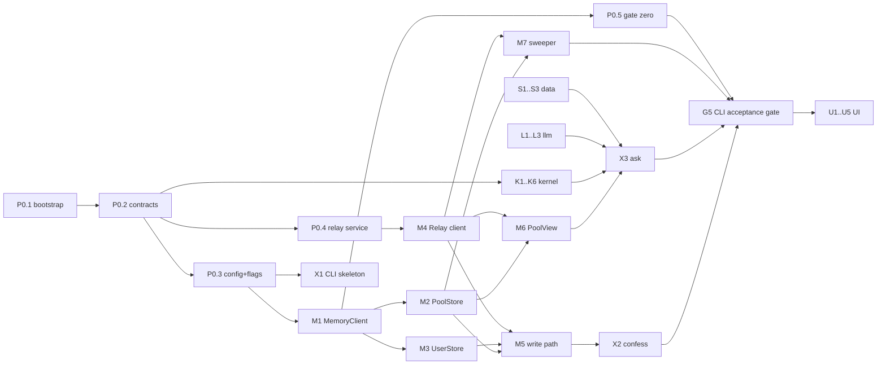

# Confit v0.8 — CLI-first task DAG

**Task breakdown for `docs/confit-design-v0.8.md` · July 25, 2026 · registered with `scripts/workstream-lock.mjs`**

**Audience:** the implementers, including implementers who have not read the design doc. Every task below states the files it owns, the interface it must satisfy, and the test that proves it. If a task's spec here disagrees with your memory of the design doc, the design doc wins — but say so in the task's `note` so the next agent sees it.

**Machine-readable seed:** `docs/confit-v0.8-tasks.seed.json`. Register with:

```bash
node scripts/workstream-lock.mjs add-tasks --seed docs/confit-v0.8-tasks.seed.json
node scripts/workstream-lock.mjs list-ready
```

Claim before you branch, per `docs/workstream-locks.md`.

---

## 0. What this DAG is, and how it differs from plan v1.0

Plan v1.0 (`docs/confit-implementation-plan.md`) cuts a 5-hour browser slice governed by design v0.3. This DAG cuts **design v0.8**, and it is **CLI-first**: every slice behaviour is reachable from a terminal before any UI exists. Three consequences:

1. **A pure core, a thin front end.** All domain logic lives in `src/kernel/**` (pure, no I/O) and `src/memory/**` (adapters). The CLI in `src/cli/**` is one of two front ends; the UI is the other, added last against the same core. No behaviour may live in a front end.
2. **Lane A, T0.3, C3 and the E-lane are gone**, replaced. Encryption and x-vec are retired by design v0.8 `[E9]`/`[E1]`; the embedder is off the spine; the UI moves behind the CLI.
3. **This is not a 5-hour scope.** 42 tasks, CLI plus UI. Section 6 marks the **CLI spine** — the subset that gets a working end-to-end terminal demo — so the schedule can be cut honestly rather than by surprise.

What survives from plan v1.0 unchanged, and should be copied rather than reinvented: the scoring formula (§3.4), the satiation model (§3.5), `KFLOOR = 5`, the near-tie invariant, the `Place`/`UsualProfile`/`MealLogEntry`/`Card`/`CohortStat` shapes (§3.1), and the relay's route shape (§8.4).

## 1. Engineering rules (apply to every task)

- **The kernel is pure.** `src/kernel/**` imports nothing from `src/memory/**`, `src/llm/**`, `src/cli/**`, `node:fs`, or the network. Pure functions of their arguments, deterministic, no clock reads — pass `now` in.
- **I/O lives behind an interface** declared in `src/contracts/**`. Every adapter has a local/fixture implementation used by tests, so the whole suite runs with no network and no API key.
- **TypeScript strict, no `any`, no non-null `!`.** Parse external input at the boundary and hand typed values inward.
- **No silent catch.** Either handle an error meaningfully or let it propagate. A degrade path is a handled error and must log which flag it flipped.
- **Every task ships tests in the same PR.** A task is not done because the code exists; it is done when its stated acceptance check passes.
- **One module, one file, one job.** If a file needs a section comment to explain its second responsibility, split it.
- **Only the integrator edits `src/contracts/**`** after P0.2 lands. Need a contract change? Open it as a note on your task and hand it to the integrator.

## 2. Lane and file ownership — exclusive, no exceptions

| Lane | `phase` | Owns |
| --- | --- | --- |
| Foundation / integrator | `P0` | `package.json`, `tsconfig.json`, `vitest.config.ts`, `src/contracts/**`, `src/config/**`, `infra/relay/**` |
| Kernel | `K` | `src/kernel/**` |
| Memory & transport | `M` | `src/memory/**` |
| LLM | `L` | `src/llm/**` |
| CLI | `X` | `src/cli/**` |
| Data & seeds | `S` | `data/**`, `scripts/seed/**` |
| Nudge | `N` | `src/nudge/**` |
| Guards & CI | `G` | `tests/guards/**`, `.github/workflows/**` |
| UI | `U` | `src/ui/**`, `index.html`, `vite.config.ts` |

Tests for a lane's own modules live beside them (`src/kernel/rotation.test.ts`). `tests/guards/**` is only for the cross-cutting guards in lane G.

## 3. Contract deltas from plan v1.0 §3.1 (P0.2 implements these)

**`Lesson` becomes `Read`, and it is exactly six fields** — design v0.8 `[E20]`, `[E25]`:

```ts
export interface Read {
  read_id: string;   // uuid v4, minted client-side at approval, no account linkage
  place: string;     // corpus slug
  signal: Signal;
  driver: Driver;
  cadence: Cadence;
  weight: number;    // 0..1 inclusive
}
```

Three differences from plan v1.0's `Lesson`, all deliberate:

- `id` → `read_id`, `placeId` → `place`, matching design v0.8 §7's schema verbatim.
- **`createdAt` is removed.** v0.8 `[E25]` closes the schema, and `[E26]` treats arrival ordering as something only the relay knows. A read carries no time at all.
- **The relay's `received_at` and any ingest handle are server-side metadata, never part of the read body.** A client that sends them fails the P0.4 route validator and the G1 guard. This is the single easiest mistake to make in this codebase.

`Signal`, `Driver`, `Cadence`, `Place`, `UsualProfile`, `MealLogEntry`, `CohortStat` and `Card` carry over from plan v1.0 §3.1 unchanged. `ProposedRead` replaces `ProposedLesson`: `{ chips: Omit<Read,'read_id'>; confidence: number }`.

**Flags** (`src/contracts/flags.ts`) — v0.8 §6, replacing plan v1.0 §3.3:

```ts
export interface Flags {
  extraction: 'live' | 'seeded';       // seeded = pre-computed chips
  narrator:   'live' | 'template';     // template = deterministic copy
  pool:       'live' | 'relay-only';   // relay-only = XTrace unavailable
  demoMode:   boolean;                 // pins context, makes Ask deterministic
}
```

**Retired:** `KeyService`, `Vault`, `Embedder`, `vaultBackend`, `potBackend`.

**Module interfaces** (`src/contracts/modules.ts`), each with a fixture stub at freeze:

| Module | Interface | Lane |
| --- | --- | --- |
| `MemoryClient` | `ingest(scope, payload) → JobHandle` · `search(scope, query, opts) → Rows` · `remove(scope, memoryId)` | M |
| `PoolStore` | `writeRead(read)` · `readsForDriver(driver, opts) → Read[]` | M |
| `UserStore` | `writeProse(profile, text)` · `usual(profile) → UsualProfile` · `mealLog(profile) → MealLogEntry[]` | M |
| `Relay` | `put(read, meta)` · `list(since?) → RelayEntry[]` · `drop(read_id)` · `stats()` · `seed(reads)` · `reset()` | M |
| `PoolView` | `readsForDriver(driver) → Read[]` — pool ∪ relay, deduped on `read_id` | M |
| `Extractor` | `propose(text, offLimits) → ProposedRead \| {blocked: true}` | L |
| `Narrator` | `write(ranked, facts) → CardCopy` | L |
| `Rotation` | `fit(log)` · `suppressions(log, now)` · `appetite(dish, now)` | K |
| `Cohorts` | `census(reads) → CohortStat[]` · `matched(usual, reads, kFloor)` | K |
| `AskEngine` | `ask(input) → Card` — pure over (reads, usual, log, corpus, flags, now) | K |
| `Nudge` | `arm()` · `maybeFire(now)` · `silenceForever()` | N |

## 4. Decisions this DAG had to make (integrator: confirm or overrule)

Design v0.8 leaves three things underspecified that a junior implementer cannot resolve alone. Recorded here rather than guessed silently in code.

**D-1 — How the sweeper verifies a read, when the author's session is gone.** `[E21]` gives The Pass the sweeper but not a verification handle. Searching the pool scope for a UUID is not a reliable retrieval query. **Recommendation:** the relay stores an opaque `ingest_job_id` as server-side metadata alongside `received_at`, so any client can poll the job. It carries no account linkage, and it is metadata, not part of the read body (§3 above). **Fallback if job handles are not readable cross-session:** verify by `readsForDriver(read.driver)` and check for the `read_id`, accepting that this is weaker. M7 owns the decision; record the outcome in `src/memory/README.md`.

**D-2 — Exact XTrace endpoint paths and payloads.** The design doc names `DELETE /v1/memories/{id}` and `POST /v1/memories/trigger` and nothing else. M1 confirms ingest/search against the live API and records what it found in `src/memory/README.md`. Everything downstream depends only on the `MemoryClient` interface, so a surprise there costs one task, not the build.

**D-3 — Gate zero has not been run.** Design v0.8 §11 blocks build day on it. P0.5 is the runner; running it needs live credentials. If it fails, the sole-store decision `[E9]` reopens and this DAG changes shape — so P0.5 is sequenced as early as M1 allows, and G5 will not pass without a recorded gate-zero result.

## 5. The CLI surface (what "done" looks like from a terminal)

Every slice goal in design v0.8 §4 is reachable here. `--json` on every command for tests; human-readable by default.

```
confit confess --profile A --text "..."      # chips preview → confirm → 3 writes
confit confess --profile A --text "..." --yes # non-interactive, for tests
confit ask --profile B                        # prints the card
confit sweep [--once|--watch]                 # settle-sweeper (E21)
confit forget <read_id>                       # both scopes + relay purge
confit pass census                            # per-driver k, floor status
confit pass seed | reset                      # seed corpus/pool, reset
confit pass flags [--set narrator=template]   # degrade flags
confit pass neartie                           # score spread + judge-read delta
confit pass nudge --arm                       # arm the nudge
confit gate0                                  # §11 gate-zero protocol
```

## 6. The DAG

**Wave 1 (no dependencies):** `P0.1` only. `X2` and `X3` are `mock_start_ok`, so `list-ready` shows them immediately — the tool skips *every* dependency check for mock-start tasks and cannot express "ready once contracts land." **Do not claim them before `P0.2` has merged**; their notes say so.
**CLI spine** — the shortest path to an end-to-end terminal demo, in order:
`P0.1 → P0.2 → P0.3 → P0.4 → M1 → {M2, M3, M4} → M5 → M6 → X1 → X2 → X3`, with `K1 K2 K3 K4 K6 L1 L2 L3 S1 S2 S3` feeding in. Everything else — `M7 M8 X4 X5 X6 N1 G1–G5` — hardens it; `U1–U5` comes after `G5` is green.



## 7. Task specs

Format: **Owns** (files you may touch) · **Depends** · **Build** · **Acceptance** (the check that closes the task).

### Lane P0 — foundation (integrator)

**P0.1 — Repo bootstrap, CLI-shaped**
- **Owns:** `package.json`, `tsconfig.json`, `vitest.config.ts`, `.gitignore`, `src/index.ts`
- **Depends:** —
- **Build:** Node 20, TypeScript strict (`strict`, `noUncheckedIndexedAccess`, `exactOptionalPropertyTypes`), `vitest`, `tsx`. Scripts: `build`, `test`, `typecheck`, `lint`, `confit` (→ `tsx src/cli/main.ts`). **No Vite, React, or Tailwind yet** — the UI lane adds them at U1.
- **Acceptance:** `npm run typecheck && npm test` passes on an empty suite; `npm run confit -- --help` exits 0.

**P0.2 — Contracts freeze v0.8**
- **Owns:** `src/contracts/**`, `src/contracts/fixtures/**`
- **Depends:** P0.1
- **Build:** §3 of this doc — `types.ts` (incl. `Read`), `flags.ts`, `modules.ts`, plus a working fixture stub for every interface in the §3 table. Stubs must be usable: `PoolView` serves `fixtures/pool-baseline.json`, `Narrator` returns template copy, `Extractor` keyword-matches six canned confessions.
- **Acceptance:** a test constructs every stub and calls every method; `Read` has exactly six keys asserted by a test over `Object.keys`. **After this merges the file set is frozen** — integrator only.

**P0.3 — Runtime config, degrade flags, logger**
- **Owns:** `src/config/**`
- **Depends:** P0.2
- **Build:** load `ANTHROPIC_API_KEY`, XTrace base URL + key, relay URL + token from env with a typed, fail-fast parse (missing var → clear error naming the var). Flag store readable and settable at runtime, defaulting to all-`live`, `demoMode: false`. A logger that records every degrade transition as one line: `flag extraction live→seeded reason=<...>`.
- **Acceptance:** unit test: missing env var produces an error naming it; setting a flag emits exactly one log line.

**P0.4 — Relay service**
- **Owns:** `infra/relay/**`
- **Depends:** P0.2
- **Build:** the six routes from design v0.8 §6 — `POST /reads`, `GET /reads?since=`, `DELETE /reads/{read_id}`, `GET /stats`, `POST /seed`, `POST /reset`. Write token required on all mutations; reads open. **`POST /reads` validates the body against the exact six-field schema and rejects anything else with 400** — extra keys included. Server assigns `received_at` and stores any `ingest_job_id` from D-1 as metadata *outside* the read object. `GET /stats` returns `{count, oldest_unverified_age_seconds}`. In-memory store plus periodic JSON dump is fine.
- **Acceptance:** `infra/relay/relay.test.ts` covers: valid read → 201; read with a seventh key → 400; read with `received_at` in the body → 400; missing token on write → 401; `DELETE` of an unknown `read_id` → 404; `oldest_unverified_age_seconds` grows with a stale entry. Plus a documented two-machine curl round-trip.

**P0.5 — Gate zero runner (`confit gate0`)**
- **Owns:** `src/cli/gate0.ts`, `docs/gate0-results.md`
- **Depends:** M1, X1
- **Build:** design v0.8 §11 exactly — ingest N=12 reads to a scratch `user_id`; poll each to retrievable or 2× settle window; re-ingest anything missing, max 2 rounds; **pass = all 12 retrievable within two rounds**; print the rounds-to-retrievable distribution; then one `DELETE` + verify-gone against a settled read in both scopes. Write the run to `docs/gate0-results.md` with a timestamp and verdict.
- **Acceptance:** runs against a fake `MemoryClient` in tests, covering a pass, a fail-at-round-3, and a delete that leaves the read retrievable (must fail). A real run recorded in `docs/gate0-results.md` is required before G5 can pass.
- **Note:** blocks build day. If it fails, stop and escalate — `[E9]` reopens.

### Lane K — kernel (pure)

**K1 — Read validator and `mintReadId`**
- **Owns:** `src/kernel/read.ts`, `src/kernel/read.test.ts`
- **Depends:** P0.2
- **Build:** `mintReadId()` → `crypto.randomUUID()`. `parseRead(unknown) → Read` throwing a message that names the offending field; closed to extra properties; `signal`/`driver`/`cadence` checked against the contract enums; `weight` a finite number in `[0,1]`. Export `READ_KEYS` as the single source of truth for the six field names — G1 and P0.4 both consume it.
- **Acceptance:** table-driven tests: each enum rejects one bad value; extra key rejected; `weight` of `-0`, `1.0000001`, `NaN`, `"0.5"` rejected; a valid read round-trips unchanged.

**K2 — Off-limits matcher**
- **Owns:** `src/kernel/offlimits.ts` + test
- **Depends:** P0.2
- **Build:** `isBlocked(text: string, topics: string[]) → boolean` — case-insensitive, whole-word, accent-insensitive matching of free-text topics. Deliberately conservative: a match blocks. This is the gate that stops a flagged confession being ingested **anywhere** (`[E24]`), so a false negative is a duty-of-care failure and a false positive is a minor annoyance — tune accordingly and say so in a comment.
- **Acceptance:** tests for case/accent/plural variation, substring non-matches (`"gluten"` must not fire on `"glutenous"` — document the choice either way), and empty-topics → never blocked.

**K3 — Rotation**
- **Owns:** `src/kernel/rotation.ts` + test
- **Depends:** P0.2
- **Build:** plan v1.0 §3.5 verbatim — `appetite(d, t) = 100·(1 − 2^(−Δdays/halfLife(d)))`, recommend above 60. Fit half-life per dish from repeat intervals when there are ≥3 observations, else inherit the seeded median for that dish. `suppressions(log, now)` returns dish ids plus a **reason key** (not prose — copy comes from the linted template catalog in L1).
- **Acceptance:** a dish eaten twice in seven days is suppressed; appetite is monotonically increasing in Δdays; a dish with 2 observations uses the seeded median (assert it does not throw).

**K4 — Ask scoring**
- **Owns:** `src/kernel/score.ts`, `src/kernel/constants.ts` + test
- **Depends:** P0.2
- **Build:** plan v1.0 §3.4 verbatim, including the polarity table and the `0.40/0.25/0.20/0.15` weights. All tunable constants in `constants.ts` — including `KFLOOR = 5`. Pure: `(reads, usual, log, corpus, context) → Array<{place, score, parts}>`, stable sort with a documented tie-break (slug ascending) so runs are reproducible. Hard-constraint filtering (gi, allergy, budget > band+1) happens here.
- **Acceptance:** a fixture case asserts an exact score to 4 decimals; reordering the input corpus does not change output order; a place violating an allergy constraint never appears.

**K5 — Copy linter**
- **Owns:** `src/kernel/copylint.ts`, `src/kernel/lexicon.ts` + test
- **Depends:** P0.2
- **Build:** `lint(text) → {ok: true} | {ok: false, hits: string[]}` over the banned lexicon from design v0.8 §9 — quantity, weight, calories, "progress", streaks, scores, daily totals. Lexicon is data in its own file so lane G can extend it without touching logic.
- **Acceptance:** every banned term is caught in a realistic sentence; a clean card string passes; the test asserts `hits` names the term.

**K6 — Cohort counting**
- **Owns:** `src/kernel/cohorts.ts` + test
- **Depends:** P0.2
- **Build:** `census(reads) → CohortStat[]` and `matched(usual, reads, kFloor = KFLOOR)`. **Dedup on `read_id` before counting** (`[E20]`) — the same read arrives from both the pool and the relay. Two distinct reads with identical other fields are two cohort members and must **not** be merged. A cohort below `kFloor` is never returned as citable; it is returned as a `cohortMiss` candidate instead.
- **Acceptance:** the case that motivated `[E20]` — four reads plus one duplicate of one of them must **not** satisfy k≥5; five reads with identical `place`/`signal`/`driver` but distinct `read_id`s **must**.

### Lane M — memory and transport

**M1 — `MemoryClient` over XTrace**
- **Owns:** `src/memory/client.ts`, `src/memory/README.md` + test
- **Depends:** P0.2, P0.3
- **Build:** typed client for ingest, search and delete. Non-negotiable, all from design v0.8 §6/§14: **always pass `user_id`** (omitting it searches app-wide — make it a required parameter, not an option); **reserve episode slots explicitly** in search, because facts are returned before episodes and a flat top-k drops them all; ingest returns a handle the caller can poll. Resolve D-2 and write the confirmed endpoints into `src/memory/README.md`.
- **Acceptance:** unit tests against a mock transport assert `user_id` is present on every request and that search requests carry an explicit episode-slot reservation. Type-level: no overload permits omitting the scope.

**M2 — `PoolStore`**
- **Owns:** `src/memory/pool.ts` + test
- **Depends:** M1, K1
- **Build:** `writeRead(read)` to `user_id: "confit:pool"`, embedding `read_id` in the record content. `readsForDriver(driver, opts)` implements design v0.8 §8's **counting query**: scoped to one driver, `k` from `constants.ts` set above the largest seeded cohort by a clear margin, parsed back through `parseRead`. Induction queries are a separate method (`inducedClaim(query)`) and may stay top-k.
- **Acceptance:** tests assert the counting query is per-driver and passes the configured `k`; a malformed row from the substrate is skipped with a logged warning rather than crashing the Ask.

**M3 — `UserStore`**
- **Owns:** `src/memory/user.ts` + test
- **Depends:** M1
- **Build:** `writeProse(profile, text)` ingests the confession as **raw prose, unmodified** (`[E11]` — no pre-cleaning, no pre-structuring; a comment should say why, citing §14). `usual(profile)` and `mealLog(profile)` read the personal tier. Per design v0.8 §6, prose verify-and-retry holds the text in memory until confirmed and **dies with the process** — acceptable for the personal tier; log a warning when it is dropped unconfirmed.
- **Acceptance:** a test asserts the ingested payload is byte-identical to the input text; a test asserts the unconfirmed-drop warning fires.

**M4 — `Relay` client**
- **Owns:** `src/memory/relay.ts` + test
- **Depends:** P0.3, P0.4, K1
- **Build:** typed client for the six routes. Validates through `parseRead` **before** sending, so a bad body never reaches the wire. Bounded retry with backoff on 5xx/network; never retries a 4xx. `list()` parses entries into `{read, received_at, ingest_job_id?}`.
- **Acceptance:** tests against a local instance of P0.4: round-trip, `drop` removes, `list(since)` filters, a read carrying an extra key is rejected client-side without a request being made.

**M5 — Approval write path**
- **Owns:** `src/memory/writeRead.ts` + test
- **Depends:** M2, M3, M4, K1, K2
- **Build:** the single function every front end calls on **Add to the pot**. In order: (1) `isBlocked` → if blocked, **write nothing anywhere** and return `{blocked: true}` (`[E24]` — this is the §9 fix, and it covers the prose too); (2) `mintReadId`; (3) `parseRead`; (4) three writes — user-scope prose, pool-scope read, relay. Relay write must succeed for the read to count as pooled, since it is what makes the read visible cross-device; a failed XTrace write is reported but does not lose the read, because the relay is the re-ingest source (`[E21]`). Return `{read_id, wrote: {...}}` so callers can report honestly.
- **Acceptance:** blocked topic → zero calls to all three stores (assert with mocks); relay failure → the call reports failure rather than claiming pooled; pool failure → returns success with a recorded warning and the relay entry present.

**M6 — `PoolView` (union, deduped)**
- **Owns:** `src/memory/poolView.ts` + test
- **Depends:** M2, M4
- **Build:** `readsForDriver(driver)` = `PoolStore.readsForDriver(driver)` ∪ relay reads for that driver, deduplicated on `read_id` (`[E20]`), feeding K6. Under `flags.pool === 'relay-only'` it serves the pre-seeded induction set plus live relay contents and marks the result `degraded: true` so the card can disclose it.
- **Acceptance:** a read present in both sources appears once; two distinct reads with identical fields appear twice; `relay-only` returns `degraded: true`.

**M7 — Settle-sweeper**
- **Owns:** `src/memory/sweeper.ts` + test
- **Depends:** M2, M4
- **Build:** `sweepOnce(now) → SweepReport`. For each relay entry older than the settle window: verify (per D-1); retrievable → `Relay.drop(read_id)`; **not** retrievable → re-ingest to the pool **from the relay entry's own six fields** and leave the entry for the next pass. **Verified-drop only — never a TTL** (`[E21]`): an entry must never be dropped unverified, because that is the silent loss `[E12]` exists to prevent. Report counts plus `oldest_unverified_age`.
- **Acceptance:** an entry that verifies is dropped; one that does not is re-ingested and retained; an entry older than any conceivable TTL is still **not** dropped while unverified (this test is the whole point of the task); the sweeper is idempotent across two consecutive runs.

**M8 — Deletion by `read_id`**
- **Owns:** `src/memory/forget.ts` + test
- **Depends:** M2, M3, M4
- **Build:** `forget(read_id)` → delete from the pool scope, the user scope, and the relay (design v0.8 §7). Partial failure returns a per-target report; the caller must be able to tell the user exactly what is gone. Copy guidance for front ends: "deleted from Confit" — never imply cryptographic enforcement.
- **Acceptance:** all three targets called; a relay-only failure is reported as such; deleting an unknown `read_id` is not an error.

### Lane L — LLM

**L1 — Template narrator and copy catalog**
- **Owns:** `src/llm/template.ts`, `src/llm/catalog.ts` + test
- **Depends:** P0.2, K5
- **Build:** deterministic card copy from facts alone — reason line, rotation line, usual line, cohort-miss line — as a catalog of templates keyed by reason key (K3 emits those keys). This is both the `narrator: template` degrade path and the fixture the whole suite narrates with, so it lands before the live narrator.
- **Acceptance:** every template passes K5's linter (assert in a test that iterates the catalog); the same inputs produce byte-identical copy across runs.

**L2 — Chip preview (`claude-haiku-4-5`)**
- **Owns:** `src/llm/extractor.ts` + test
- **Depends:** P0.3, K2
- **Build:** `propose(text, offLimits)` — structured output against the `Omit<Read,'read_id'>` schema. `isBlocked` runs **before** the call (don't send a flagged confession anywhere) and the result is re-checked after. One retry on schema-invalid output, then flip `extraction: seeded` and serve the canned proposal. UI-only per design v0.8 §6 — nothing downstream may depend on this output being correct, only on it being schema-valid.
- **Acceptance:** tests with a mocked client: valid output parses; invalid output retries once then degrades with one log line; a blocked topic returns `{blocked: true}` with **zero** model calls.

**L3 — Live narrator (`claude-sonnet-5`)**
- **Owns:** `src/llm/narrator.ts` + test
- **Depends:** L1, K5, P0.3
- **Build:** `write(ranked, facts)` with a facts-only prompt and a strict choose-from-corpus contract — the model never introduces a venue or dish not in the provided candidates. Output passes K5's linter; a hit triggers exactly one regenerate, then falls back to L1's template. Never cites a cohort below `KFLOOR` and never receives confession prose in the prompt.
- **Acceptance:** a mocked response naming an off-corpus venue is rejected; a response with a banned term regenerates once then templates; a test asserts the prompt payload contains no prose field.

### Lane X — CLI

**X1 — CLI skeleton**
- **Owns:** `src/cli/main.ts`, `src/cli/args.ts`, `src/cli/render.ts` + test
- **Depends:** P0.1, P0.3
- **Build:** subcommand dispatch for §5's surface, `--profile`, `--json`, `--yes`, `--help`. Exit codes: `0` success, `1` expected failure (blocked topic, cohort miss is *not* a failure), `2` usage error, `3` config/connectivity error. Rendering is separate from logic — every command returns a plain object that `render.ts` prints as text or JSON. No business logic in this lane.
- **Acceptance:** `--help` lists every command; unknown command exits 2; `--json` output parses as JSON for every command (once they exist).

**X2 — `confit confess`**
- **Owns:** `src/cli/confess.ts` + test · **mock-start OK**
- **Depends:** X1, L2, M5
- **Build:** text → `Extractor.propose` → print the five chips → confirm (`--yes` skips) → `writeRead`. Prints `read_id` and per-target write status. Blocked topic prints the plain refusal and exits 1 with nothing written. **Consent copy** (`[E27]`): state both halves before writing — the words go to the user's private Confit memory, only the five fields go to the pot.
- **Acceptance:** end-to-end against fixture stores: chips printed, `read_id` returned, three writes recorded; `--yes` with a blocked topic writes nothing; the consent sentence appears in output (assert on the string, so it cannot be dropped silently).

**X3 — `confit ask`**
- **Owns:** `src/cli/ask.ts` + test · **mock-start OK**
- **Depends:** X1, M3, M6, K3, K4, K6, L3, S1
- **Build:** assemble the card — candidates from the corpus, reads from `PoolView`, cohort counts from K6, suppressions from K3, scores from K4, copy from L3. Print pick, reason line, cohort citation `{driver, k}` or the cohort-miss line, rotation and usual lines, runners-up with scores. Never print a confession, never a cohort below `KFLOOR`.
- **Acceptance:** with the S2 seed and profile B fixtures, the card names a pick and cites a cohort with k≥5; forcing a driver with k=4 renders the cohort-miss line instead; `--json` includes the full score map.

**X4 — `confit sweep`**
- **Owns:** `src/cli/sweep.ts` + test
- **Depends:** X1, M7
- **Build:** `--once` (default) runs one sweep and prints the report; `--watch` loops on an interval from config. This is the operator-run sweeper of `[E21]` — the command that must work when the author's session is gone.
- **Acceptance:** report prints verified/re-ingested/retained counts and `oldest_unverified_age`; `--watch` is interruptible and exits 0.

**X5 — `confit forget`**
- **Owns:** `src/cli/forget.ts` + test
- **Depends:** X1, M8
- **Build:** `forget <read_id>`, printing per-target results in the "deleted from Confit" register.
- **Acceptance:** all three targets reported; a partial failure exits 1 and names the target that failed.

**X6 — `confit pass`**
- **Owns:** `src/cli/pass.ts` + test
- **Depends:** X1, K6, M6, S3, N1
- **Build:** `census` (per-driver k, floor status, and the seed-manifest cross-check from design v0.8 §8 — flag any driver whose counted total differs from the manifest), `seed`, `reset`, `flags [--set k=v]`, `neartie` (print `score(top1) − score(top3)` and the delta a judge read would apply), `nudge --arm`.
- **Acceptance:** `census --json` lists every driver with `k` and `citable`; a deliberately shrunk `k` in `constants.ts` makes the cross-check fail loudly (this is the `[E22]` guard working); `neartie` prints both numbers.

### Lane S — data and seeds

**S1 — Corpus**
- **Owns:** `data/places.json`, `scripts/seed/validate-corpus.ts` + test
- **Depends:** P0.2
- **Build:** 40 hand-picked places against the `Place` schema, tuned for the demo city, with signature dishes and spice levels. A validator script that fails on schema violation, duplicate slug, or a signature dish referenced nowhere.
- **Acceptance:** validator passes on the corpus and fails on a deliberately broken fixture; exactly 40 entries; all slugs unique.

**S2 — Seed generator**
- **Owns:** `scripts/seed/gen-seeds.ts`, `data/seeds/**` + test
- **Depends:** S1, K1, K4
- **Build:** generate 220 reads with **every demo-relevant driver at k ∈ [5,9] across distinct places** (design v0.8 §7 — a judge's read must join a cohort, not create one), tuned so profile B's ranking sits near-tied: `score(top1) − score(top3) ≤ 0.04` and a judge read (any demo driver, weight ≥ 0.7) shifts ≥ 0.05. Deterministic from a seeded PRNG — no `Math.random()` without a fixed seed. Emit `data/seeds/manifest.json` with per-driver counts; X6 and G4 both consume it.
- **Acceptance:** generated set re-generates byte-identical from the same seed; every demo driver has 5 ≤ k ≤ 9 across ≥5 distinct places; the near-tie inequality holds against K4.

**S3 — Seed loader**
- **Owns:** `scripts/seed/load-seeds.ts` + test
- **Depends:** S2, M2, M4
- **Build:** push the generated reads to the XTrace pool scope and the relay, idempotently (re-running must not double-count — key on `read_id`). Print a progress line per batch and a final count. Design v0.8 §11 requires seeding **hours ahead** of a demo because induction operates over the pool; the loader should say so when it finishes, with the measured settle window.
- **Acceptance:** loading twice yields the same census (assert via K6); a partial failure is reported with the `read_id`s that did not land.

### Lane N — nudge

**N1 — Nudge rules**
- **Owns:** `src/nudge/**`
- **Depends:** P0.2
- **Build:** opt-in, **default off**; fires at most once per calendar day; `silenceForever()` is permanent and one call; `arm()` for demo control. Pure rules over an injected `now` and a small persisted state — no timers in this module. Copy comes from L1's catalog, never a model.
- **Acceptance:** never fires when opted out; fires once then not again the same day; after `silenceForever` never fires regardless of `arm`.

### Lane G — guards and CI

**G1 — Pool-write schema guard**
- **Owns:** `tests/guards/poolWrite.test.ts`, `src/memory/guard.ts`
- **Depends:** K1, M5
- **Build:** design v0.8 `[E25]` — an interceptor around every pool-bound and relay-bound write asserting the body is **exactly** the six-field read schema (`READ_KEYS` from K1), closed to additional properties, enums respected. This replaces v0.7's "detect narrative text", which CI cannot evaluate. Anything else throws, and the guard is on in production code, not just tests.
- **Acceptance:** a write carrying prose, a profile `user_id`, or a seventh key fails; the legitimate `writeRead` path passes; the guard is proven active by a test that bypasses `writeRead` and still gets stopped.

**G2 — Off-limits propagation test**
- **Owns:** `tests/guards/offLimits.test.ts`
- **Depends:** K2, M5
- **Build:** design v0.8 `[E24]` — mark a topic off-limits, submit a confession containing it, and assert **zero new records in both tiers**: no pool read, no relay entry, **and no user-scope prose**. v0.7's version checked only the pool, which is exactly how the §9 violation survived a review cycle; the test must fail if someone re-introduces the prose write.
- **Acceptance:** the test fails when `writeRead`'s block check is removed from either the pool path or the prose path — verify by temporarily breaking each and confirming a red test.

**G3 — Copy-linter regression**
- **Owns:** `tests/guards/copy.test.ts`
- **Depends:** K5, L1, L3
- **Build:** iterate every template in L1's catalog and every canned narrator fixture through K5. Add a case per banned lexicon entry so a future lexicon addition without a corresponding fix fails.
- **Acceptance:** all catalog strings clean; a deliberately inserted "you're on a 3-day streak" fails.

**G4 — Near-tie and cohort-count invariants**
- **Owns:** `tests/guards/neartie.test.ts`, `tests/guards/cohortCount.test.ts`
- **Depends:** K4, K6, S2
- **Build:** the near-tie invariant asserted against the **actual seed file**, not a fixture (plan v1.0 §3.4: the demo's climax is CI-protected). Plus the `[E22]` cross-check: counted per-driver totals must equal the S2 manifest, so a `k` sized for the seed but not for seed-plus-live reads fails here rather than on stage.
- **Acceptance:** both pass on the committed seed; shrinking the counting `k` below the largest cohort makes the cross-check fail.

**G5 — CI wiring and the CLI acceptance gate**
- **Owns:** `.github/workflows/ci.yml`, `scripts/gate-cli.sh`
- **Depends:** G1, G2, G3, G4, X2, X3, X4, X5, X6, P0.5
- **Build:** `npm run gate:cli` — typecheck, full test suite, then a scripted end-to-end run against fixture stores: seed → confess (A) → ask (B) and assert the cohort citation moved → sweep → forget → census. Fails if `docs/gate0-results.md` has no recorded pass (D-3). CI runs it on every push.
- **Acceptance:** green on a clean checkout with no network and no API key; removing the gate-zero record turns it red.

### Lane U — UI (only after G5 is green)

**U1 — Vite + React shell**
- **Owns:** `vite.config.ts`, `index.html`, `src/ui/app.tsx`, `src/ui/routes.tsx`, design tokens
- **Depends:** G5
- **Build:** add Vite, React 18, Tailwind. Routes `/confess`, `/ask`, `/settings`, `/pass`. **The UI imports the same core the CLI uses** and adds no domain logic; if a screen needs behaviour the CLI cannot do, that behaviour belongs in a kernel or memory task first.
- **Acceptance:** `npm run build` succeeds; a smoke test renders each route; a lint rule or test asserts `src/ui/**` imports no `node:*` module.

**U2 — Confess screen** · **Depends:** U1, X2 — textarea → editable/strikeable chips → **Add to the pot**, calling the same `writeRead`. Blocked-topic state. `[E27]` consent copy visible before the button. **Acceptance:** blocked topic shows the refusal and issues no writes; the consent copy is asserted in a render test.

**U3 — Ask card** · **Depends:** U1, X3 — pick, reason line, cohort citation, rotation and usual lines, cohort-miss variant, runners-up. **Acceptance:** each variant renders from a fixture card; no confession text can reach the DOM (assert on the cohort-miss and citation paths).

**U4 — Settings and nudge surface** · **Depends:** U1, N1, K2 — off-limits editor, nudge opt-in, quiet banner with dismiss and silence-forever. **Acceptance:** adding a topic blocks a subsequent confess in an integration test; the banner cannot appear twice in one day.

**U5 — The Pass panel** · **Depends:** U1, X6 — census table, near-tie inspector, seed/reset, flag toggles, sweeper status with `oldest_unverified_age`. **Acceptance:** every action maps to an existing `confit pass` operation — the panel is a view over the CLI, not a second implementation.

## 8. Honest notes on this breakdown

- **42 tasks is not five hours.** The CLI-first constraint adds a front end rather than replacing one, and design v0.8 added the sweeper, the counting query and the guards. §6's CLI spine is the honest minimum for a working end-to-end demo; the UI lane is a separate day.
- **Gate zero still gates everything** (D-3). If it fails, `M7`, `M5` and the `[E9]` sole-store decision all change, and this DAG needs re-cutting. Run `P0.5` the moment `M1` merges.
- **Three specification decisions were made here, not in the design doc** (§4). D-1 in particular invents relay-side metadata; the integrator should confirm or overrule it before `M7` is claimed.
- **Plan v1.0 is still governed by design v0.3** and its registry still holds the v0.3 lanes. This DAG uses non-colliding ids (`P0.x`, `K`, `M`, `L`, `X`, `S`, `N`, `G`, `U`), so both can sit in one registry while the old tasks are retired deliberately rather than by a destructive reseed.
