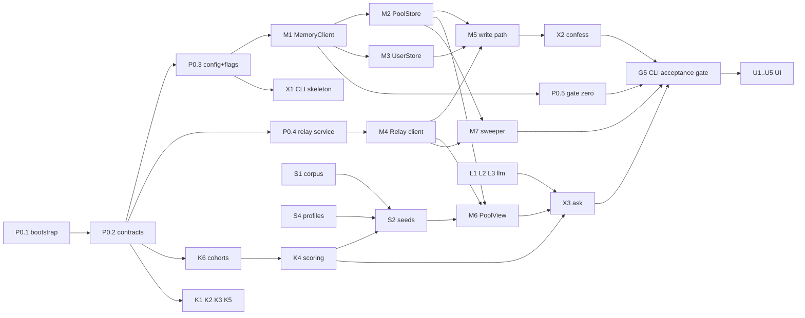

# Confit v0.8 — CLI-first task DAG

**Task breakdown for `docs/confit-design-v0.8.md` · July 25, 2026 · registered with `scripts/workstream-lock.mjs`**

**Audience:** the implementers, including implementers who have not read the design doc. Every task below states the files it owns, the interface it must satisfy, and the test that proves it. If a task's spec here disagrees with your memory of the design doc, the design doc wins — but say so in the task's `note` so the next agent sees it.

**Machine-readable seed:** `docs/confit-v0.8-tasks.seed.json`. The registry holds this DAG and nothing else:

```bash
node scripts/workstream-lock.mjs list-ready
```

Claim before you branch, per `docs/workstream-locks.md`.

---

## 0. What this DAG is, and how it differs from plan v1.0

Plan v1.0 (`docs/confit-implementation-plan.md`) cuts a 5-hour browser slice governed by design v0.3. This DAG cuts **design v0.8**, and it is **CLI-first**: every slice behaviour is reachable from a terminal before any UI exists. Three consequences:

1. **A pure core, a thin front end.** All domain logic lives in `src/kernel/**` (pure, no I/O) and `src/memory/**` (adapters). The CLI in `src/cli/**` is one of two front ends; the UI is the other, added last against the same core. No behaviour may live in a front end.
2. **Lane A, T0.3, C3 and the E-lane are gone**, replaced. Encryption and x-vec are retired by design v0.8 `[E9]`/`[E1]`; the embedder is off the spine; the UI moves behind the CLI.
3. **This is not a 5-hour scope.** 44 tasks, CLI plus UI. Section 6 marks the **CLI spine** — the subset that gets a working end-to-end terminal demo — so the schedule can be cut honestly rather than by surprise.

What survives from plan v1.0 unchanged, and should be copied rather than reinvented: the scoring formula (§3.4), the satiation model (§3.5), `KFLOOR = 5`, the near-tie invariant, the `Place`/`UsualProfile`/`MealLogEntry`/`Card`/`CohortStat` shapes (§3.1), and the relay's route shape (§8.4).

The v0.3-era task registry (`docs/confit-tasks.seed.json`, 32 tasks across lanes A–F) has been **wiped**. That seed file is retained for historical reference only and must not be re-registered.

## 1. Engineering rules (apply to every task)

- **The kernel is pure.** `src/kernel/**` imports nothing from `src/memory/**`, `src/llm/**`, `src/cli/**`, `node:fs`, or the network. Pure functions of their arguments, deterministic, no clock reads — pass `now` in.
- **I/O lives behind an interface** declared in `src/contracts/**`. Every adapter has a local/fixture implementation used by tests, so the whole suite runs with no network and no API key.
- **TypeScript strict, no `any`, no non-null `!`.** Parse external input at the boundary and hand typed values inward.
- **No silent catch.** Either handle an error meaningfully or let it propagate. A degrade path is a handled error and must log which flag it flipped.
- **Every task ships tests in the same PR.** A task is not done because the code exists; it is done when its stated acceptance check passes.
- **One module, one file, one job.** If a file needs a section comment to explain its second responsibility, split it.
- **Only the integrator edits `src/contracts/**`** after P0.2 lands. Need a contract change? Open it as a note on your task and hand it to the integrator.

## 2. Lane and file ownership — exclusive, no exceptions

Every path below is owned by exactly one lane. If your task needs a file outside your lane's list, that is a contract change: raise it, don't take it.

| Lane | `phase` | Owns |
| --- | --- | --- |
| Foundation / integrator | `P0` | `package.json`, `package-lock.json`, `tsconfig.json`, `vitest.config.ts`, `eslint.config.js`, `.gitignore`, `src/index.ts`, `src/contracts/**`, `src/config/**`, `infra/relay/**`, `scripts/gate0.ts` |
| Kernel | `K` | `src/kernel/**` |
| Memory & transport | `M` | `src/memory/**` |
| LLM | `L` | `src/llm/**` |
| CLI | `X` | `src/cli/**` |
| Data & seeds | `S` | `data/**`, `scripts/seed/**` |
| Nudge | `N` | `src/nudge/**` |
| Guards & CI | `G` | `tests/guards/**`, `.github/workflows/**`, `scripts/gate-cli.sh` |
| UI | `U` | `src/ui/**`, `index.html`, `vite.config.ts`, `tailwind.config.ts` |

Tests for a lane's own modules live beside them (`src/kernel/rotation.test.ts`). `tests/guards/**` is only for the cross-cutting guards in lane G. Nothing outside this table may be created without the integrator adding a row.

**Adding a dependency is an integrator change.** `package.json` and `package-lock.json` belong to lane P0, so a task that needs a new package — `U1` adding React and Vite is the obvious one — does not edit them itself. Ask the integrator, who adds the dependency and pushes the lockfile. This keeps one agent responsible for the lockfile and stops two lanes racing on it.

**One import convention, imposed by the toolchain.** `module: NodeNext` with `verbatimModuleSyntax` and `"type": "module"` means **relative imports carry a `.js` extension even though the source is `.ts`** — `import { parseRead } from './read.js'`. That is Node's ESM resolution, not a quirk to work around; `tsx` and `vitest` both honour it. Bare package imports are unaffected.

**Within a lane, tasks own disjoint paths too.** A lane's globs stop two lanes colliding; they do not stop two tasks in the same lane colliding, and several lanes run their tasks in parallel. Every task's **Owns** list below is exclusive against every other task's — check yours before you create a file. Lane U is where this matters most: `U2`–`U5` all land in the same wave, so each owns its own subdirectory and only `U1` touches the shell.

## 3. Contract deltas from plan v1.0 §3.1 (P0.2 implements these)

**`Lesson` becomes `Read`, and it is exactly six fields** — design v0.8 `[E20]`, `[E25]`:

```ts
export const READ_KEYS = ['read_id','place','signal','driver','cadence','weight'] as const;

export interface Read {
  read_id: string;   // uuid v4, minted client-side at approval, no account linkage
  place: string;     // corpus slug
  signal: Signal;
  driver: Driver;
  cadence: Cadence;
  weight: number;    // 0..1 inclusive
}
```

`READ_KEYS` lives in `src/contracts/types.ts` and is **the single source of truth for the six field names**. K1's validator, P0.4's route validator and G1's guard all consume it; none of them re-declares the list.

Three differences from plan v1.0's `Lesson`, all deliberate:

- `id` → `read_id`, `placeId` → `place`, matching design v0.8 §7's schema verbatim.
- **`createdAt` is removed.** v0.8 `[E25]` closes the schema, and `[E26]` treats arrival ordering as something only the relay knows. A read carries no time at all.
- **The relay's `received_at` and `ingest_job_id` are server-side metadata, never part of the read body.** A client that sends them fails the P0.4 route validator and the G1 guard. This is the single easiest mistake to make in this codebase.

`Signal`, `Driver`, `Cadence`, `Place`, `UsualProfile`, `MealLogEntry`, `CohortStat` and `Card` carry over from plan v1.0 §3.1 unchanged. `ProposedRead` replaces `ProposedLesson`: `{ chips: Omit<Read,'read_id'>; confidence: number }`.

**Flags** (`src/contracts/flags.ts`) — v0.8 §6, replacing plan v1.0 §3.3:

```ts
export interface Flags {
  extraction: 'live' | 'seeded';       // seeded = pre-computed chips
  narrator:   'live' | 'template';     // template = deterministic copy
  pool:       'live' | 'relay-only';   // relay-only = XTrace unavailable
  demoMode:   boolean;                 // pins context, makes Ask deterministic
}
```

**Retired:** `KeyService`, `Vault`, `Embedder`, `vaultBackend`, `potBackend`.

**Module interfaces** (`src/contracts/modules.ts`), each with a fixture stub at freeze:

| Module | Interface | Lane |
| --- | --- | --- |
| `MemoryClient` | `ingest(scope, payload) → JobHandle` · `search(scope, query, opts) → Rows` · `remove(scope, memoryId)` | M |
| `PoolStore` | `writeRead(read)` · `readsForDriver(driver, opts) → Read[]` · `inducedClaim(query) → string` | M |
| `UserStore` | `writeProse(profile, text)` · `usual(profile)` · `setUsual(profile, usual)` · `mealLog(profile)` | M |
| `Relay` | `put(read)` · `setJob(read_id, jobId)` · `list(since?) → RelayEntry[]` · `drop(read_id)` · `stats()` · `seed(reads)` · `reset()` | M |
| `PoolView` | `readsForDriver(driver) → {reads, degraded}` — pool ∪ relay, deduped on `read_id` | M |
| `Extractor` | `propose(text, offLimits) → ProposedRead \| {blocked: true}` | L |
| `Narrator` | `write(ranked, facts) → CardCopy` | L |
| `Rotation` | `fit(log)` · `suppressions(log, now)` · `appetite(dish, now)` | K |
| `Cohorts` | `census(reads) → CohortStat[]` · `matched(usual, reads, kFloor)` | K |
| `AskEngine` | `ask(input) → Card` — pure over (reads, usual, log, corpus, flags, now) | K |
| `Nudge` | `arm()` · `maybeFire(now)` · `silenceForever()` | N |

`UserStore.setUsual` is how off-limits topics are written — the topic list lives in `UsualProfile.offLimits`, so editing it is a user-tier write, not a separate store.

## 4. Decisions this DAG had to make (integrator: confirm or overrule)

Design v0.8 leaves three things underspecified that a junior implementer cannot resolve alone. Recorded here rather than guessed silently in code.

**D-1 — How the sweeper verifies a read once the author's session is gone.** `[E21]` gives The Pass the sweeper but no verification handle, and searching the pool scope for a UUID is not a reliable retrieval query. **Recommendation:** the relay stores an opaque `ingest_job_id` as server-side metadata, so any client can poll the job. It carries no account linkage and is metadata, not part of the read body (§3).

This forces a two-call write, because the job id does not exist until the pool ingest has been issued and the relay must be written *first* (see M5): `Relay.put(read)` → `PoolStore.writeRead(read)` → `Relay.setJob(read_id, jobId)`. The third call is best-effort. **An entry with no job id is not broken** — M7 falls back to searching the pool for the `read_id`, accepting that this is weaker. Both paths must work, because the best-effort call can always be the one that fails. Record the outcome in `src/memory/README.md`.

**D-2 — Exact XTrace endpoint paths and payloads.** The design doc names `DELETE /v1/memories/{id}` and `POST /v1/memories/trigger` and nothing else. M1 confirms ingest/search against the live API and records what it found in `src/memory/README.md`. Everything downstream depends only on the `MemoryClient` interface, so a surprise there costs one task, not the build.

**D-5 — Six of the eleven drivers cannot reach a card, and this one needs a product decision.** Found while implementing K6. A pool citation claims something about *this* user, so a cohort only qualifies if its driver is evidenced in their `UsualProfile`. That profile (frozen at P0.2) carries spice tolerance, budget band, portion preference, solo comfort and gi constraint — and nothing corresponding to `allergy_constraint`, `sensory_shift`, `companion_constraint`, `emotional_exclusion`, `acclaim_skeptic` or `crowd_aversion`. Those six drivers are therefore inert: reads carrying them enter the pool, count in a census, and can never be cited.

That includes **`companion_constraint`, the driver in design v0.8 §7's own worked example** of a pooled read, and `emotional_exclusion`, which §1 names as a motivating case ("the excellent restaurant a breakup made permanently unvisitable"). So the gap is not an edge case; it removes several of the doc's own headline examples from the product.

K6 ships the honest version — the five mappable drivers, with the other six exported as `UNMATCHABLE_DRIVERS` and asserted in a test so the gap is visible in CI rather than buried. Resolving it is a decision, not an implementation detail: either extend `UsualProfile` (a contract change, and the seed/profile tasks S2/S4 would need to set the new fields), or derive driver relevance from the user's *own* reads instead of their Usual — which is arguably truer to "you tell it once; it remembers", but is new behaviour rather than a fix. **S2's near-tie tuning depends on which way this goes**, so it wants deciding before S2 is claimed.

The same missing field breaks a second thing, found while implementing K4: plan v1.0 §3.4's hard-constraint list is `gi, allergy, budget > band+1`, and the **allergy** constraint is equally unimplementable. K4 filters on gi and budget and says so; K4's acceptance no longer claims otherwise. One contract change fixes both.

**D-6 — `AskEngine` is declared, stubbed, and implemented by nobody.** Found while implementing K4. `src/contracts/modules.ts` declares `AskEngine.ask(input) → Card`, P0.2 ships a fixture stub for it, and no task in lane K builds it: K1 is the read validator, K2 off-limits, K3 rotation, K4 scoring, K5 the linter, K6 cohorts. Meanwhile X3's spec has the CLI doing exactly that job — "assemble the card — candidates from the corpus, reads from `PoolView`, cohort counts from K6, suppressions from K3, scores from K4, copy from L3."

That directly contradicts §1's "no behaviour may live in a front end", and it would leave the UI lane (U3) with a choice between importing from `src/cli/**` and reimplementing the assembly. It also splits ownership of the card's shape across two lanes, which is how the two front ends drift apart.

**Resolution: a new task, `K7 — AskEngine`,** owning `src/kernel/askEngine.ts`. It composes K4's ranking, K6's cohorts and K3's suppressions into everything the card needs *except* copy, since copy comes from an async narrator and the engine is pure — so it returns the `Card` minus `reasonLine`/`rotationLine`/`usualLine` plus the `NarratorFacts` L3 needs, and the caller assembles the two. `X3` then becomes what §1 wants a front end to be: call the engine, call the narrator, render. Registered with `depends_on: [K3, K4, K6]`; `X3` gains it as a dependency.

**Consequence the integrator has to act on: the declared `AskEngine` interface is unimplementable and should be retired.** `ask(input) → Card` is synchronous and pure, and a `Card` carries `reasonLine` — a sentence only a model writes. No production code can satisfy that signature; K7 ships `planAsk(input) → AskPlan` and `assembleCard(plan, copy) → Card` instead. The interface and its P0.2 stub still exist, so a task typing against `AskEngine` would be coding to a shape nothing implements. Either replace the interface with the two-function shape or delete it and let `src/kernel/askEngine.ts` be the definition — both are contract edits, so both are the integrator's.

**D-4 — Two deliberate divergences from the design doc's own wording.** Both are naming, not behaviour, and both are recorded here because §0 says the design doc wins unless a divergence is declared. (1) Design v0.8 §6 gives `/stats` a field called `oldest_unverified_age`; P0.4 implements `oldest_entry_age_seconds`, because the relay tracks no verification state and a name implying it would mislead every future reader. (2) Design v0.8 §11 calls gate zero part of the app's hour zero; here it is `npm run gate0`, a script outside the CLI, because it must run before the CLI exists. Overrule either and the only cost is a rename.

**D-3 — Gate zero has not been run.** Design v0.8 §11 blocks build day on it. P0.5 is the runner; running it needs live credentials. If it fails, the sole-store decision `[E9]` reopens and this DAG changes shape — so P0.5 is sequenced as early as M1 allows, and G5 will not pass without a recorded gate-zero result.

## 5. The CLI surface (what "done" looks like from a terminal)

Every slice goal in design v0.8 §4 is reachable here. `--json` on every command for tests; human-readable by default.

```
confit confess --profile A --text "..."       # chips preview → confirm → writes
confit confess --profile A --text "..." --yes  # non-interactive, for tests
confit ask --profile B                         # prints the card
confit sweep [--once|--watch]                  # settle-sweeper (E21)
confit forget <read_id>                        # both scopes + relay purge
confit pass census                             # per-driver k, floor status, manifest cross-check
confit pass neartie                            # score spread + judge-read delta
confit pass provision [--profile A|B|all]      # create demo profiles
confit pass seed | reset                       # load/clear pool + relay
confit pass flags [--set narrator=template]    # degrade flags
confit pass nudge --arm                        # arm the nudge

npm run gate0                                  # §11 gate-zero protocol (not a confit subcommand:
                                               # it predates the CLI and is owned by lane P0)
npm run gate:cli                               # full CLI acceptance gate
```

## 6. The DAG

**Wave 1 (no dependencies):** `P0.1` only. `X2` and `X3` are `mock_start_ok`, so `list-ready` shows them immediately — the tool skips *every* dependency check for mock-start tasks and cannot express "ready once contracts land." **Do not claim them before `P0.2` has merged**; their notes say so.

**CLI spine** — the shortest path to an end-to-end terminal demo:
`P0.1 → P0.2 → P0.3 → P0.4 → M1 → {M2, M3, M4} → M5 → M6 → X1 → X2 → X3`, with `K1–K6`, `L1–L3` and `S1–S4` feeding in. Everything else — `M7 M8 X4 X5 X6 X7 N1 G1–G5` — hardens it; `U1–U5` comes after `G5` is green.



## 7. Task specs

Format: **Owns** (files you may touch) · **Depends** · **Build** · **Acceptance** (the check that closes the task).

### Lane P0 — foundation (integrator)

**P0.1 — Repo bootstrap, CLI-shaped**
- **Owns:** `package.json`, `package-lock.json`, `tsconfig.json`, `vitest.config.ts`, `eslint.config.js`, `.gitignore`, `src/index.ts` + test
- **Depends:** —
- **Build:** Node 20, TypeScript strict (`strict`, `noUncheckedIndexedAccess`, `exactOptionalPropertyTypes`), `vitest`, `tsx`, `eslint`. Scripts: `build`, `test`, `typecheck`, `lint`, `confit` (→ `tsx src/cli/main.ts`), `gate0`, `gate:cli`. **No Vite, React, or Tailwind as direct dependencies** — the UI lane adds them at U1. (`vite` will appear in the lockfile transitively; vitest is built on it. That is not a violation.)
  `eslint.config.js` is where §1 stops being prose: `no-explicit-any`, `no-non-null-assertion`, `no-floating-promises`, and a `no-restricted-imports` ban that makes `src/kernel/**` importing `node:*` or another lane a build failure.
- **Acceptance:** `npm run typecheck`, `npm run lint`, `npm test` and `npm run build` all exit 0. The suite is **not** empty — vitest is configured without `passWithNoTests` on purpose, so this task ships the toolchain-invariant tests that assert the strict compiler options, the shared test roots, and the npm scripts other tasks invoke by name.
  **`npm run confit -- --help` is X1's acceptance, not this one** — the script is declared here, but `src/cli/main.ts` belongs to lane X, so P0.1 cannot satisfy it without violating §2. Same for `gate0` (P0.5) and `gate:cli` (G5): declared here, satisfied there.

**P0.2 — Contracts freeze v0.8**
- **Owns:** `src/contracts/**`, `src/contracts/fixtures/**`
- **Depends:** P0.1
- **Build:** §3 of this doc — `types.ts` (incl. `Read` and `READ_KEYS`), `flags.ts`, `modules.ts`, plus a working fixture stub for every interface in the §3 table. Stubs must be usable: `PoolView` serves `fixtures/pool-baseline.json`, `Narrator` returns template copy, `Extractor` keyword-matches six canned confessions, `UserStore` is an in-memory map.
- **Acceptance:** a test constructs every stub and calls every method. A test asserts `READ_KEYS.length === 6` and that `Object.keys(fixtures.sampleRead).sort()` equals `[...READ_KEYS].sort()` — the interface can't be introspected at runtime, so the fixture plus the constant is what pins the shape.
- **Note:** after this merges the file set is frozen — integrator only.

**P0.3 — Runtime config, degrade flags, logger**
- **Owns:** `src/config/**`
- **Depends:** P0.2
- **Build:** typed, fail-fast parse of the **required** config — XTrace base URL and key, relay URL and token. Missing one is an error naming the variable.
  **`ANTHROPIC_API_KEY` is optional, and this is load-bearing:** with no key, start with `extraction: 'seeded'` and `narrator: 'template'` and log one line saying so. G5 requires a green acceptance run with no key and no network, so a fail-fast on the model key would make the gate unpassable. Flags are readable and settable at runtime, `demoMode: false` by default. The logger records every degrade transition as one line: `flag narrator live→template reason=no-api-key`.
- **Acceptance:** missing XTrace URL → error naming it; absent `ANTHROPIC_API_KEY` → flags default to `seeded`/`template` with exactly two log lines and **no** thrown error; setting a flag emits exactly one line.

**P0.4 — Relay service**
- **Owns:** `infra/relay/**`
- **Depends:** P0.2
- **Build:** the routes from design v0.8 §6, plus the job-annotation route D-1 requires:
  ```
  POST   /reads                        {token, read}            → 201
  POST   /reads/{read_id}/ingest-job   {token, ingest_job_id}   → 204
  GET    /reads?since=                                          → RelayEntry[]
  DELETE /reads/{read_id}              {token}                  → 204
  GET    /stats                                                 → {count, oldest_entry_age_seconds}
  POST   /seed                         {token, reads[]}         → {count}
  POST   /reset                        {token}                  → {count: 0}
  ```
  Write token required on all mutations; reads open. **`POST /reads` validates the body against `READ_KEYS` exactly and rejects anything else with 400** — extra keys included. The server assigns `received_at` and stores `ingest_job_id` as metadata *outside* the read object; `RelayEntry` is `{read, received_at, ingest_job_id?}`.
  **`oldest_entry_age_seconds`, not `oldest_unverified_age`:** the relay does not track verification state and must not pretend to. Because M7 drops an entry only once it is verified, *every entry still present is unverified by construction* — the age of the oldest entry is exactly the stuck-entry signal the operator needs. In-memory store plus periodic JSON dump is fine.
- **Acceptance:** `infra/relay/relay.test.ts` covers: valid read → 201; read with a seventh key → 400; read with `received_at` or `ingest_job_id` in the body → 400; missing token on write → 401; `DELETE` of an unknown `read_id` → 404; `ingest-job` on an unknown `read_id` → 404; `oldest_entry_age_seconds` grows with a stale entry. Plus a documented two-machine curl round-trip.

**P0.5 — Gate zero runner and settle-window measurement**
- **Owns:** `scripts/gate0.ts`, `docs/gate0-results.md`
- **Depends:** M1, K1
- **Build:** a standalone script, not a `confit` subcommand — it exists to answer a question that predates the app, and it must run before the CLI does. Design v0.8 §11 exactly: ingest N=12 reads to a scratch `user_id`; poll each to retrievable or 2× the settle window; re-ingest anything missing, max 2 rounds; **pass = all 12 retrievable within two rounds**; print the rounds-to-retrievable distribution; then one `DELETE` + verify-gone against a settled read in both scopes.
  **It also produces the settle-window number the rest of the build needs** (design v0.8 §11 hour-zero item 1): the measured ingest→retrievable p50 and max, written into `docs/gate0-results.md` and copied into config as `SETTLE_WINDOW_SECONDS`, which M7 and S3 both read. Nothing else measures this, so if you skip it those two tasks are guessing.
- **Acceptance:** runs against a fake `MemoryClient` in tests, covering a pass, a fail-at-round-3, and a delete that leaves the read retrievable (must fail). A real run recorded in `docs/gate0-results.md`, including the measured window, is required before G5 can pass.
- **Note:** blocks build day. If it fails, stop and escalate — `[E9]` reopens.

### Lane K — kernel (pure)

**K1 — Read validator and `mintReadId`**
- **Owns:** `src/kernel/read.ts` + test
- **Depends:** P0.2
- **Build:** `mintReadId()` → `crypto.randomUUID()`. `parseRead(unknown) → Read` throwing a message that names the offending field; closed to extra properties, checked against `READ_KEYS` imported from contracts (**do not re-declare the field list**); `signal`/`driver`/`cadence` against the contract enums; `weight` a finite number in `[0,1]`.
- **Acceptance:** table-driven tests: each enum rejects one bad value; extra key rejected; `weight` of `1.0000001`, `NaN`, `Infinity`, `"0.5"` rejected and `0` and `1` accepted; a valid read round-trips unchanged.

**K2 — Off-limits matcher**
- **Owns:** `src/kernel/offlimits.ts` + test
- **Depends:** P0.2
- **Build:** `isBlocked(text: string, topics: string[]) → boolean`. **Substring matching, case-insensitive and accent-insensitive** — normalise both sides with `String.prototype.normalize('NFD')` and strip combining marks, then `includes`. This deliberately over-blocks: a topic of `"gluten"` fires on `"glutenous"`. That is the intended trade, because this is the gate that stops a flagged confession being ingested **anywhere** (`[E24]`) — a false negative is a duty-of-care failure and a false positive is an annoyance the user can fix by rewording. Put that sentence in a comment so nobody "improves" it into word-boundary matching.
- **Acceptance:** case variation, accented input, and the `gluten`/`glutenous` over-block are all asserted as **expected** behaviour; empty topic list never blocks; an empty-string topic never blocks (guard against it matching everything).

**K3 — Rotation**
- **Owns:** `src/kernel/rotation.ts` + test
- **Depends:** P0.2
- **Build:** plan v1.0 §3.5 verbatim — `appetite(d, t) = 100·(1 − 2^(−Δdays/halfLife(d)))`, recommend above 60. Fit half-life per dish from repeat intervals when there are ≥3 observations, else inherit the seeded median for that dish. `suppressions(log, now)` returns dish ids plus a **reason key** (not prose — copy comes from L1's linted catalog).
- **Acceptance:** a dish eaten twice in seven days is suppressed; appetite is monotonically increasing in Δdays; a dish with 2 observations uses the seeded median without throwing; `now` is a parameter in every signature (no `Date.now()` in the module).

**K4 — Ask scoring**
- **Owns:** `src/kernel/score.ts`, `src/kernel/constants.ts` + test
- **Depends:** P0.2, K6
- **Build:** plan v1.0 §3.4 verbatim, including the polarity table and the `0.40/0.25/0.20/0.15` weights. **Depends on K6 because `pool(p)` sums over cohorts matched to the Usual** — call `matched`, don't re-derive cohorts here. Note that `CohortStat` is a summary and carries no per-read signal, so compute `pool(p)` from the raw reads filtered by the drivers `matched` returns. Pure: `(reads, usual, log, corpus, context) → Array<{place, score, parts}>`, stable sort with a documented tie-break (place slug ascending) so runs are reproducible. Hard-constraint filtering (gi, allergy, budget > band+1) happens here.
  `constants.ts` holds the scoring tunables, including `COUNTING_K = 200` (see M2). **`KFLOOR` is not one of them** — K6 exports it from `src/kernel/cohorts.ts`, because it is a privacy invariant from design v0.8 §7 rather than a knob, and it belongs with the code that enforces it. Import it; do not declare a second copy.
- **Acceptance:** a fixture case asserts an exact score to 4 decimals; reordering the input corpus does not change output order; `parts` sums to `score` within floating-point tolerance; a place violating a **gi or budget** constraint never appears.
  **The allergy constraint is struck from this acceptance and cannot be met:** §3.4 lists `gi, allergy, budget > band+1`, but `UsualProfile` has no allergy field, so there is nothing to check against. Same root cause as §4 D-5, and it resolves with the same contract change. K4 excludes on gi and budget and reports why; add the allergy case here once the profile carries one.

**K5 — Copy linter**
- **Owns:** `src/kernel/copylint.ts`, `src/kernel/lexicon.ts` + test
- **Depends:** P0.2
- **Build:** `lint(text) → {ok: true} | {ok: false, hits: string[]}` over the banned lexicon from design v0.8 §9 — quantity, weight, calories, "progress", streaks, scores, daily totals. Lexicon is data in its own file so lane G can extend it without touching logic.
- **Acceptance:** every banned term is caught in a realistic sentence; a clean card string passes; `hits` names the term that fired.

**K6 — Cohort counting**
- **Owns:** `src/kernel/cohorts.ts` + test
- **Depends:** P0.2
- **Build:** `census(reads) → CohortStat[]` and `matched(usual, reads, kFloor = KFLOOR)`. **Dedup on `read_id` before counting** (`[E20]`) — the same read arrives from both the pool and the relay. Two distinct reads with identical other fields are two cohort members and must **not** be merged. A cohort below `kFloor` is never returned as citable; it is returned as a `cohortMiss` candidate instead.
  Also exports, beyond the frozen `Cohorts` interface: **`missed(usual, reads, kFloor)`** for the cohort-miss candidates — the interface has no room for them and folding them into `matched` would make citing a miss a one-field mistake — plus **`KFLOOR`** (see K4) and **`UNMATCHABLE_DRIVERS`** (see §4 D-5). The `Cohorts` stub in `src/contracts/stubs/` implements only the two frozen methods, so a task mock-starting against the stub does not get `missed`: import `src/kernel/cohorts.js` directly for it.
- **Acceptance:** the case that motivated `[E20]` — four reads plus one duplicate of one of them must **not** satisfy k≥5; five reads with identical `place`/`signal`/`driver` but distinct `read_id`s **must**.

### Lane M — memory and transport

**M1 — `MemoryClient` over XTrace**
- **Owns:** `src/memory/client.ts`, `src/memory/README.md` + test
- **Depends:** P0.2, P0.3
- **Build:** typed client for ingest, search and delete. Non-negotiable, all from design v0.8 §6/§14: **`user_id` is a required positional parameter, never an option** (omitting it searches app-wide); **reserve episode slots explicitly** in search, because facts are returned before episodes and a flat top-k drops them all; ingest returns a pollable handle. Resolve D-2 and write the confirmed endpoints into `src/memory/README.md`.
- **Acceptance:** tests against a mock transport assert `user_id` is present on every request and that search requests carry an explicit episode-slot reservation; a type-level test (`// @ts-expect-error`) proves no overload permits omitting the scope.

**M2 — `PoolStore`**
- **Owns:** `src/memory/pool.ts` + test
- **Depends:** M1, K1
- **Build:** `writeRead(read)` to `user_id: "confit:pool"`, embedding `read_id` in the record content so M7's fallback verification can find it. `readsForDriver(driver, opts)` implements design v0.8 §8's **counting query**: scoped to one driver, `k = COUNTING_K` from `src/kernel/constants.ts` (default **200** — roughly 20× the largest seeded cohort of 9, cheap because it is one driver at a time), rows parsed through `parseRead`. `inducedClaim(query)` is the separate induction query and may stay top-k.
- **Acceptance:** tests assert the counting query is scoped to one driver and passes `COUNTING_K`; a malformed row from the substrate is skipped with a logged warning rather than crashing the Ask.

**M3 — `UserStore`**
- **Owns:** `src/memory/user.ts` + test
- **Depends:** M1
- **Build:** `writeProse(profile, text)` ingests the confession as **raw prose, unmodified** (`[E11]` — no pre-cleaning, no pre-structuring; comment why, citing §14). `usual(profile)` / `setUsual(profile, usual)` read and write the `UsualProfile`, which is how **off-limits topics are edited** — G2, X7 and U4 all go through `setUsual`. `mealLog(profile)`. Per design v0.8 §6, prose verify-and-retry holds the text in memory until confirmed and **dies with the process** — acceptable for the personal tier; log a warning when it is dropped unconfirmed.
- **Acceptance:** the ingested prose payload is byte-identical to the input; `setUsual` then `usual` round-trips including `offLimits`; the unconfirmed-drop warning fires.

**M4 — `Relay` client**
- **Owns:** `src/memory/relay.ts` + test
- **Depends:** P0.3, P0.4, K1
- **Build:** typed client for every P0.4 route, including `setJob(read_id, jobId)`. Validates through `parseRead` **before** sending, so a bad body never reaches the wire. Bounded retry with backoff on 5xx and network errors; **never** retries a 4xx. `list()` parses entries into `{read, received_at, ingest_job_id?}`.
- **Acceptance:** tests against a local instance of P0.4: round-trip, `setJob` then `list` shows the id, `drop` removes, `list(since)` filters, a read carrying an extra key is rejected client-side with **no request made**, a 400 is not retried.

**M5 — Approval write path**
- **Owns:** `src/memory/writeRead.ts`, `src/memory/guard.ts` + test
- **Depends:** M2, M3, M4, K1, K2
- **Build:** the single function every front end calls on **Add to the pot**, plus the write guard G1 tests.
  1. `isBlocked` → if blocked, **write nothing anywhere** and return `{blocked: true}`. This is the `[E24]` §9 fix and it covers the prose too. **This check is the authoritative one** — L2 also checks, earlier and cheaper, but that one is an optimisation and this one is the guarantee. Do not remove either.
  2. `mintReadId`, then `parseRead`.
  3. **Relay first, then pool, then job annotation, then prose.** The order is a correctness requirement, not a style choice: the relay entry is the recovery record M7 re-ingests from, so a crash must never leave a pool write that nothing tracks. Writing the relay first means the worst case is a duplicate re-ingest, which K6 dedups on `read_id`; writing the pool first means silent loss.
  4. `Relay.setJob` is **best-effort** — a failure here is logged, not fatal, because M7 has a fallback path for entries with no job id.
  Return `{read_id, wrote: {relay, pool, job, prose}}` so callers report honestly. A failed relay write means the read is **not** pooled and must be reported as such; a failed pool write is recoverable and reported as a warning.
- **Acceptance:** blocked topic → zero calls to all three stores (assert with mocks); call order asserted as relay → pool → setJob → prose; relay failure → result says not pooled; pool failure → success with a warning and the relay entry present; `setJob` failure → success with a warning.

**M6 — `PoolView` (union, deduped)**
- **Owns:** `src/memory/poolView.ts` + test
- **Depends:** M2, M4, S2
- **Build:** `readsForDriver(driver) → {reads, degraded}` = `PoolStore.readsForDriver(driver)` ∪ relay reads for that driver, deduplicated on `read_id` (`[E20]`), feeding K6. Under `flags.pool === 'relay-only'` it serves **`data/seeds/induction-set.json` (produced by S2)** plus live relay contents and returns `degraded: true` so the card can disclose it.
- **Acceptance:** a read present in both sources appears once; two distinct reads with identical fields appear twice; `relay-only` returns `degraded: true` and includes the S2 induction set.

**M7 — Settle-sweeper**
- **Owns:** `src/memory/sweeper.ts` + test
- **Depends:** M2, M4
- **Build:** `sweepOnce(now) → SweepReport`. For each relay entry older than `SETTLE_WINDOW_SECONDS` (measured by P0.5): verify, then retrievable → `Relay.drop(read_id)`; not retrievable → re-ingest to the pool **from the entry's own six fields** and leave the entry for the next pass.
  Verification per D-1: **entry has `ingest_job_id`** → poll the job; **entry has none** → fall back to `PoolStore.readsForDriver(entry.read.driver)` and look for the `read_id`. Both paths must be implemented, because `setJob` is best-effort.
  **Verified-drop only — never a TTL** (`[E21]`): an entry must never be dropped unverified, because that is the silent loss `[E12]` exists to prevent.
- **Acceptance:** an entry that verifies is dropped; one that does not is re-ingested and retained; **an entry older than any conceivable TTL is still not dropped while unverified** — this test is the point of the task; both verification paths are covered; two consecutive sweeps are idempotent.

**M8 — Deletion by `read_id`**
- **Owns:** `src/memory/forget.ts` + test
- **Depends:** M2, M3, M4
- **Build:** `forget(read_id)` → delete from the pool scope, the user scope, and the relay (design v0.8 §7). Partial failure returns a per-target report so the caller can tell the user exactly what is gone. Front-end copy is "deleted from Confit" — never imply cryptographic enforcement.
- **Acceptance:** all three targets called; a relay-only failure is reported as such; deleting an unknown `read_id` is not an error.

### Lane L — LLM

**L1 — Template narrator and copy catalog**
- **Owns:** `src/llm/template.ts`, `src/llm/catalog.ts` + test
- **Depends:** P0.2, K5
- **Build:** deterministic card copy from facts alone — reason line, rotation line, usual line, cohort-miss line — as a catalog of templates keyed by reason key (K3 emits those keys). This is both the `narrator: template` degrade path and the fixture the whole suite narrates with, so it lands before the live narrator.
- **Acceptance:** a test iterates the catalog and asserts every template passes K5; the same inputs produce byte-identical copy across runs.

**L2 — Chip preview (`claude-haiku-4-5`)**
- **Owns:** `src/llm/extractor.ts` + test
- **Depends:** P0.3, K2
- **Build:** `propose(text, offLimits)` — structured output against the `Omit<Read,'read_id'>` schema. `isBlocked` runs **before** the call so a flagged confession is never sent anywhere, and the result is re-checked after. One retry on schema-invalid output, then flip `extraction: seeded` and serve the canned proposal. UI-only per design v0.8 §6: nothing downstream may depend on this output being *correct*, only on it being schema-valid — M5 is what guarantees blocking.
- **Acceptance:** with a mocked client: valid output parses; invalid output retries exactly once then degrades with one log line; a blocked topic returns `{blocked: true}` with **zero** model calls; with no API key the module returns the canned proposal without attempting a request.

**L3 — Live narrator (`claude-sonnet-5`)**
- **Owns:** `src/llm/narrator.ts` + test
- **Depends:** L1, K5, P0.3
- **Build:** `write(ranked, facts)` with a facts-only prompt and a strict choose-from-corpus contract — the model never introduces a venue or dish not in the provided candidates. Output passes K5; a hit triggers exactly one regenerate, then falls back to L1's template. Never cites a cohort below `KFLOOR`; never receives confession prose in the prompt.
- **Acceptance:** a mocked response naming an off-corpus venue is rejected; a response with a banned term regenerates once then templates; a test asserts the prompt payload contains no prose field; with `narrator: template` the module delegates to L1 without a request.

### Lane X — CLI

**X1 — CLI skeleton**
- **Owns:** `src/cli/main.ts`, `src/cli/args.ts`, `src/cli/render.ts` + test
- **Depends:** P0.1, P0.3
- **Build:** subcommand dispatch for §5's surface, `--profile`, `--json`, `--yes`, `--help`. Exit codes: `0` success, `1` expected failure (blocked topic, partial deletion — a cohort miss is **not** a failure), `2` usage error, `3` config or connectivity error. Rendering is separate from logic: every command returns a plain object that `render.ts` prints as text or JSON. **No business logic in this lane.**
- **Acceptance:** **`npm run confit -- --help` exits 0** — P0.1 declares the script but cannot satisfy it, because `src/cli/main.ts` is yours. `--help` lists every command; unknown command exits 2; a missing required flag exits 2; `--json` output parses as JSON for every implemented command.

**X2 — `confit confess`**
- **Owns:** `src/cli/confess.ts` + test · **mock-start OK**
- **Depends:** X1, L2, M5
- **Build:** text → `Extractor.propose` → print the five chips → confirm (`--yes` skips) → `writeRead`. Print `read_id` and per-target write status from M5's report. A blocked topic prints the plain refusal and exits 1 with nothing written. **Consent copy** (`[E27]`): before writing, state both halves — the words go to the user's private Confit memory, only the five fields go to the pot.
- **Acceptance:** end-to-end against fixture stores: chips printed, `read_id` returned, per-target status shown; `--yes` with a blocked topic writes nothing and exits 1; the consent sentence is asserted on the string so it cannot be dropped silently.

**X3 — `confit ask`**
- **Owns:** `src/cli/ask.ts` + test · **mock-start OK**
- **Depends:** X1, M3, M6, K3, K4, K6, L3, S1
- **Build:** assemble the card — candidates from the corpus, reads from `PoolView`, cohort counts from K6, suppressions from K3, scores from K4, copy from L3. Print pick, reason line, cohort citation `{driver, k}` or the cohort-miss line, rotation and usual lines, runners-up with scores. Never print a confession; never cite a cohort below `KFLOOR`.
- **Acceptance:** **against the P0.2 fixture pool, not the S2 seed** — a fixture cohort with k=5 produces a citation, a fixture driver with k=4 produces the cohort-miss line, `--json` includes the full score map, and `degraded: true` from `PoolView` is disclosed in the output. The near-tie assertion against the real seed belongs to G4, not here; keeping them apart is what lets X3 land before the seeds exist.

**X4 — `confit sweep`**
- **Owns:** `src/cli/sweep.ts` + test
- **Depends:** X1, M7
- **Build:** `--once` (default) runs one sweep and prints the report; `--watch` loops on an interval from config. This is the operator-run sweeper of `[E21]` — the command that must work when the author's session is gone.
- **Acceptance:** the report prints verified / re-ingested / retained counts and `oldest_entry_age_seconds`; `--watch` is interruptible and exits 0 on SIGINT.

**X5 — `confit forget`**
- **Owns:** `src/cli/forget.ts` + test
- **Depends:** X1, M8
- **Build:** `forget <read_id>`, printing per-target results in the "deleted from Confit" register.
- **Acceptance:** all three targets reported; a partial failure exits 1 and names the target that failed; an unknown `read_id` exits 0.

**X6 — `confit pass census` and `neartie` (read-only diagnostics)**
- **Owns:** `src/cli/pass-report.ts` + test
- **Depends:** X1, K4, K6, M6, S2
- **Build:** `census` prints per-driver `k`, whether each is citable at `KFLOOR`, and the **seed-manifest cross-check** from design v0.8 §8 — flag any driver whose counted total differs from `data/seeds/manifest.json`. `neartie` prints `score(top1) − score(top3)` and the delta a judge read would apply. Read-only: no mutations in this task, which is why it is split from X7 and can land earlier.
- **Acceptance:** `census --json` lists every driver with `k` and `citable`; shrinking `COUNTING_K` below the largest cohort makes the cross-check report a mismatch (this is the `[E22]` guard working); `neartie` prints both numbers.

**X7 — `confit pass` mutations**
- **Owns:** `src/cli/pass-ops.ts` + test
- **Depends:** X1, M3, S3, N1
- **Build:** `provision [--profile A|B|all]` writes the S4 demo profiles via `UserStore.setUsual` and the meal log; `seed` / `reset` drive S3's loader and the relay reset; `flags [--set k=v]` toggles degrade flags; `nudge --arm` arms the nudge. Every mutation prints what it changed.
- **Acceptance:** `provision --profile B` then `confit ask --profile B` works on a fresh store; `flags --set narrator=template` is visible to a subsequent `ask`; `reset` empties the relay; `nudge --arm` then a second `--arm` in the same day does not double-fire.

### Lane S — data and seeds

**S1 — Corpus**
- **Owns:** `data/places.json`, `scripts/seed/validate-corpus.ts` + test
- **Depends:** P0.2
- **Build:** 40 hand-picked places against the `Place` schema, tuned for the demo city, with signature dishes and spice levels. A validator that fails on schema violation, duplicate slug, or a signature dish id used by two places.
- **Acceptance:** validator passes on the corpus and fails on a deliberately broken fixture; exactly 40 entries; all slugs unique.

**S4 — Demo profiles**
- **Owns:** `data/profiles/{a,b}.json`, `scripts/seed/validate-profiles.ts` + test
- **Depends:** P0.2
- **Build:** the `UsualProfile` and `MealLogEntry[]` for accounts A and B — tolerances, budget band, portion preference, solo comfort, gi constraint, an empty `offLimits` by default, and a meal log rich enough for K3 to fit half-lives (≥3 observations on at least two dishes). **B is the account whose ranking must sit near-tied**, so B's profile and S2's seed are tuned together. Referenced place and dish ids must exist in S1's corpus.
- **Acceptance:** validator passes both profiles and rejects a profile referencing an unknown dish id; B's meal log yields at least two fitted half-lives from K3.
- **Note:** this is the task the old plan called D1. Nothing else creates profiles, so S2, X7, X3 and G4 all sit downstream of it.

**S2 — Seed generator**
- **Owns:** `scripts/seed/gen-seeds.ts`, `data/seeds/**` + test
- **Depends:** S1, S4, K1, K4
- **Build:** generate 220 reads with **every demo-relevant driver at k ∈ [5,9] across distinct places** (design v0.8 §7 — a judge's read must join a cohort, not create one), tuned so profile B's ranking sits near-tied: `score(top1) − score(top3) ≤ 0.04`, and a judge read (any demo driver, weight ≥ 0.7) shifts ≥ 0.05. **Deterministic from a fixed PRNG seed** — no unseeded `Math.random()` anywhere. Emit three artifacts: `data/seeds/reads.json`, `data/seeds/manifest.json` (per-driver counts, consumed by X6 and G4), and `data/seeds/induction-set.json` (the pre-seeded pool claims M6 serves under `relay-only`).
- **Acceptance:** re-generating from the same seed is byte-identical; every demo driver has 5 ≤ k ≤ 9 across ≥5 distinct places; the near-tie inequality holds when evaluated with K4 against S4's profile B; all three artifacts are written and schema-valid.

**S3 — Seed loader**
- **Owns:** `scripts/seed/load-seeds.ts` + test
- **Depends:** S2, M2, M4
- **Build:** push the generated reads to the XTrace pool scope and the relay, printing a progress line per batch and a final count. **Re-running is safe but not because of upserts:** XTrace ingest has no upsert semantics, so a second run creates duplicate pool records — they carry the same `read_id`, and K6's dedup is what keeps the census stable. Do not attempt to implement upsert against an API that does not offer it; do print a warning when a re-run is detected. Design v0.8 §11 requires seeding **hours ahead** of a demo, so the loader finishes by printing the measured `SETTLE_WINDOW_SECONDS` and the earliest time induction will be warm.
- **Acceptance:** loading twice yields an identical census via K6; a partial failure reports the `read_id`s that did not land; the closing message names the settle window.

### Lane N — nudge

**N1 — Nudge rules**
- **Owns:** `src/nudge/**`
- **Depends:** P0.2
- **Build:** opt-in, **default off**; fires at most once per calendar day **in the device's local timezone** (compute the day key from the injected `now`, not UTC, or a 23:00 nudge fires twice in one evening for anyone west of Greenwich); `silenceForever()` is permanent and takes one call; `arm()` for demo control. Pure rules over an injected `now` plus a small persisted state — **no timers in this module**. Copy comes from L1's catalog, never a model.
- **Acceptance:** never fires when opted out; fires once then not again the same local day, asserted across a timezone offset that would break a UTC implementation; after `silenceForever` never fires regardless of `arm`.

### Lane G — guards and CI

**G1 — Pool-write schema guard test**
- **Owns:** `tests/guards/poolWrite.test.ts`
- **Depends:** K1, M5
- **Build:** the guard itself is `src/memory/guard.ts`, delivered by M5 (lane M owns `src/memory/**`); this task is the adversarial test suite around it. Design v0.8 `[E25]`: every pool-bound and relay-bound write body must be **exactly** `READ_KEYS`, closed to extra properties, enums respected — reject-by-construction, because CI cannot recognise "narrative text".
- **Acceptance:** writes carrying prose, a profile `user_id`, a seventh key, or a bad enum all fail; the legitimate `writeRead` path passes; a test that calls the pool store **directly, bypassing `writeRead`,** is still stopped — proving the guard sits at the boundary and not in the caller.

**G2 — Off-limits propagation test**
- **Owns:** `tests/guards/offLimits.test.ts`
- **Depends:** K2, M3, M5
- **Build:** design v0.8 `[E24]` — set a topic off-limits via `UserStore.setUsual`, submit a confession containing it, and assert **zero new records in both tiers**: no pool read, no relay entry, **and no user-scope prose**. v0.7's version checked only the pool, which is exactly how the §9 violation survived a review cycle.
- **Acceptance:** the suite goes red when M5's block check is removed from either the pool path or the prose path — verify by temporarily breaking each and confirming a failure, and record in the test's docblock that you did.

**G3 — Copy-linter regression**
- **Owns:** `tests/guards/copy.test.ts`
- **Depends:** K5, L1, L3
- **Build:** iterate every template in L1's catalog and every canned narrator fixture through K5. One case per banned lexicon entry, so extending the lexicon without fixing the copy fails.
- **Acceptance:** all catalog strings clean; a deliberately inserted "you're on a 3-day streak" fails.

**G4 — Near-tie and cohort-count invariants**
- **Owns:** `tests/guards/neartie.test.ts`, `tests/guards/cohortCount.test.ts`
- **Depends:** K4, K6, S2, S4
- **Build:** the near-tie invariant asserted against the **actual seed file and S4's profile B**, not a fixture (plan v1.0 §3.4 — the demo's climax is CI-protected). Plus the `[E22]` cross-check: counted per-driver totals must equal S2's manifest, so a `COUNTING_K` sized for the seed but not for seed-plus-live reads fails here rather than on stage.
- **Acceptance:** both pass on the committed seed; lowering `COUNTING_K` below the largest cohort makes the cross-check fail.

**G5 — CI wiring and the CLI acceptance gate**
- **Owns:** `.github/workflows/ci.yml`, `scripts/gate-cli.sh`
- **Depends:** G1, G2, G3, G4, X2, X3, X4, X5, X6, X7, P0.5
- **Build:** `npm run gate:cli` — typecheck, full test suite, then a scripted end-to-end run against fixture stores: provision → seed → confess (A) → ask (B) asserting the cohort citation moved → sweep → forget → census. Fails if `docs/gate0-results.md` records no gate-zero pass (D-3). CI runs it on every push.
- **Acceptance:** green on a clean checkout with **no network and no `ANTHROPIC_API_KEY`** (P0.3's optional-key rule is what makes this possible); removing the gate-zero record turns it red.

### Lane U — UI (only after G5 is green)

`U2`–`U5` land in the same wave, so each owns one subdirectory and none of them touches the shell.

**U1 — Vite + React shell**
- **Owns:** `vite.config.ts`, `tailwind.config.ts`, `index.html`, `src/ui/app.tsx`, `src/ui/routes.tsx`, `src/ui/tokens.css`
- **Depends:** G5
- **Build:** add Vite, React 18, Tailwind. Routes `/confess`, `/ask`, `/settings`, `/pass`, each pointing at a placeholder component the `U2`–`U5` tasks replace inside their own directories. **The UI imports the same core the CLI uses** and adds no domain logic; if a screen needs behaviour the CLI cannot do, that behaviour belongs in a kernel or memory task first.
- **Acceptance:** `npm run build` succeeds; a smoke test renders each route; a test asserts `src/ui/**` imports no `node:*` module.

**U2 — Confess screen**
- **Owns:** `src/ui/confess/**`
- **Depends:** U1, X2
- **Build:** textarea → editable/strikeable chips → **Add to the pot**, calling the same `writeRead` the CLI calls. Blocked-topic state. `[E27]` consent copy visible above the button.
- **Acceptance:** a blocked topic shows the refusal and issues no writes; the consent copy is asserted in a render test.

**U3 — Ask card**
- **Owns:** `src/ui/ask/**`
- **Depends:** U1, X3
- **Build:** pick, reason line, cohort citation, rotation and usual lines, cohort-miss variant, runners-up, degraded-pool disclosure.
- **Acceptance:** each variant renders from a fixture card; a test asserts no confession text can reach the DOM on the citation and cohort-miss paths.

**U4 — Settings and nudge surface**
- **Owns:** `src/ui/settings/**`, `src/ui/nudge/**`
- **Depends:** U1, N1, K2, M3
- **Build:** off-limits editor writing through `UserStore.setUsual`, nudge opt-in, quiet banner with dismiss and silence-forever.
- **Acceptance:** adding a topic blocks a subsequent confess in an integration test; the banner cannot appear twice in one local day.

**U5 — The Pass panel**
- **Owns:** `src/ui/pass/**`
- **Depends:** U1, X6, X7
- **Build:** census table, near-tie inspector, provision, seed/reset, flag toggles, sweeper status with `oldest_entry_age_seconds`.
- **Acceptance:** every action maps to an existing `confit pass` operation — the panel is a view over the CLI, not a second implementation.

## 8. Honest notes on this breakdown

- **44 tasks is not five hours.** The CLI-first constraint adds a front end rather than replacing one, and design v0.8 added the sweeper, the counting query and the guards. §6's CLI spine is the honest minimum for a working end-to-end demo; the UI lane is a separate day.
- **Gate zero still gates everything** (D-3). It also produces the settle-window constant M7 and S3 depend on, so skipping it leaves two tasks guessing. Run `P0.5` the moment `M1` merges.
- **Three specification decisions were made here, not in the design doc** (§4). D-1 in particular invents relay-side metadata and a route to carry it; the integrator should confirm or overrule before `M7` is claimed.
- **Plan v1.0 is still governed by design v0.3.** This DAG supersedes its §4 in practice; reconciling the plan's own text is separate work.

## 9. Review log

This DAG was reviewed against the brief — unambiguous, correct, junior-implementable, and biased toward clean code — until a pass produced no findings.

**Round 1 — 24 findings, all fixed.** Three ownership violations (`P0.5` in lane X's directory, `G1` in lane M's, an unowned `scripts/` root). Four wrong or missing edges (`K4` needs `K6` for `pool(p)`; `P0.5` needs `K1`; `G4` needs the profile task; `M6` served an artifact nobody produced). Three missing tasks or capabilities (nothing created demo profiles → `S4`; nothing measured the settle window → folded into `P0.5`; no write path for off-limits topics → `UserStore.setUsual`). Six correctness bugs, of which the two that mattered: `M5`'s write order was pool-before-relay, which loses a read on a crash, and D-1's job id cannot exist at relay-write time, so a `setJob` route was added with a documented fallback. Also: `P0.3`'s fail-fast contradicted `G5`'s no-API-key requirement; `K2` gave three mutually inconsistent matching rules; `P0.4`'s `oldest_unverified_age` named state the relay does not track. Five ambiguities got numbers or decisions (`COUNTING_K = 200`, local-timezone day keys, substring matching, which off-limits check is authoritative, why re-seeding is safe without upserts). `X6` was split into read-only diagnostics and mutations so it stops blocking `G5`.

**Round 2 — 5 findings, all fixed.** `X7`'s `provision` needed `M3` (it writes profiles through `setUsual`); `U4` likewise. `X6`'s `neartie` needed `K4`. `S4` had to be sequenced before `S2`, since the near-tie tuning is joint. `P0.1`'s script list was missing `gate0` and `gate:cli`, which `P0.5` and `G5` invoke.

**Round 3 — 2 findings, both fixed.** Checked mechanically (lane globs pairwise disjoint, every `Owns` path inside its lane, every `depends_on` resolving, no cycles, a spec section per task) plus by hand. (1) `U2`–`U5` had no `Owns` lines at all and all four land in the same wave — four agents in one `src/ui/**`. Each now owns a subdirectory, and §2 gained the rule that tasks within a lane must own disjoint paths, not just lanes against each other. (2) Two divergences from the design doc's own wording — the `/stats` field rename and gate zero living outside the CLI — were explained in their task specs but never declared, which §0's "the design doc wins unless you say so" requires. Both are now **D-4**.

**Round 4 — no findings.** Lane globs disjoint; all 44 `Owns` lists disjoint task-to-task; 44/44 dependencies resolve; no cycles; 10 waves; every artifact a task consumes (`READ_KEYS`, `SETTLE_WINDOW_SECONDS`, `manifest.json`, `induction-set.json`, `data/profiles/*`, `src/memory/guard.ts`) is produced by exactly one named task; every acceptance criterion is checkable without opening another document.
